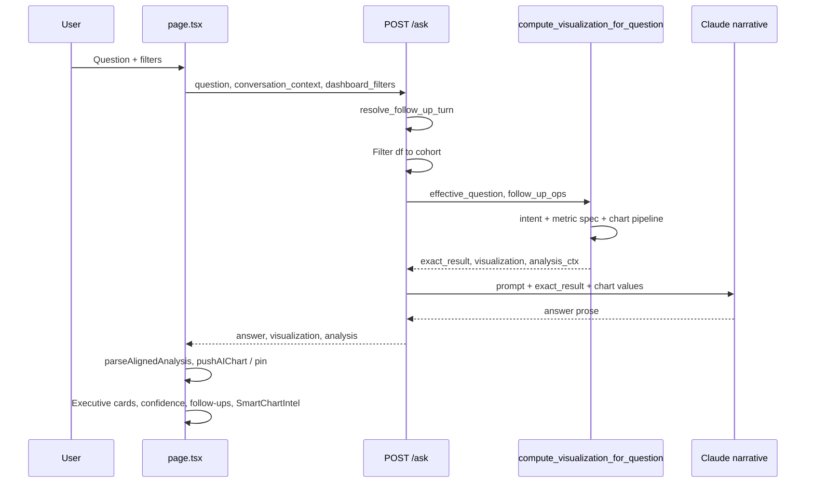
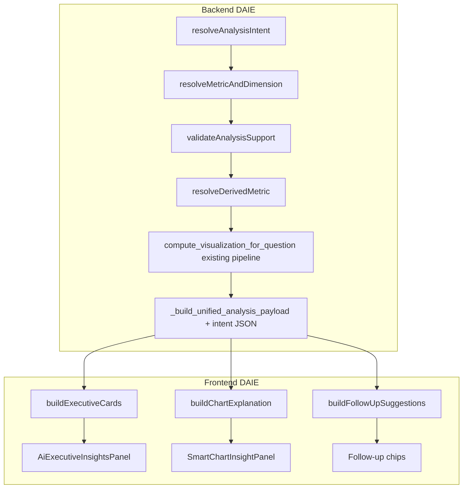

# Dynamic Analytics Intent Engine — Architecture (Proposal)

**Status:** Design only — **no implementation in this phase**  
**Date:** June 2026  
**Scope:** AI Insights question → chart → narrative → executive cards → follow-ups  
**Constraint:** Do not modify existing business logic until migration phases explicitly allow it.

**Related baseline docs:** [`PROJECT_ARCHITECTURE_SUMMARY.md`](PROJECT_ARCHITECTURE_SUMMARY.md) · [`AI_INSIGHTS_STABLE_SUMMARY.md`](AI_INSIGHTS_STABLE_SUMMARY.md) · [`AI_VISUALIZATION_BEHAVIOR.md`](AI_VISUALIZATION_BEHAVIOR.md) · [`AGENTS.md`](AGENTS.md)

---

## 1. Executive summary

Today, **analytics intent** (what the user wants to measure, how to group, which chart pattern applies, and whether the data supports it) is **distributed** across a ~12.8k-line `backend/main.py` pipeline and a ~13k-line `frontend/app/page.tsx` presentation layer. Specialized modes (trend, unsupported growth, derived profit margin, dual-metric compare, ROI) are implemented as **parallel branches** rather than a single composable engine.

The **Dynamic Analytics Intent Engine (DAIE)** proposes a thin, testable **intent contract** produced once per `/ask`, then consumed by:

- Visualization builders (backend, deterministic pandas)
- Analysis payload / confidence (backend)
- Executive cards, chart explanation, follow-ups (frontend, derived from contract + viz primitives)

Existing behavior remains the source of truth during migration; new modules **wrap and delegate** to current functions until parity is proven.

---

## 2. Current AI Insights flow (as-is)

### 2.1 End-to-end sequence



### 2.2 Backend: `/ask` entry

| Step | Location | Function / artifact |
|------|----------|-------------------|
| HTTP entry | `backend/main.py` ~12463 | `ask_question` |
| Follow-up rewrite | ~11229 | `resolve_follow_up_turn` → `effective_question`, `follow_up_ops`, `conversation_sidecar` |
| Cohort | `ask_question` | Filtered `df` slice from dashboard filters / date range |
| Visualization | ~12654 | `compute_visualization_for_question` |
| Narrative | ~12679+ | `_generate_insight_narrative` + `_confidence_answer_prompt_block` |
| Response | ~12800+ | `answer`, `visualization`, `analysis`, `conversation_context` |

### 2.3 Backend: visualization orchestrator

`compute_visualization_for_question` (~11368–12460) is the **single orchestrator**. Order today (simplified):

1. `_describe_aggregate_intent` + `_resolve_question_metric_spec` + `_apply_metric_spec_to_intent`
2. Dual-metric grouped bar (`_resolve_two_metric_compare_spec`)
3. Two-dimension stack
4. Trend (`_try_build_trend_line_visualization`)
5. Outlier (`_try_outlier_visualization`)
6. `analyze_data` (rule-based default)
7. `_fallback_aggregate_chart` (intent-aligned rebuild)
8. `build_smart_chart`
9. `_deterministic_viz_last_resort`
10. ROI / profit-margin **alignment guards** → `_fallback_aggregate_chart` again
11. `determine_chart_type_and_reason`
12. `_build_unified_analysis_payload` (+ unsupported growth assess)

**Outputs:** `exact_result` (ground truth for LLM), `visualization` (labels/values/chartType/provenance), `analysis_ctx` (aligned metadata for UI).

### 2.4 Frontend: `/ask` consumption

| Step | Location | Notes |
|------|----------|-------|
| Request | `page.tsx` `askAI` | POST `/ask`, clears then sets `alignedAnalysis` |
| Parse | `parseAlignedAnalysis` | Maps API `analysis` → `AlignedAnalysisContext` |
| Chart session | `chart-session-context.tsx` | `pushAIChart`, `freezeVisualizationContract` |
| Pin / preserve | `shouldPreservePinnedInsightChart`, `chartSnapshotMatchesAnalysis` | Follow-up and trend continuity |
| Gates | `chart-question-intent.ts` | `insightChartMatchesCurrentQuestion`, outlier guards |
| Presentation | `selected-visualization.ts`, `final-chart-presentation.ts` | Titles, axes, rounding, contract |

UI render order on Insights tab is documented in [`AI_INSIGHTS_STABLE_SUMMARY.md`](AI_INSIGHTS_STABLE_SUMMARY.md) §2 (executive panel → confidence → answer → follow-ups → viz → export).

---

## 3. Where concerns live today

### 3.1 Intent detection

Intent is **not one function** — it is split across **tags**, **routing buckets**, and **aggregate intent dicts**.

| Concern | Primary symbols | File | Role |
|---------|-----------------|------|------|
| Aggregate intent (metric + dimension + agg) | `_describe_aggregate_intent` | `backend/main.py` ~5842 | Core `intent_debug`: `group_col`, `value_col`, `agg_key`, `secondary_group_col` |
| Derived / named metrics | `_resolve_question_metric_spec`, `_apply_metric_spec_to_intent` | ~6329–6412 | Profit margin %, ROI, `__derived_*__` keys |
| Question → metric column score | `_best_numeric_column_for_question` | ~6525+ | Picks numeric column; ROI/margin bias |
| Dimension “by X” | `_resolve_by_column_from_question`, `_infer_dimension_column_from_question` | ~5695+ | Region/product/etc. |
| Intent **tags** (analysis payload) | `_detect_intent_tags` | ~10292 | `detectedIntent[]`: trend, growth, ranking, … |
| Chart routing **bucket** | `_chart_selection_question_bucket` | ~9538 | `chartRecommendation.detectedIntent`: trend, ranking, compare, … |
| Trend | `_question_requests_trend_intent`, `_try_build_trend_line_visualization` | ~7032+, ~7182+ | Time bucket + line/area path |
| Growth (unsupported) | `_question_requests_growth_intent`, `_assess_unsupported_growth_analysis` | ~6888–7028 | Diagnostic mode, no true growth series |
| ROI / margin alignment | `_rendered_metric_matches_question`, `_question_requests_roi`, `_question_requests_profit_margin` | ~6203–6503 | Prevents profit chart on margin questions |
| Outlier / compare | `_question_asks_outlier_analysis`, `_question_requests_two_metric_compare` | ~7583+, ~9659+ | Separate viz branches |
| Frontend intent guard | `chartSnapshotMatchesQuestionIntent`, `isMisleadingOutlierDepartmentChart` | `frontend/lib/chart-question-intent.ts` | Blocks misaligned pinned charts |
| Frontend mode flags | `resolveUnsupportedGrowthMode`, `resolveProfitMarginMode` | `unsupported-growth-analysis.ts`, `derived-profit-margin.ts` | Re-parse API flags + client fallback |

**Gap:** Backend `detectedIntent` (tags) and `chartRecommendation.detectedIntent` (bucket) can diverge; frontend adds a third layer (contract + mode helpers).

---

### 3.2 Chart selection

| Layer | Primary symbols | File | Role |
|-------|-----------------|------|------|
| Orchestrator | `compute_visualization_for_question` | `backend/main.py` ~11368 | Chooses **which builder** runs |
| Rule engine | `analyze_data` | ~8644+ | Early exits: derived margin/ROI, spread, top-N, … |
| Intent fallback | `_fallback_aggregate_chart` | ~6006 | Grouped series from `intent_debug` |
| Smart routing | `build_smart_chart` | ~8088 | Scatter, histogram, pie, heuristics |
| Last resort | `_deterministic_viz_last_resort` | ~7838 | Schema rules |
| Type + reason | `determine_chart_type_and_reason` | ~9975 | bar_horizontal, line, pie, confidence |
| Recommendation object | `_build_chart_recommendation_dict` | ~10360 | Exposed on `analysis.chartRecommendation` |
| Follow-up chart ops | `_apply_follow_up_post_process_chart` | (grep in main.py) | User-requested chart type tweaks |
| Frontend kind | `resolvePresentationKindFromContract`, `computeFinalChartPresentation` | `selected-visualization.ts`, `final-chart-presentation.ts` | Maps API type → `ChartKind`, margins, titles |
| Charts tab copy | `generateChartReason` | `generate-chart-reason.ts` | Reuses smart-chart blurbs |

**Gap:** Chart type is decided **late** (after data exists) and can be **repaired** multiple times (alignment guards). Contract freeze on frontend happens **after** API response.

---

### 3.3 Executive cards

| Layer | Primary symbols | File | Role |
|-------|-----------------|------|------|
| Default ranking cards | `buildExecutiveVizInsights` | `page.tsx` ~2969 | Highest/Lowest {dim}, gap, avg — from viz pairs |
| Trend cards | `buildTrendExecutiveVizInsights` | `trend-visualization.ts` | Peak, granularity, avg monthly, etc. |
| Grouped dual-metric | `buildGroupedMetricExecutiveInsights` | `page.tsx` ~2810 | ROAS-style side-by-side |
| Unsupported growth | `buildUnsupportedGrowthExecutiveCards` | `unsupported-growth-analysis.ts` | Diagnostic tiles |
| Profit margin | `buildProfitMarginExecutiveInsights` | `derived-profit-margin.ts` | Best/Worst margin, gap, avg |
| Wiring | `insightExecutiveVizInsights` useMemo | `page.tsx` ~9187 | **Branch order** picks builder |
| UI shell | `AiExecutiveInsightsPanel` | `ai-executive-insights-panel.tsx` | Renders `cards` + `narrativeBrief` |
| Brief text | `buildNumberedExecutiveBrief`, `insightExecutiveBrief` | `executive-insights-brief.ts`, `page.tsx` | Numbered summary above cards |

**Gap:** Card semantics are **mode-specific functions** in frontend; backend `focusKpis` exists but is not the primary driver for Insights executive tiles.

---

### 3.4 Follow-up suggestions

| Layer | Primary symbols | File | Role |
|-------|-----------------|------|------|
| Chip builder | `buildAiFollowUpQuestionChips` | `ai-follow-up-suggestions.ts` | Generic rank/compare/drill chips |
| Mode-specific | `buildUnsupportedGrowthFollowUpChips`, `buildProfitMarginFollowUpChips`, `buildDualMetricCompareFollowUpChips` | Same + `unsupported-growth-analysis.ts` |
| Domain seeds | `schemaAwareFollowUpSeeds`, `buildFollowupQuestion` | `ux-narrative.ts` | Template phrases from dataset domain |
| Orchestration | `insightFollowUpChips` useMemo | `page.tsx` ~8980 | Mode branch → merge → dedupe → max 5 |
| Backend templates | `_tpl_*` / suggested questions on dashboard | `main.py` | Overview suggestions, not post-answer chips |

**Gap:** Follow-ups are **fully frontend-generated**; they do not read a structured intent object from the API (only heuristics on axis labels and rows).

---

### 3.5 Chart explanation (“Why this chart” / AI Read)

| Layer | Primary symbols | File | Role |
|-------|-----------------|------|------|
| Intel bundle | `computeSmartChartIntel` | `smart-chart-intelligence.ts` | Kind label, blurb, anomalies |
| Grouped bar blurb | `buildGroupedBarChartBlurb` | same | Dynamic multi-series copy |
| Panel | `SmartChartInsightPanel` | `SmartChartInsightPanel.tsx` | Gated on `insightChartMatchesCurrentQuestion` |
| Charts tab | `generateChartReason` | `generate-chart-reason.ts` | Session chart reason string |
| Narrative helper | `buildChartNarrative` | `ux-narrative.ts` | Used inside smart-chart |

**Gap:** Explanation is **derived from rendered chart kind + axis labels**, not from a first-class `chartSelectionReason` object on the intent contract (backend `chart_sel_reason` is not fully surfaced).

---

### 3.6 Confidence, validation, and narrative

| Concern | Backend | Frontend |
|---------|---------|----------|
| Sample size / cohort | `_insight_confidence_meta` in `_build_unified_analysis_payload` | `computeUnifiedInsightConfidence` (`insight-confidence.ts`) |
| Mapping confidence | Same payload | Merged in `insightUnifiedConfidence` (`page.tsx`) |
| Growth unsatisfied | `unsupportedGrowthAnalysis`, `growthRequestUnsatisfied` | `resolveUnsupportedGrowthMode` |
| LLM tone rules | `_confidence_answer_prompt_block` | `insight-narrative-tone.ts`, `parsedInsightAnswer` |
| Analysis validation | `_build_analysis_validation_block` | Provenance UI in details |

---

## 4. Problems the engine should solve (without changing behavior yet)

1. **Scattered intent** — Adding a new derived metric (e.g. conversion rate) requires edits in `main.py` (spec, fallback, analyze_data, guards, rounding, payload) **and** new frontend mode files + `page.tsx` branches.
2. **Duplicated detection** — Margin/growth/trend detected on backend and re-inferred on frontend.
3. **Implicit branch order** — Executive cards and follow-ups depend on `if (modeA) … else if (modeB)` order in `page.tsx`.
4. **Weak contract** — `AlignedAnalysisContext` is flat; no single `AnalysisIntent` type shared across chart, cards, chips, and explanation.
5. **Testing** — Intent logic is hard to unit test inside monoliths.

---

## 5. Proposed architecture: Dynamic Analytics Intent Engine

### 5.1 Design principles

- **Single intent resolution** per question+cohort (backend-authoritative).
- **Declarative modes** (trend, derived_metric, unsupported_growth, dual_compare, …) as flags on one struct, not mutually exclusive scattered booleans everywhere.
- **Pure presentation builders** on frontend: `buildExecutiveCards(intent, vizPrimitives)` with no hidden question regex.
- **Support validation before chart build** where possible (fail fast with diagnostic payload).
- **Strangler migration**: new engine calls existing functions; parity tests before cutover.

### 5.2 Canonical intent contract (proposed)

```typescript
// Conceptual — shared types package or mirrored TS/Pydantic models

type AnalysisIntent = {
  question: string;
  normalizedQuestion: string;

  // Semantic goal
  primaryGoal:
    | "rank" | "compare" | "trend" | "distribution" | "relationship"
    | "outlier" | "kpi" | "derived_metric" | "unsupported_analysis";

  // Metric plane
  metric: {
    kind: "column" | "derived" | "count";
    columnKey: string | null;
    displayLabel: string;
    derived?: {
      id: "profit_margin" | "roi" | "roas" | string;
      operands: Record<string, string>; // profit, revenue, spend, …
      formulaDescription: string;
    };
    aggregation: { key: string; label: string };
  };

  // Dimension plane
  dimension: {
    columnKey: string | null;
    displayLabel: string;
    secondaryColumnKey?: string | null;
  };

  // Chart plane (requested / recommended — final type may differ)
  chart: {
    routingBucket: string;
    recommendedInternalType: string;
    selectionReason?: string;
    followUpOps?: Record<string, unknown>;
  };

  // Support / honesty
  support: {
    supported: boolean;
    reasonCodes: string[];
    growth?: UnsupportedGrowthMeta;
    trend?: { satisfied: boolean; bucket?: string };
    margin?: { available: boolean; unavailableReason?: string };
  };

  // Tags for LLM + UI copy
  tags: string[];
};
```

Backend produces **`AnalysisIntent`** (or JSON equivalent) inside `analysis.intent` (new field, optional during migration). Frontend consumes it for cards, follow-ups, and explanation; falls back to today’s heuristics when absent.

### 5.3 Proposed engine API (seven functions)

These are the **public seams** of DAIE. Initial implementation = thin wrappers delegating to existing code.

| Function | Tier | Responsibility | Delegates to (today) |
|----------|------|----------------|----------------------|
| **`resolveAnalysisIntent()`** | Backend | Top-level: question + df + profile + follow-up context → `AnalysisIntent` | `_describe_aggregate_intent`, `_resolve_question_metric_spec`, `_detect_intent_tags`, `_chart_selection_question_bucket`, growth/trend/margin detectors |
| **`resolveMetricAndDimension()`** | Backend | Metric column or derived spec + group-by column + agg | `_best_numeric_column_for_question`, `_resolve_by_column_from_question`, `_apply_metric_spec_to_intent` |
| **`validateAnalysisSupport()`** | Backend | Can this cohort answer the intent? (growth w/o time, margin w/o revenue, empty groups) | `_assess_unsupported_growth_analysis`, margin fallback branch, row counts |
| **`resolveDerivedMetric()`** | Backend | Derived series only: ROI, profit margin %, future rates | `_grouped_derived_profit_margin_series`, `_grouped_derived_roi_series`, `_resolve_question_metric_spec` |
| **`buildExecutiveCards()`** | Frontend | Intent + chart rows → executive tile list | `buildExecutiveVizInsights`, `buildTrendExecutiveVizInsights`, `buildProfitMarginExecutiveInsights`, `buildUnsupportedGrowthExecutiveCards`, … |
| **`buildChartExplanation()`** | Frontend | Intent + presentation kind → “Why this chart” + methodology lines | `computeSmartChartIntel`, `buildGroupedBarChartBlurb`, `generateChartReason` |
| **`buildFollowUpSuggestions()`** | Frontend | Intent + axis labels + top/bottom entities → 3–5 chips | `buildAiFollowUpQuestionChips`, mode-specific chip builders, `schemaAwareFollowUpSeeds` |

**Chart data generation** stays in existing `compute_visualization_for_question` until Phase 4; DAIE does not replace pandas aggregation in v1 — it **feeds and documents** decisions.



### 5.4 `resolveAnalysisIntent()` — detail

**Inputs:** `question`, filtered `DataFrame`, `profile`, optional `conversation_sidecar`, `follow_up_ops`.

**Outputs:** `AnalysisIntent` + optional `intent_debug` legacy dict (migration shim).

**Internal steps (ordered):**

1. Normalize question (follow-up effective question already applied upstream).
2. `resolveMetricAndDimension()`.
3. Detect modifiers: trend, growth, outlier, dual-compare, top-N.
4. `validateAnalysisSupport()` → may set `primaryGoal = unsupported_analysis` or attach `support.growth`.
5. Merge tags from `_detect_intent_tags` and bucket from `_chart_selection_question_bucket`.
6. Attach derived metric metadata from `resolveDerivedMetric()` when applicable.

**Does not:** Build chart rows or call LLM.

### 5.5 `resolveMetricAndDimension()` — detail

**Outputs:**

- `metric.columnKey` or derived id
- `metric.displayLabel` (`_metric_display_from_intent`)
- `dimension.columnKey` (primary group-by)
- `aggregation` key/label (`_resolve_agg_label_and_key` or derived overrides)

**Rules preserved:** mapped columns via `get_mapped_or_detected_column`, incident/count paths, time-bucket phrases blocked as dimensions.

### 5.6 `validateAnalysisSupport()` — detail

Returns `support.supported` and `reasonCodes[]`. Examples:

| Code | Meaning | Current equivalent |
|------|---------|-------------------|
| `growth_single_period` | Growth question, no multi-period series | `_assess_unsupported_growth_analysis` |
| `margin_no_revenue` | Margin question, profit only | `profitMarginUnavailable` |
| `few_rows` | Small cohort | `smallSampleCohort` (confidence, not blocking) |
| `low_mapping` | Inferred columns | `mappingConfidenceLevel` |
| `misaligned_metric` | Smart routing used wrong column | alignment guard paths |

Unsupported cases still may return a **context chart** (today’s behavior) — validation documents *honesty*, not always hard failure.

### 5.7 `resolveDerivedMetric()` — detail

**Inputs:** intent metric derived id, df, group column, operand column keys.

**Outputs:** Sorted `{ name, value }[]` or Series; formula metadata for labels/rounding (`pct_1` vs `ratio_1`).

**Extensibility:** Register handlers `DerivedMetricRegistry["profit_margin"] = …` instead of new `if derived_profit_margin` chains.

### 5.8 `buildExecutiveCards()` — detail

**Inputs:** `AnalysisIntent`, `vizPrimitives` (labels, values, formatted, chart kind), optional `roundingHint`.

**Outputs:** `ExecutiveCard[]` (same shape as today’s `ExecutiveVizInsightCard`).

**Routing inside builder (replaces page.tsx branch order):**

```
if intent.support.growth?.active → growth diagnostic cards
else if intent.metric.derived?.id === "profit_margin" → margin cards
else if intent.chart.routingBucket === "trend" → trend cards
else if dual_compare → grouped metric cards
else → default buildExecutiveVizInsights
```

### 5.9 `buildChartExplanation()` — detail

**Inputs:** `AnalysisIntent`, presentation `ChartKind`, axis labels, optional `multiSeries` meta.

**Outputs:** `{ title, blurb, methodologyLines[], signals[] }` compatible with `SmartChartInsightPanel`.

Uses intent to choose blurb templates (e.g. margin % vs currency profit). Surfaces backend `selectionReason` when present.

### 5.10 `buildFollowUpSuggestions()` — detail

**Inputs:** `AnalysisIntent`, series rows (top/bottom), `alternateMetricLabels`, dataset domain.

**Outputs:** 3–5 deduped strings.

Mode templates driven by `intent.metric.derived.id`, `intent.primaryGoal`, `intent.dimension.displayLabel` — not ad hoc regex in `page.tsx`.

---

## 6. Proposed file structure

New code lives in **dedicated modules**; monoliths remain until Phase 5.

```
backend/
  intent_engine/
    __init__.py
    models.py                 # Pydantic: AnalysisIntent, MetricSpec, SupportResult
    resolve_analysis_intent.py    # resolveAnalysisIntent()
    resolve_metric_dimension.py # resolveMetricAndDimension()
    validate_support.py           # validateAnalysisSupport()
    derived_metrics/
      __init__.py
      registry.py               # DerivedMetricRegistry
      profit_margin.py          # resolveDerivedMetric handler
      roi.py
    adapters/
      legacy_main.py            # Wrappers calling main.py symbols (migration only)

frontend/
  lib/
    intent-engine/
      types.ts                  # AnalysisIntent (mirror backend)
      parse-analysis-intent.ts  # From analysis.intent or legacy fallback
      build-executive-cards.ts  # buildExecutiveCards()
      build-chart-explanation.ts# buildChartExplanation()
      build-follow-up-suggestions.ts # buildFollowUpSuggestions()
      modes/
        trend.ts                # Moved from trend-visualization (cards only)
        growth.ts               # From unsupported-growth-analysis
        profit-margin.ts        # From derived-profit-margin
      adapters/
        legacy-page.ts          # Optional re-export of old builders

  # page.tsx eventually:
  #   const intent = parseAnalysisIntent(alignedAnalysis);
  #   const cards = buildExecutiveCards(intent, vizPrimitives);
```

**Shared contract (optional Phase 3+):**

```
shared/
  analysis-intent.schema.json   # JSON Schema for API field analysis.intent
```

**Tests (recommended before cutover):**

```
backend/tests/intent_engine/
  test_profit_margin_intent.py
  test_growth_unsupported.py
  test_trend_intent.py

frontend/lib/intent-engine/__tests__/
  build-executive-cards.test.ts
  build-follow-up-suggestions.test.ts
```

**Docs:**

```
DYNAMIC_ANALYTICS_INTENT_ENGINE.md   # This document
docs/intent-engine-migration-log.md  # Phase checklist (create at Phase 0)
```

---

## 7. API evolution (non-breaking)

Add optional field on existing `/ask` `analysis` object:

```json
{
  "analysis": {
    "metricColumn": "...",
    "chartTitle": "...",
    "intent": { /* AnalysisIntent */ },
    "derivedProfitMargin": true
  }
}
```

Legacy fields (`derivedProfitMargin`, `unsupportedGrowthAnalysis`, `detectedIntent`) remain until frontend fully consumes `analysis.intent`.

---

## 8. Migration plan

### Phase 0 — Documentation and inventory (current)

- [x] Architecture document (this file)
- [ ] Golden questions spreadsheet: 15–20 representative asks (margin, trend, growth, ROI, outlier, dual compare, follow-up)
- [ ] Capture baseline screenshots + API payloads per question

**Exit criteria:** Team agrees on `AnalysisIntent` shape and seam functions.

---

### Phase 1 — Backend adapters (no behavior change)

1. Create `backend/intent_engine/` with `models.py`.
2. Implement `resolveAnalysisIntent()` as **facade** calling existing `main.py` helpers; unit tests assert equivalence to current `intent_debug` + flags.
3. Implement `resolveMetricAndDimension()`, `validateAnalysisSupport()`, `resolveDerivedMetric()` as facades.
4. From `compute_visualization_for_question`, after existing intent build, attach `analysis["intent"] = resolveAnalysisIntent(...)` (additive JSON only).

**Exit criteria:** All backend tests pass; `/ask` response includes `intent` blob; UI unchanged.

---

### Phase 2 — Frontend parse + shadow mode

1. Add `frontend/lib/intent-engine/types.ts` + `parse-analysis-intent.ts` (fallback synthesizes intent from `AlignedAnalysisContext` when `intent` missing).
2. Wire `buildExecutiveCards()` to call new router **in parallel** with existing `insightExecutiveVizInsights` (dev-only diff logging, not user-visible).
3. Same shadow for `buildFollowUpSuggestions()` and `buildChartExplanation()`.

**Exit criteria:** Shadow diff rate &lt; agreed threshold on golden questions; no UI switch.

---

### Phase 3 — UI cutover (presentation only)

1. Replace `insightExecutiveVizInsights` branch tree with `buildExecutiveCards(intent, …)`.
2. Replace `insightFollowUpChips` with `buildFollowUpSuggestions(intent, …)`.
3. Point `insightSmartChartIntel` / panel copy at `buildChartExplanation(intent, …)`.
4. Remove shadow logging.

**Exit criteria:** [`AI_INSIGHTS_STABLE_SUMMARY.md`](AI_INSIGHTS_STABLE_SUMMARY.md) behaviors preserved; manual golden pass.

---

### Phase 4 — Backend chart pipeline refactor (highest risk)

1. Move derived metric and support validation **ahead** of smart routing inside `compute_visualization_for_question`.
2. Register derived metrics in `DerivedMetricRegistry` instead of inline branches.
3. Reduce duplicate ROI/margin alignment guards to single `validateAnalysisSupport` + one rebuild path.

**Exit criteria:** Parity on chart data + titles + rounding hints for golden set; alignment_repaired rate not worse.

---

### Phase 5 — Monolith thinning (optional)

1. Move intent_engine modules out of `main.py` imports (delete duplicated helpers).
2. Split `page.tsx` Insights handlers into `useInsightAsk`, `useInsightPresentation` hooks.
3. Update [`PROJECT_ARCHITECTURE_SUMMARY.md`](PROJECT_ARCHITECTURE_SUMMARY.md) and baseline docs.

**Exit criteria:** `main.py` shrinks measurably; no regression in Charts/Overview/PDF paths.

---

### Rollback strategy

Each phase is independently revertible:

- Phase 1: Stop emitting `analysis.intent`.
- Phase 2–3: Restore `page.tsx` useMemo branches.
- Phase 4: Feature flag `USE_DAIE_CHART_PIPELINE=false` (env) calling old ordering.

---

## 9. Mapping: proposed functions → current code

| Proposed | Current primary locations |
|----------|---------------------------|
| `resolveAnalysisIntent()` | `_describe_aggregate_intent`, `_resolve_question_metric_spec`, `_detect_intent_tags`, `_chart_selection_question_bucket`, growth/trend/margin detectors (`main.py`) |
| `resolveMetricAndDimension()` | Same + `_best_numeric_column_for_question`, `_resolve_by_column_from_question` |
| `validateAnalysisSupport()` | `_assess_unsupported_growth_analysis`, margin unavailable path, `_build_analysis_validation_block`, confidence meta |
| `resolveDerivedMetric()` | `_grouped_derived_profit_margin_series`, `_grouped_derived_roi_series`, `analyze_data` early branches |
| `buildExecutiveCards()` | `page.tsx` `insightExecutiveVizInsights` + `trend-visualization.ts`, `derived-profit-margin.ts`, `unsupported-growth-analysis.ts` |
| `buildChartExplanation()` | `smart-chart-intelligence.ts`, `generate-chart-reason.ts`, `SmartChartInsightPanel.tsx` |
| `buildFollowUpSuggestions()` | `ai-follow-up-suggestions.ts`, `page.tsx` `insightFollowUpChips`, `ux-narrative.ts` seeds |

---

## 10. Out of scope (this proposal)

- Changing chart-type semantics or baseline UI layout ([`AGENTS.md`](AGENTS.md)).
- LLM-driven intent (intent stays deterministic).
- New derived metrics beyond registry **plumbing** (profit margin / ROI migrate first).
- PDF export refactor (consume same intent later).
- Splitting `page.tsx` / `main.py` for non-Insights tabs.

---

## 11. Success metrics

| Metric | Target |
|--------|--------|
| Golden question parity | 100% match on chart type, title, top entity, executive card titles |
| New derived metric cost | One registry handler + one mode file (not 8+ touch points) |
| Test coverage | Core intent_engine unit tests without loading full FastAPI app |
| Duplicated regex | Frontend question parsers only in `parse-analysis-intent` fallback |

---

## 12. Next steps (when implementation is approved)

1. Review and sign off `AnalysisIntent` schema (§5.2).
2. Create `docs/intent-engine-migration-log.md` with Phase 0 golden questions.
3. Begin Phase 1 backend facades only — **no** changes to `compute_visualization_for_question` ordering until Phase 4.

---

*This document is architecture-only. No production code paths were modified as part of its creation.*
