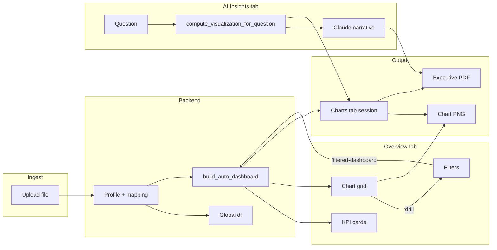

# Architecture Summary

**Generated:** June 8, 2026  
**Audience:** External architecture review, new engineering lead

---

## System context

The AI Data Analyst App is a **single-page analytics workbench**: upload a tabular dataset, explore it via an auto-generated Overview dashboard, ask natural-language questions (AI Insights), inspect charts in a timeline, preview raw data, and export executive PDFs or chart PNGs.

It is designed as a **pilot / single-tenant MVP**, not a multi-user SaaS. The backend holds one in-memory dataframe per process.

```
┌─────────────────────────────────────────────────────────────────┐
│                     Browser (Next.js SPA)                       │
│  page.tsx — tabs: Overview | Preview | Insights | Charts | Export│
│  ChartSessionProvider (client chart history)                      │
└───────────────────────────┬─────────────────────────────────────┘
                            │ HTTP (NEXT_PUBLIC_API_BASE_URL)
                            │ Headers: X-Session-Id, X-Plan-Tier
┌───────────────────────────▼─────────────────────────────────────┐
│                   FastAPI (backend/main.py)                       │
│  Globals: df, dataset_profile, column_mapping                   │
│  Services: auto_dashboard, usage_tracker, file_parsers            │
│  Intent engine: backend/intent_engine/                            │
│  External: Anthropic API (narrative only)                       │
└─────────────────────────────────────────────────────────────────┘
```

---

## End-to-end request flow

### 1. Upload

```
User selects file
  → POST /upload (multipart)
  → file_parsers: CSV | Parquet | JSON
  → build_profile(df), infer column_mapping
  → calculate_kpis(), build_auto_dashboard()
  → Response: columns, profile, mapping, kpis, auto_dashboard, sheets
  → Frontend: set state, replaceAutoDashboardCharts, invalidate dataset epoch
```

### 2. Data Preview

```
User opens Preview tab
  → POST /preview { offset, limit }
  → Slice global df (NOT filter-aware)
  → Render paginated table + quality insights (client-side derivations)
```

### 3. Overview (filters + Auto Dashboard)

```
User sets filters
  → POST /filtered-dashboard { filters }
  → apply_dashboard_filters_to_df()
  → build_auto_dashboard() on filtered slice
  → Frontend: KPI chips + chart grid

User drills from chart bar
  → Client adds filter dimension value
  → Re-post /filtered-dashboard

User exports chart PNG
  → Offscreen portal + buildOverviewDashboardPlot(pngCapture=true)
  → chart-png-export-session → download
```

### 4. AI Insights

```
User asks question
  → POST /ask { question, filters, conversationContext }
  → apply_dashboard_filters_to_df()
  → compute_visualization_for_question()  [pandas, ordered routing]
  → _build_unified_analysis_payload()
  → _generate_insight_narrative()         [Claude, grounded on exact_result]
  → record_ai_question() [usage debit]
  → Frontend gates → pushAIChart → render insight UI
```

**Routing order (simplified):**
1. Correlation / relationship pack
2. Two-metric compare / stacked bar
3. Trend line / area
4. Outlier / fallback analyze_data

### 5. Charts tab

```
Reads ChartSessionProvider only (no refetch on tab switch)
Sources: pushAIChart (Insights), replaceAutoDashboardCharts (Overview)
User selects timeline entry → ChartRenderer with frozen contract
PNG export uses shared pipeline (ChartRenderer, not overview plot builder)
```

### 6. Export (PDF)

```
User configures sections on Export tab
  → buildExecutivePdfExportInput from session + insights
  → validateExportMatchesContract (alignment gates)
  → POST /usage/pdf-export (reserve quota)
  → runExecutivePdfExport (pdf-report.ts)
  → jsPDF + captured chart images
  → On failure: POST /usage/pdf-export/refund
```

---

## Upload → Preview → Overview → AI Insights → Export flow



---

## Key services

### Backend

| Service | Responsibility | Stateful? |
|---------|----------------|-----------|
| `main.py` | HTTP API, viz pipeline, Claude integration | Global `df` |
| `auto_dashboard_opportunities.py` | Chart/KPI opportunity logic | Stateless (pure on df) |
| `intent_engine/*` | Question understanding, routing guards | Stateless |
| `usage_tracker.py` | Quota counters | In-memory per session ID |
| `file_parsers.py` | Upload parsing | Stateless |
| `plan_limits.py` | Tier definitions | Stateless |

### Frontend

| Module | Responsibility | Stateful? |
|--------|----------------|-----------|
| `page.tsx` | All tab state, API orchestration | React state |
| `chart-session-context.tsx` | Chart timeline, contracts | React context |
| `chart-renderer.tsx` | Recharts presentation | Props-driven |
| `chart-png-capture.ts` | Rasterization | Stateless |
| `pdf-report.ts` | PDF assembly | Stateless |
| `saas-session.ts` | Session/plan headers | localStorage |

---

## Important data contracts

### Auto dashboard API shape

```typescript
type AutoDashboardPayload = {
  kind: string;           // sales | hr | operations | generic
  type_label: string;
  cards: { title: string; value: string; subtitle?: string }[];
  charts: {
    title: string;
    chartType: string;    // bar | horizontalBar | line | area | pie | donut | scatter
    labels: string[];
    values: number[];
    interaction?: { drillDimensions: { column: string; label: string }[] };
    metricColumn?: string;
    dimensionColumn?: string;
  }[];
};
```

### Chart row (frontend)

```typescript
type ChartRow = {
  name: string;
  value: number;
  displayValue?: string;  // formatted for UI/tooltip
  x?: number;             // scatter
};
```

### Visualization contract (Charts / AI / PDF)

Frozen via `freezeVisualizationContract()` in `selected-visualization.ts`:
- `displayTitle`, `chartKind`, `aggregationKey`, `semanticContext`
- Ensures PDF and Charts tab match insight presentation

### `/ask` response (simplified)

```json
{
  "answer": "string",
  "visualization": { "title", "chartType", "labels", "values", ... },
  "analysis": { "confidence", "intentDebug", "rankedExecutiveInsights", ... },
  "exact_result": [ ... tabular grounding for LLM ... ]
}
```

### Usage API

```json
{
  "tier": "free" | "paid",
  "limits": { "ai_questions_per_day", "pdf_exports_per_day", ... },
  "usage": { "ai_questions_remaining", "pdf_exports_remaining", ... }
}
```

---

## Presentation pipeline split (architectural note)

| Pipeline | Entry | Used by |
|----------|-------|---------|
| **Shared** | `computeFinalChartPresentation` | Charts tab, AI Insights, PDF |
| **Overview** | `computeOverviewDashboardChartPresentation` + `buildOverviewDashboardPlot` | Auto Dashboard cards + their PNG export |

This split allows denser overview layouts (forced h-bar, compact margins) without changing AI/Charts behavior. **Risk:** orientation or formatting drift between pipelines.

---

## Risks

| Risk | Impact | Likelihood |
|------|--------|------------|
| Global `df` | Data leakage between users | Certain in multi-user deploy |
| Client plan tier | Quota bypass | Certain if header trusted |
| Monolithic `main.py` / `page.tsx` | Regression, slow onboarding | High |
| Dual chart pipelines | Export/dashboard mismatch | Medium (mitigated for overview PNG) |
| LLM narrative drift | Wrong numbers in prose | Medium |
| In-memory usage | Quota reset, worker inconsistency | High under scale |
| No auth | Abuse, data exposure | Critical for public internet |
| Filter/preview inconsistency | User confusion | Medium |
| PDF main-thread work | UI freeze on large exports | Medium |

---

## Future scalability considerations

### Short term (pilot hardening)
- Structured logging replacing `print()` in hot paths
- FastAPI `TestClient` smoke tests for upload/ask/filtered-dashboard
- Surface `filtered-dashboard` errors in UI
- Server-side title polish or single canonical title field in API

### Medium term (multi-user)
- **Per-tenant dataset store** (S3 + DuckDB/Parquet or Postgres)
- **Authentication** (OAuth) replacing `X-Session-Id`
- **Server-derived plan tier** from billing system
- **Durable usage counters** (Redis/DB)
- Horizontal scaling with stateless API + external session store

### Long term (product)
- Extract viz pipeline from `main.py` into service modules
- Extract Overview from `page.tsx` into route-level or feature folders
- Unified chart presentation layer (optional merge of overview + shared)
- Server-persisted chart sessions / dashboards
- Real-time filter push to Data Preview
- Background PDF generation job queue

---

## Deployment topology (typical)

| Component | Platform | Env vars |
|-----------|----------|----------|
| Frontend | Vercel | `NEXT_PUBLIC_API_BASE_URL` |
| Backend | Render | `ANTHROPIC_API_KEY`, `ALLOWED_ORIGINS`, `APP_ENV` |

See `docs/deployment-guide.md`, `deployment-readiness.md`, `render.yaml`.

---

## Testing strategy

| Layer | Tool | Scope |
|-------|------|-------|
| Frontend unit | Vitest | Presentation, export layout, title polish, grid |
| Backend unit | pytest | Intent routing, auto dashboard, usage |
| Manual QA | wave1_qa_execution.py | Cross-domain question packs |
| PDF validation | phase7-pdf-generate.test.ts | PDF structure |
| E2E | None in CI | Browser QA checklist only |

**Recommended next:** HTTP integration tests + Playwright smoke for upload → overview → ask.
