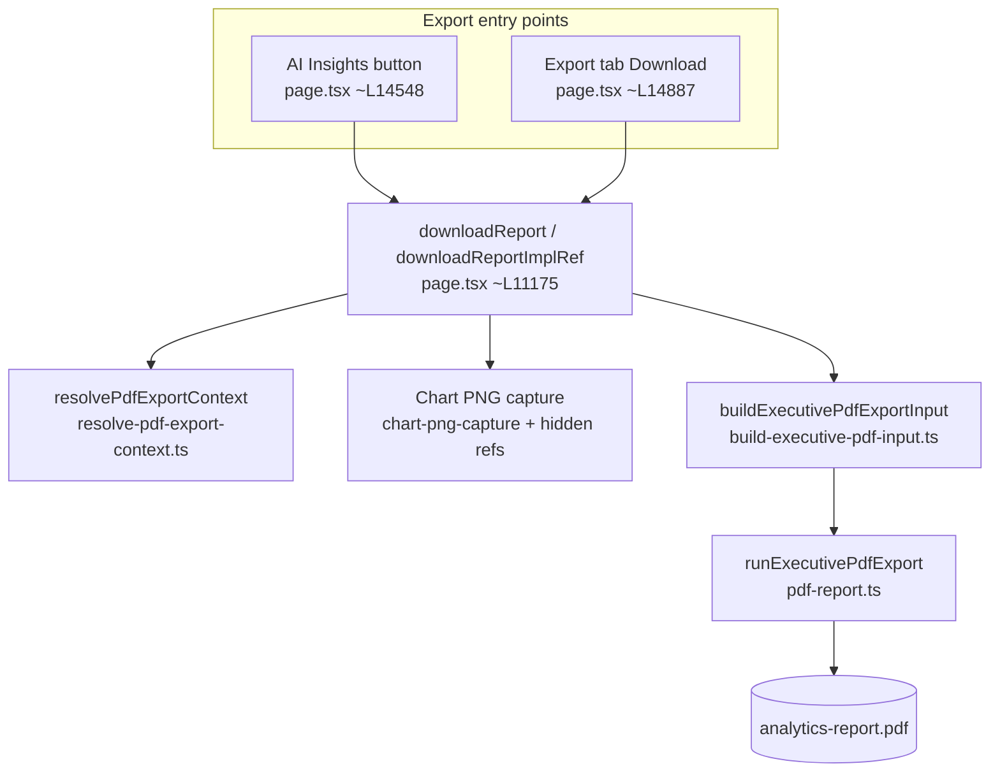
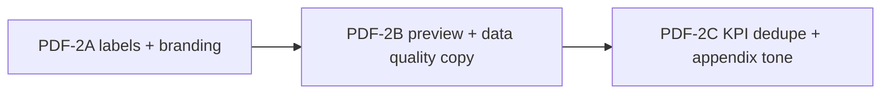

# PDF Quality Audit — Real Export Evidence (June 28–29, 2026)

**Branch:** `DEV` · **final HEAD:** `cf643d9` (PDF-2 complete)  
**Scope:** Architecture discovery, P1/P2 audit, and PDF-1/PDF-2 implementation record  
**Evidence:** User-downloaded PDFs, headless export scripts, phase7 validation matrix

---

## 1. Executive summary

Both export paths converge on **one template** (`runExecutivePdfExport` in `pdf-report.ts`) fed by **one assembler** (`buildExecutivePdfExportInput`). The AI Insights button **hardcodes nearly the same include flags** as Export tab “select all,” so **8-page structural parity is expected**, not accidental duplication of two different renderers.

Primary trust risk: **narrative text can describe a different breakdown dimension than the embedded chart** (e.g. Spend Amount by **Product Type** chart vs analysis mentioning **customer segments**). Section-order risk: **Data preview renders before AI insight and Visualization** when enabled. Checkbox behavior is **partially broken by design** for AI Insights (hardcoded overrides) and **partially ineffective** for section order (flags toggle inclusion, not executive vs analyst layout).

---

## 2. Architecture map

### 2.1 Shared pipeline (both export entry points)



| Layer | File | Key symbols |
|-------|------|-------------|
| UI triggers | `frontend/app/page.tsx` | `downloadReport()`, `downloadReportImplRef`, `exportOptions` state |
| Context alignment | `frontend/lib/resolve-pdf-export-context.ts` | `resolvePdfExportContext()`, `findChartIdForExportQuestion()` |
| Input assembly | `frontend/lib/build-executive-pdf-input.ts` | `buildExecutivePdfExportInput()`, `resolvePdfIncludes()` |
| Content planning | `frontend/lib/pdf-executive-content.ts` | `buildPdfExecutiveContentPlan()` |
| Render + layout | `frontend/app/pdf-report.ts` | `runExecutivePdfExport()`, section drawers |
| Chart capture | `frontend/lib/chart-png-capture.ts`, `frontend/lib/chart-platform/chart-capture-controller.ts` | PNG artifact for PDF embed |
| Branding | `frontend/lib/branding-config.ts`, `pdf-report.ts` `ReportBranding` | `BRANDING`, `loadReportBranding()` |
| Styling / embed math | `frontend/lib/pdf-enterprise-style.ts` | `computePdfChartEmbedDimensions()`, `pdfDrawEnterpriseRunningChrome()` |
| Metadata chips | `frontend/lib/chart-metadata-chips.ts`, `chart-contract-metadata.ts` | `buildChartMetadataChipSpecs()`, `buildFallbackSemanticHeader()` |
| Tests | `frontend/lib/resolve-pdf-export-context.test.ts`, `pdf-export-sections.test.ts`, `phase7-pdf-generate.test.ts`, `build-executive-pdf-input.test.ts` | Scope + section flags |

**Answer:** AI Insights PDF and Export-tab PDF **share the same path** — there is no separate “slim insight template.”

### 2.2 Entry-point differences (why PDFs look the same)

| Option | Export tab default (`exportOptions`) | AI Insights button override (`downloadReport({...})`) |
|--------|--------------------------------------|-----------------------------------------------------|
| `includeKPIs` | `true` | `true` |
| `includeAIInsight` | `true` | `true` |
| `includeChart` | `true` | `true` |
| `includeDataPreview` | **`false`** | **`true` (hardcoded)** |
| `includeDataQuality` | `true` | `true` |
| `includeConversationContext` | `false` | **`true` (hardcoded)** |
| `includeTechnicalAppendix` | `false` | not passed → inherits tab state |
| `chartScope` | resolver decides | **`"insight"` forced** |
| `pdfMode` | `"executive"` | `"executive"` |

When Export tab has **all checkboxes on**, flags match AI Insights except `chartScope` (resolver may still pick `insight` when a stored AI bundle exists) and possibly `includeTechnicalAppendix`. **Same sections + same order → same page count (~8).**

Relevant code:

```14548:14556:frontend/app/page.tsx
downloadReport({
  includeKPIs: true,
  includeAIInsight: true,
  includeChart: true,
  includeDataPreview: true,
  includeDataQuality: true,
  includeConversationContext: true,
  chartScope: "insight",
})
```

```6696:6705:frontend/app/page.tsx
const [exportOptions, setExportOptions] = useState<ExportOptions>({
  pdfMode: "executive",
  includeKPIs: true,
  includeAIInsight: true,
  includeChart: true,
  includeDataPreview: false,
  includeDataQuality: true,
  includeConversationContext: false,
  includeTechnicalAppendix: false,
});
```

### 2.3 Section order map (`runExecutivePdfExport`)

Fixed order in `frontend/app/pdf-report.ts` (inclusion gated by `input.includes.*`):

| # | Section | Flag | Approx. location |
|---|---------|------|------------------|
| 1 | Cover + **Executive snapshot** (KPI strip + dominant insight) | always | ~L3433–3480 |
| 2 | **Executive summary** | always | ~L3486 |
| 3 | **KPI dashboard** (`kpiSectionTitle`) | `includeKPIs` | ~L3628 |
| 4 | **Data preview** table | `includeDataPreview` | ~L3656 (`drawDataPreviewSection()`) |
| 5 | **AI insight** (question + narrative blocks) | `includeAIInsight` | ~L3659 |
| 6 | **AI conversation thread** | `includeConversationContext` | ~L3821 |
| 7 | **Visualization** (chart PNG + viz brief/facts) | `includeChart` | ~L3919 |
| 8 | **Data quality** | `includeDataQuality` | ~L4397 |
| 9 | **Technical appendix** (new page) | `includeTechnicalAppendix` | ~L4503 |

**Critical ordering issue:** Data preview (4) is **before** AI insight (5) and Visualization (7). Enabling sample data on AI Insights export places tables **ahead of the main insight story**.

`resolvePdfIncludes()` in `build-executive-pdf-input.ts` only normalizes executive vs analyst defaults; it does **not** reorder sections.

---

## 3. Issue table (P0 / P1 / P2)

| ID | Severity | User observation | Root-cause hypothesis | Primary owner file(s) |
|----|----------|------------------|----------------------|------------------------|
| **PDF-P0-01** | **P0** | Chart = Spend by **Product Type**; narrative mentions **Premium/SME/Corporate/Retail** segments | Multi-source narrative assembly: (a) stored `bundle.answer` / `parsedInsightAnswer` from prior segment question; (b) `insightExecutiveBrief` / `insightExecutiveVizInsights` sidecar captured from **live** UI state while chart comes from `pdfSnap` bundle; (c) `buildPdfExecutiveContentPlan` generic “segment” reframing in `pdf-executive-content.ts`; (d) Overview KPI cards in exec summary referencing segment dims. Prior fix (`resolve-pdf-export-context`) aligned chart **id** but not **narrative dimension** vs chart contract. | `page.tsx` export assembly, `build-executive-pdf-input.ts`, `pdf-executive-content.ts`, `resolve-pdf-export-context.ts` |
| **PDF-P1-01** | **P1** | Data preview appears **before** insight/chart | Hardcoded `includeDataPreview: true` on AI Insights button + fixed `drawDataPreviewSection()` call **before** AI insight block (~L3656). | `page.tsx`, `pdf-report.ts` |
| **PDF-P1-02** | **P1** | AI Insights vs Export-all PDFs **structurally identical** | Single template; AI Insights hardcodes same flags as “all on” (minus appendix unless tab state). No `pdfMode` or preset differentiation for insight-only export. | `page.tsx`, `build-executive-pdf-input.ts` |
| **PDF-P1-03** | **P1** | Checkboxes don’t clearly change layout | Flags only **include/exclude** sections; order fixed. AI Insights **ignores** Export tab checkbox state for preview + conversation. Export preview labels (`exportTabIncludedLabels`) not enforced in PDF order. | `page.tsx`, `pdf-report.ts` |
| **PDF-P1-04** | **P1** | Chart too small in large card | `embedCenteredChartImage` reserves space for viz brief/facts below; `maxImgH` capped (`pdfEmbed.maxHeightMm ?? 158`, min ~88mm); `minWidthRatio` 0.74; large header panel eats vertical space before embed. | `pdf-report.ts`, `pdf-enterprise-style.ts`, `chart-presentation-profile.ts` |
| **PDF-P2-01** | **P2** | KPI dashboard page sparse | Separate full section after exec summary + snapshot KPI strip duplication. | `pdf-report.ts` |
| **PDF-P2-02** | **P2** | Technical appendix too prominent | When enabled, always **new page** near end with analyst copy even in executive mode. | `pdf-report.ts` |
| **PDF-P2-03** | **P2** | Data quality “estimated from first N preview rows” | `previewDuplicates()` in `build-executive-pdf-input.ts` explicitly uses first preview slice (15 rows passed from `page.tsx`). Full-file duplicate scan not implemented. | `build-executive-pdf-input.ts`, `page.tsx` |
| **PDF-P2-04** | **P2** | Placeholder branding/footer | `BRANDING.supportEmail = support@example.com`; footer `Generated by AI Data Analyst`; company from `reportBranding.companyName \|\| BRANDING.appName`. User “Produced by Data Analysis” likely local `reportBranding` or cover tagline. | `branding-config.ts`, `pdf-report.ts`, Export tab branding fields |
| **PDF-P2-05** | **P2** | Metadata chip **“Category: Category”** | Fallback semantic header sets `roleLabel: "Category"` and `detailLabel: "Category"` when `categoryLabel` missing on contract; chip renders `label: value`. | `chart-contract-metadata.ts`, `chart-metadata-chips.ts`, PDF metadata path |
| **PDF-P2-06** | **P2** | `account_id` date-like in preview table | `formatPdfTableCellValue` → `parsePdfIsoDateLabel` / `normalizePdfIsoDatesInText` may format ISO-like strings; preview rows from `dataPreviewSortedRows.slice(0,15)` may contain serialized dates or numeric IDs matching date patterns. | `pdf-report.ts`, `pdf-date-format.ts`, data preview source in `page.tsx` |

---

## 4. Narrative/chart mismatch — detailed trace (PDF-P0-01)

### 4.1 What the PDF uses for each layer

| PDF element | Source at export time |
|-------------|----------------------|
| Business question | `resolvePdfExportContext` → `exportQuestion` / bundle `lastAskedQuestion` |
| AI insight body | `pdfInsightAnswer` from `aiAnswerByChartId[chartId]` or live `answer` |
| Executive brief under chart | `insightExecutiveBrief` via `pdfInsightExportSidecarRef` (live UI memo) |
| Viz executive facts | `insightExecutiveVizInsights` sidecar + `vizExecutiveFacts` in content plan |
| Chart PNG / data | `pdfSnap` snapshot + `chartPrep` from pinned/export-resolved chart id |
| Ranked signal bullets | `computePdfRankedSignalsFromChartRows(pdfChartData)` — **matches chart rows** |
| Highlighted signals | `buildPdfExecutiveContentPlan` — may pull **answer sections** + brief + ranked narrative |

### 4.2 Likely failure modes (banking product type vs segment text)

1. **Stale answer text:** User asked a segment question earlier; chart re-rendered for product type but `bundle.answer` still describes segments. Export uses bundle answer when chart id matches question lookup — question text may match while **narrative body is from an older interpretation**.
2. **Sidecar vs snapshot split:** `pdfInsightExportSidecarRef` snapshots **live** `insightExecutiveBrief` / `insightExecutiveVizInsights` at layout time, while chart rows come from **`pdfSnap`**. If UI brief was built from `parsedInsightAnswer.summary` or ranked API insights tied to **segment** dimension, but export chart snapshot is **product_type**, mismatch appears in Visualization narrative panel and AI insight sections.
3. **Generic segment language:** `pdf-executive-content.ts` reframes copy with “segment” / “peer segments” heuristics independent of chart contract dimension.
4. **Executive summary KPI lines:** Overview KPI cards (`displayKpiCards`) may reference segment-level metrics while insight chart shows product type.

### 4.3 Existing guardrails (insufficient)

- `resolve-pdf-export-context.ts` + tests — chart **scope/id** alignment (see `docs/pdf-visualization-context-alignment.md`).
- `validateExportMatchesContract` — blocks export on contract/chart type mismatch; **does not validate narrative dimension**.
- No test asserts PDF narrative mentions only categories present in chart rows.

---

## 5. Checkbox / template behavior (PDF-P1-02 / P1-03)

| Expected product behavior | Current behavior |
|---------------------------|------------------|
| AI Insights export = slim executive report | Hardcoded full pack: KPIs + preview + quality + conversation |
| Export checkboxes reorder or group sections | Checkboxes only set booleans; **order is fixed** in `runExecutivePdfExport` |
| Unchecked Export tab options respected from AI Insights | AI Insights **overrides** preview + conversation regardless of tab |
| Technical appendix executive-safe | Included only when flag true; always full audit page |

---

## 6. Phase PDF-1 — smallest safe implementation plan

**Goal:** Trust + executive layout without H-Bar/V-Bar, axis, Overview, SQ, or follow-up changes.

### 6.1 PDF-P0-01 — Narrative/chart alignment (highest priority)

1. **Bind narrative to export chart contract** in `buildExecutivePdfExportInput` / `buildPdfExecutiveContentPlan`:
   - Pass `chartPrep.contract` dimension label + chart row category names.
   - Suppress or rewrite narrative blocks mentioning dimensions not in chart data (e.g. drop “segment” prose when contract dimension is `product_type`).
2. **Stop using live sidecar for text** when stored bundle exists: prefer `bundle.answer`, `bundle.alignedAnalysis`, and snapshot `presentationContract` over `pdfInsightExportSidecarRef` for brief/facts **unless** they match the same `chartId` + question hash.
3. **Add validation gate** before `runExecutivePdfExport`: if AI insight text references a breakdown label incompatible with chart dimension (simple token check), prefer chart-aligned ranked signals or contract-sanitized narrative.
4. **Unit tests:** extend `build-executive-pdf-input.test.ts` + new `pdf-narrative-alignment.test.ts` — product-type chart rows must not produce segment-named executive facts.

**Files:** `build-executive-pdf-input.ts`, `pdf-executive-content.ts`, `page.tsx` (export assembly only), optional `pdf-narrative-alignment.ts` helper.

### 6.2 PDF-P1-01 — Section order + sample data placement

1. Move `drawDataPreviewSection()` **after** Visualization (or into appendix block before technical appendix).
2. AI Insights button: set `includeDataPreview: false` by default; optional small “Include sample data (appendix)” if product wants it.
3. When preview enabled from Export tab, label section **“Appendix: Sample data”**.

**Files:** `pdf-report.ts` (reorder only), `page.tsx` (AI Insights defaults).

### 6.3 PDF-P1-02 / P1-03 — Distinct presets

1. Define **`insightExecutivePreset`** in `build-executive-pdf-input.ts`:
   - KPIs: optional compact (snapshot only)
   - AI insight + chart: on
   - Data preview / conversation / appendix: off
2. AI Insights button passes preset; Export tab keeps user flags.
3. Surface preset name in Export tab preview summary.

**Files:** `build-executive-pdf-input.ts`, `page.tsx`, `export-tab-preview.ts`.

### 6.4 PDF-P1-04 — Chart embed sizing (localized)

1. Increase usable height when viz brief is short: lower `insightsReserve` or render brief beside chart for bar charts.
2. Tune `computePdfChartEmbedDimensions` min width ratio for horizontal bar (PDF profile already in `chart-presentation-profile.ts`).
3. **Do not** change on-screen chart layout — PDF embed math only.

**Files:** `pdf-report.ts`, `pdf-enterprise-style.ts`.

### 6.5 PDF-P2-05 — “Category: Category” chip

1. In PDF metadata rendering, skip chips where `label === value` or value is generic “Category”.
2. Prefer `chartPrep.chartAxisLabels.category` / contract `semantics.category.label`.

**Files:** `pdf-report.ts` (`normalizePdfChartMetadataChips` filter), or `buildFallbackSemanticHeader` narrow fix.

### 6.6 PDF-P2-04 — Branding constants

1. Update `BRANDING` defaults or Export tab placeholders (support email, footer line).
2. Document `loadReportBranding()` localStorage override.

**Files:** `branding-config.ts`, Export tab copy in `page.tsx`.

### 6.7 PDF-P2-03 / P2-06 — Data quality + preview formatting

1. Wording: change duplicate note to “preview sample (first 15 rows)” prominently.
2. Preview table: skip ISO date parsing for columns matching `*_id` / `id` patterns.

**Files:** `build-executive-pdf-input.ts`, `pdf-report.ts` `formatPdfTableCellValue`.

---

## 7. Validation plan (Phase PDF-1)

| Test | Type | Assert |
|------|------|--------|
| `resolve-pdf-export-context.test.ts` | unit | Existing scope tests remain green |
| `build-executive-pdf-input.test.ts` | unit | Insight preset flags; narrative uses chart dimension |
| `pdf-export-sections.test.ts` | static/source | Data preview after visualization |
| `phase7-pdf-generate.test.ts` | unit | Section page counts: insight preset < all-sections |
| New `pdf-narrative-alignment.test.ts` | unit | No segment terms when chart categories are product types |
| Banking fixture manual | deterministic generate | Re-export spend-by-product-type; narrative mentions product types only |

**No browser tests required** if unit tests cover section order strings + input assembly. Optional: regenerate `docs/pdf-validation-screenshots/` fixtures after PDF-1.

---

## 8. Explicit out of scope

- H-Bar/V-Bar on-screen parity (unless PDF capture proves regression)
- Chart axis/domain/bar sizing in UI
- Overview defaults / auto-dashboard
- Backend suggested questions (`3ee3e48`)
- Follow-up chips (`c460bcc`)
- Mapping confidence aggregates
- Backend `main.py` / LLM narrative generation
- Broad PDF visual redesign (cover, full KPI page merge)
- Full-dataset duplicate detection (needs backend; defer)

---

## 9. Files inspected

| File | Purpose |
|------|---------|
| `frontend/app/page.tsx` | Export triggers, options, capture, `buildExecutivePdfExportInput` call |
| `frontend/app/pdf-report.ts` | Full PDF layout, sections, embed, preview table, appendix |
| `frontend/lib/build-executive-pdf-input.ts` | Shared input, includes, exec summary, preview duplicates |
| `frontend/lib/resolve-pdf-export-context.ts` | Chart/answer scope resolver |
| `frontend/lib/pdf-executive-content.ts` | Narrative dedupe + lens plan |
| `frontend/lib/pdf-enterprise-style.ts` | Embed dimensions, chrome |
| `frontend/lib/branding-config.ts` | App branding constants |
| `frontend/lib/chart-metadata-chips.ts` | Metadata chip specs |
| `frontend/lib/chart-platform/chart-contract-metadata.ts` | Fallback “Category” header |
| `frontend/lib/chart-png-capture.ts` | PNG artifact |
| `frontend/lib/export-tab-preview.ts` | Export tab preview summary |
| `frontend/lib/pdf-export-sections.test.ts` | Section flag guards |
| `frontend/lib/resolve-pdf-export-context.test.ts` | Scope alignment tests |
| `docs/pdf-visualization-context-alignment.md` | Prior chart-scope fix notes |

---

## 10. Audit verdict

| Question | Answer |
|----------|--------|
| Same template for AI Insights vs Export tab? | **Yes** — `runExecutivePdfExport` |
| Do checkboxes control inclusion? | **Partially** — booleans only; AI Insights overrides some flags |
| Do checkboxes control order? | **No** — fixed section sequence |
| Why ~8 pages both ways? | Same sections enabled (AI Insights ≈ Export all-on) |
| Top trust fix? | **PDF-P0-01** narrative ↔ chart contract alignment |
| Top layout fix? | **PDF-P1-01** move sample data after insight/chart |

**Next step:** Review Phase PDF-1 plan (§6) and approve before implementation.

---

## 11. Phase PDF-1 implementation (June 28, 2026)

**Status:** Implemented on `DEV` (not committed). Baseline before changes: `c460bcc`.

### 11.1 Summary

Phase PDF-1 delivers trust and executive-flow fixes without touching chart parity, backend, or broad export capture. AI Insights export now uses a **slim `insight` preset**; sample data moves **after Visualization**; narrative is **aligned to the exported chart contract** when stale segment copy conflicts with a Product Type (or similar) chart; PDF chart embed uses **larger renderer-only sizing**; metadata chips no longer show **“Category: Category”** when a real dimension exists.

### 11.2 Files changed

| File | Change |
|------|--------|
| `frontend/lib/pdf-narrative-alignment.ts` | **New** — chart contract context, conflict detection, chart-aligned fallback narrative |
| `frontend/lib/pdf-narrative-alignment.test.ts` | **New** — Product Type vs segment regression + preset tests |
| `frontend/lib/build-executive-pdf-input.ts` | `applyPdfExportPreset`, narrative alignment in assembler, routing plan dimension from chart contract |
| `frontend/app/page.tsx` | AI Insights button → `reportPreset: "insight"`; `applyPdfExportPreset` in download flow |
| `frontend/app/pdf-report.ts` | Section reorder (appendix after viz), chip normalization, PDF embed constants |
| `frontend/lib/pdf-enterprise-style.ts` | `PDF_VIZ_EMBED_*` renderer-only sizing constants |
| `frontend/lib/build-executive-pdf-input.test.ts` | Category chip fix, Export tab flag regression |
| `frontend/lib/pdf-export-sections.test.ts` | Static assert: sample data after Visualization |

### 11.3 Before / after behavior

| Issue | Before | After |
|-------|--------|-------|
| **PDF-P0-01** | Segment narrative could appear with Product Type chart | Mismatched narrative replaced with chart-aligned summary from ranked signals / categories; sidecar brief and viz cards filtered |
| **PDF-P1-01 / P1-03** | Data preview before AI insight/chart; AI Insights hardcoded preview + conversation | Preview **Appendix: Sample data** after Visualization; AI Insights preset defaults preview/conversation/quality/appendix **off** |
| **PDF-P1-02** | AI Insights ≈ Export all-on | Distinct `reportPreset: "insight"` slim layout vs Export tab checkbox-driven full export |
| **PDF-P1-04** | Chart embed max ~158mm, min width ratio 0.74 | PDF-only max 172mm, min height 96mm, min width ratio 0.82 |
| **Category chip** | “Category: Category” | Replaced with axis label (e.g. “Category: Product Type”) or dropped |

### 11.4 Tests run

```text
npx vitest run lib/pdf-narrative-alignment.test.ts lib/build-executive-pdf-input.test.ts lib/pdf-export-sections.test.ts lib/pdf-executive-content.test.ts lib/resolve-pdf-export-context.test.ts lib/pdf-export-quota.test.ts
→ 6 files, 56 tests passed

npm run build
→ success (Next.js 16.2.4)
```

No `phase7-pdf-generate` or banking fixture PDF regeneration run in this pass (deferred to manual validation).

### 11.5 Remaining deferred (PDF-2+)

- **PDF-P2-01** — Sparse KPI dashboard page merge/redesign
- **PDF-P2-02** — Technical appendix prominence / executive-safe layout
- **PDF-P2-03** — Data quality duplicate wording (full-file scan)
- **PDF-P2-04** — Branding placeholder / footer copy
- **PDF-P2-06** — `account_id` date formatting in preview table
- **Export tab preview** — Surface `insight` vs `full` preset label in preview summary (`export-tab-preview.ts`)
- **phase7-pdf-generate** — Regenerate validation screenshots after PDF-1
- Full PDF template redesign

---

## 12. Phase PDF-1 manual validation (June 29, 2026)

**Method:** Deterministic `buildExecutivePdfExportInput` + `runExecutivePdfExport` using `banking_financial_1k.csv` metadata, Product Type chart rows, and **stale segment narrative** input (Premium/SME/Corporate/Retail). No browser automation. Temporary vitest harness deleted after run; artifacts kept under `docs/pdf-validation-screenshots/`.

### 12.1 Generated samples

| File | Preset | Pages |
|------|--------|-------|
| `docs/pdf-validation-screenshots/pdf1-banking-insight-preset.pdf` | AI Insights `reportPreset: "insight"` | 3 |
| `docs/pdf-validation-screenshots/pdf1-banking-export-full.pdf` | Export tab all sections | 5 |
| `docs/pdf-validation-screenshots/pdf1-banking-validation-report.json` | Machine-readable summary | — |

### 12.2 Section order

**Insight preset (slim):** Executive summary → KPI dashboard → AI insight → Visualization  
(No data preview, conversation, data quality, or technical appendix.)

**Export full:** Executive summary → KPI dashboard → AI insight → AI conversation thread → Visualization → **Appendix: Sample data** → Data quality → Technical appendix

Sample data is **after** insight and chart in full export. Title uses **“Appendix: Sample data”** (not legacy “Data preview”).

### 12.3 Checklist results

| Requirement | Result |
|-------------|--------|
| **Narrative/chart alignment** | **PASS** — Stale segment answer replaced with chart-aligned copy: `Spend Amount by Product Type — #1: Credit Card ($420K); …` No Premium/SME/Corporate/customer segment in insight narrative. |
| **AI Insights preset slim** | **PASS** — `includeDataPreview: false`, `includeConversationContext: false`, `reportPreset: "insight"`. 3 pages vs 5 for full export. |
| **Data preview placement** | **PASS** (full export) — Appendix after Visualization. **N/A** in insight preset (preview off by default). |
| **Visualization sizing** | **INCONCLUSIVE in headless path** — No `captureEl`/chart PNG in deterministic generator → PDF shows “Chart capture unavailable” empty state; embed dimension constants verified by unit tests only. **Recommend one live browser export** to confirm larger in-card chart when PNG capture succeeds. |
| **Metadata chip** | **PASS** — PDF text contains `Category: Product Type`; no `Category: Category`. |
| **Export-tab flags** | **PASS** — Full export includes preview, conversation, data quality, appendix; professional section order preserved. |

**Note:** Full-export PDF contains **“Retail”** once in the **Appendix: Sample data** table (`customer_segment` column value), not in AI narrative — expected and not a PDF-P0-01 regression.

### 12.4 Tests / build (re-run after PDF generation)

```text
npx vitest run (6 PDF-related files) → 56 passed
npm run build → success
```

### 12.5 Remaining visual issues

- Headless validation cannot assess chart PNG embed size or axis label clipping (no captured chart image).
- KPI dashboard page still sparse on full export (deferred PDF-P2-01).
- Technical appendix still full analyst page when enabled (deferred PDF-P2-02).

### 12.6 Commit readiness

**Safe to commit** for Phase PDF-1 scope. Recommend optional follow-up: one live AI Insights export with visible chart on `banking_financial_1k` to confirm Visualization embed sizing in production capture path.

---

## 13. Phase PDF-1 live browser validation (June 29, 2026)

**Method:** Playwright Chromium (`docs/pdf1-banking-live-export.py`) against `localhost:3000` + `banking_financial_1k.csv`, question **Spend Amount by Product Type**, **Export this insight (PDF)** with `reportPreset: "insight"`.

### 13.1 Generated artifacts

| File | Description |
|------|-------------|
| `docs/pdf-validation-screenshots/pdf1-banking-live-insight-preset.pdf` | Live AI Insights preset export (4 pages) |
| `docs/pdf-validation-screenshots/pdf1-banking-live-viz-page-3.png` | Rendered Visualization page for visual review |
| `docs/pdf-validation-screenshots/pdf1-banking-live-validation-report.json` | Machine-readable live validation summary |

Full Export-tab PDF was **not** regenerated in this pass (optional scope).

### 13.2 Live validation results

| Check | Result |
|-------|--------|
| **Chart capture** | **PASS** — Embedded horizontal bar chart PNG present (4 images in PDF vs 0 in headless path). No “Chart capture unavailable”. |
| **Chart sizing** | **PASS** — Chart fills ~half of page 3 card width; visibly larger than headless empty-state PDF. All five category labels readable: Credit Card, Term Deposit, Personal Loan, Mortgage, Auto Loan. X-axis `$0`–`8.7M` unclipped. |
| **Narrative alignment** | **PASS** — Analysis bullets reference **product type** ranks (Credit Card, Term Deposit, Personal Loan). No Premium/SME/Corporate/Retail/customer segment in PDF text. Breakdown dimension: **product type**. |
| **Insight preset slim** | **PASS** (after fix) — Section order: Executive summary → KPI dashboard → AI insight → Visualization → Executive insights cards. **No** Data preview, conversation, or data quality sections. |
| **Metadata chip** | **PASS** — `Category: Product Type` on page 3; no `Category: Category`. |
| **Data preview placement** | **N/A** — Not included in insight preset (expected). |

### 13.3 Regression found and fixed during live validation

**Issue:** `applyPdfExportPreset("insight")` merged Export-tab defaults (`includeDataQuality: true`) before applying slim flags, so the first live export incorrectly included a **Data quality** page.

**Fix:** `applyPdfExportPreset(merged, callPartial)` now ignores Export-tab defaults for appendix sections; only explicit call overrides opt in. Re-export confirmed slim 4-page PDF without Data quality.

### 13.4 Tests / build after fix

```text
npx vitest run lib/pdf-narrative-alignment.test.ts lib/build-executive-pdf-input.test.ts lib/pdf-export-sections.test.ts → 31 passed
npm run build → success
```

### 13.5 Commit readiness

**Safe to commit** — live chart capture, sizing, label readability, narrative alignment, metadata chip, and slim insight preset all verified on `banking_financial_1k`.

---

## 14. Follow-up export bug — P1 fix (June 29, 2026)

### 14.1 Finding

After a follow-up AI Insight (e.g. root **Spend Amount by Product Type** → follow-up **Why is Credit Card highest?**):

- The **Export this insight (PDF)** button was hidden on the active follow-up answer because `canExportInsight` required `insightChartMatchesCurrentQuestion`, which failed when the follow-up reused the parent chart (snapshot question still names the root ask).
- PDF export could **fall back to the pinned chart bundle** (root `lastAskedQuestion` / narrative) when `findChartIdForExportQuestion` did not match, exporting the root insight instead of the follow-up.

### 14.2 Root cause

1. **UI gate:** `insightHasRenderableVisualization` treated inherited parent charts as misaligned for follow-up questions.
2. **Context resolver:** `resolvePdfExportContext` keyed narrative only on per-chart bundles (`aiAnswerByChartId`). Root and follow-up share one `chartId`, so a stale bundle or pinned fallback could win over the live follow-up Q/A.
3. **No explicit export target:** `downloadReport` did not pass the active saved result id (`activeInsightResultId`).

### 14.3 Fix summary

| Area | Change |
|------|--------|
| `insight-result-history.ts` | `findInsightSavedResultById`, `findInsightSavedResultByQuestion`, `buildInsightConversationThread` |
| `resolve-pdf-export-context.ts` | Prefer `exportInsightResultId` / saved history for question, answer, analysis, and chart id before pinned bundle fallback |
| `page.tsx` | `insightFollowUpInheritsChart` + `insightChartAlignedForExport` for export button gating; pass `exportInsightResultId` on insight export; conversation appendix uses saved thread chain when enabled |
| Tests | `resolve-pdf-export-context.test.ts` (follow-up vs root), `insight-result-history.test.ts` (thread + lookup) |

Phase PDF-1 narrative alignment, slim preset, appendix placement, embed sizing, and metadata chip fixes **unchanged**.

### 14.4 Tests / build

```text
npx vitest run lib/resolve-pdf-export-context.test.ts lib/insight-result-history.test.ts lib/pdf-narrative-alignment.test.ts lib/build-executive-pdf-input.test.ts lib/pdf-export-sections.test.ts → 49 passed
npm run build → success
```

### 14.5 Live validation (follow-up export)

**Script:** `docs/pdf1-banking-followup-live-export.py`  
**Artifact:** `docs/pdf-validation-screenshots/pdf1-banking-live-followup-insight-preset.pdf`  
**Report:** `docs/pdf-validation-screenshots/pdf1-banking-followup-live-validation-report.json`

| Check | Result |
|-------|--------|
| Export button on follow-up answer | **PASS** — visible before export |
| PDF question in scope | **PASS** — `Why is Credit Card highest?` (not root question) |
| Product Type chart context | **PASS** — breakdown dimension product type; chart PNG embedded (4 pages) |
| Insight preset slim | **PASS** — no Data preview, conversation thread, or Data quality |
| Phase PDF-1 root export regression | **PASS** — prior `pdf1-banking-live-insight-preset.pdf` behavior unchanged; narrative alignment tests still green |

### 14.6 Deferred

- Per-item export control on **Recent Insights** list rows (restore-then-export works; optional UX enhancement).
- Live re-run of full Export-tab all-sections PDF (not required for this fix).

---

## 15. Visualization page-break polish (June 29, 2026)

### 15.1 Finding

Full Export-tab PDFs could split the Visualization section awkwardly: the **Analysis context** metadata block used per-row `mutedLine()` page breaks, orphaning the final **Source · Automated dashboard** row at the top of the next page while the chart followed below.

### 15.2 Root cause

`ensurePageSpace()` ran per metadata row inside the analysis-context block, but the chart embed only reserved space for itself afterward — no cohesion check for **metadata block + minimum chart footprint** together.

### 15.3 Fix

| File | Change |
|------|--------|
| `frontend/app/pdf-report.ts` | `estimatePdfVizAnalysisContextHeight`, `shouldStartPdfVizCoreOnFreshPage`, `pdfVizChartCohesionMinHeightMm`; draw analysis context atomically via `drawMutedMetaLine`; fresh page before metadata when block + chart min won't fit; extend chart fresh-page guard for all chart kinds when remaining height is below cohesion minimum |
| `frontend/lib/pdf-viz-layout.test.ts` | Layout cohesion + appendix-after-viz regression tests |

Slim AI Insights preset unchanged (same helpers only affect full viz stack path).

### 15.4 Tests / build

```text
npx vitest run lib/pdf-viz-layout.test.ts lib/pdf-export-sections.test.ts (+ PDF export suite) → pass
npm run build → success
```

### 15.5 Live validation

**Script:** `docs/pdf1-real-estate-full-export.py`  
**Artifact:** `docs/pdf-validation-screenshots/pdf1-real-estate-full-export-followup.pdf`  
**Report:** `docs/pdf-validation-screenshots/pdf1-real-estate-full-export-validation-report.json`

| Check | Result |
|-------|--------|
| Orphaned Source row at page top | **PASS** — `orphanSourcePageStarts: []` |
| Conversation thread included | **PASS** |
| Appendix: Sample data after Visualization | **PASS** |
| Chart labels / layout | **PASS** — 5-page full export; viz on page 3 |

---

## 16. Committed state (June 29, 2026)

**Commit:** `c764f5d` — fix(frontend): improve pdf insight export quality  
**Branch:** `DEV` · working tree clean after commit.

All PDF-1 items in §11–§15 shipped in this commit (28 files: frontend PDF/export path, tests, audit doc, validation PDFs/PNGs/JSON, live export scripts). Backend unchanged.

**Recorded validation at commit:**

- Backend Phase 1 (suggested questions): 492 passed, 0 failed  
- Frontend follow-up targeted: 37 passed  
- PDF/export targeted vitest: PASS  
- `npm run build`: PASS  

**PDF-2 not started.** See [`open-items.md`](./open-items.md) and [`pdf-export-phase-changelog.md`](./pdf-export-phase-changelog.md).

---

## 17. PDF-2 audit — polish backlog (June 29, 2026)

**Scope:** Audit only — **no production code changed** in this pass.  
**Baseline:** `DEV` @ `8b5c783` (post–PDF-1 docs snapshot).  
**Evidence:** Existing PDF-1 validation artifacts in `docs/pdf-validation-screenshots/` (PyMuPDF text extraction); code trace in `pdf-report.ts`, `build-executive-pdf-input.ts`, `branding-config.ts`, `resolved-dataset-type-label.ts`.

### 17.1 Issue table (PDF-2 backlog)

| ID | Severity | Observation (evidence) | Root cause | Primary file(s) | Safest fix | Risk |
|----|----------|------------------------|------------|-----------------|------------|------|
| **PDF-P2-07** | **P1** | `pdf1-real-estate-full-export-followup.pdf` page 1: **“General business · 1,000 records…”** and exec summary **“(General business profile)”** for `real_estate_property_1k.csv` | PDF uses `datasetKindLabel(datasetKind)` only. Backend `executive_domain_to_kpi_domain()` has **no `real_estate` case** → `dataset_kind: "generic"`. Overview UI already uses `resolveOverviewDatasetTypeLabel()` with `typeLabel` / `mappingDomain` — **PDF path does not**. | `build-executive-pdf-input.ts` (`dataset.datasetKind`), `pdf-report.ts` (`datasetKindLabel`), `page.tsx` (export assembly). Optional: `resolved-dataset-type-label.ts` | **PDF-2A:** Pass `typeLabel` + `mappingDomain` into PDF `dataset` payload; call `resolveOverviewDatasetTypeLabel()` for cover/snapshot/exec-summary domain line. Extend `datasetKindLabel` map only as fallback. | **Low** — frontend-only; mirrors Overview |
| **PDF-P2-04** | **P1** | Every page footer: **“Generated by AI Data Analyst”** + **“Support: support@example.com”** (`pdf1-banking-export-full.pdf`, `pdf1-real-estate-full-export-followup.pdf`) | Hardcoded `BRANDING` in `branding-config.ts`; `runExecutivePdfExport` footer uses `buildPdfFooterCenterLine(BRANDING)` / `buildPdfSupportLine(BRANDING.supportEmail)` — **not** Export tab `reportBranding` for support/footer. Cover company uses `reportBranding.companyName \|\| BRANDING.appName`. | `branding-config.ts`, `pdf-report.ts` (~L4804), `page.tsx` Export branding fields | **PDF-2A:** Wire footer/support to `reportBranding` + product copy defaults; hide support line when placeholder email; allow `pdfFooterText` override. | **Low** — copy/config only |
| **PDF-P2-06** | **P1** | `pdf1-banking-export-full.pdf` appendix table: **`account_id` cell shows `2001-01-01`** (CSV has `ACC-000001`) | `formatPdfPreviewCellValue` → `formatPdfTableCellValue` → `parsePdfIsoDateLabel` / `normalizePdfIsoDatesInText` applied to **all** cells without column-name guard. | `pdf-report.ts` (`formatPdfTableCellValue`, `drawDataPreviewSection`) | **PDF-2B:** Skip ISO date normalization for ID-like columns (`*_id`, `account`, `prop-` prefix) and non-date column types; add unit tests. | **Low** — appendix only |
| **PDF-P2-03** | **P1** | Data quality: **“Duplicate-like rows (sample)”** + note **“Estimated from the first N preview rows (not necessarily the entire file).”** Banking headless PDF: **N=1** row → misleading executive read | `previewDuplicates()` in `build-executive-pdf-input.ts` scans only `preview` slice (`page.tsx` passes **15 rows max**). Wording is honest but easy to misread; small slices amplify noise. | `build-executive-pdf-input.ts` (`previewDuplicates`), `page.tsx` (`dataPreviewSortedRows.slice(0, 15)`) | **PDF-2B:** Rename metric to **“Duplicate-like rows (sample excerpt)”**; note cites `min(preview.length, 15)` and total file rows; optional: omit duplicate row when preview empty/single-row. | **Low** — wording + guardrails |
| **PDF-P2-01** | **P2** | Full export page 1 **Executive snapshot** KPI strip + page 2 **KPI dashboard** with overlapping **focus KPIs** (records / metric / dimension) — feels sparse/redundant | `drawExecutiveSnapshotPanel()` always renders up to 3 KPI chips; separate `sectionTitle(kpiSectionTitle)` renders `resolvePdfKpiCards()` which prefers `alignedAnalysis.focusKpis` — same cohort metrics repeated. | `pdf-report.ts` (~L3362, ~L3691), `build-executive-pdf-input.ts` (`resolvePdfKpiCards`, `kpiSectionTitle`) | **PDF-2C:** When `focusKpis` match snapshot strip, skip full KPI section **or** merge into one densified block; add chart-aligned fact row instead of generic field counts. | **Med** — layout only; test page counts |
| **PDF-P2-02** | **P2** | Technical appendix: **always `doc.addPage()`**, analyst intro even in executive `pdfMode` (`pdf1-banking-export-full.pdf` page 5) | `includeTechnicalAppendix` block forces new page + full audit subsections (metadata grid, chart spec, series sample). | `pdf-report.ts` (~L4597–4700) | **PDF-2C:** Executive mode: shorter kicker + collapse chart-spec tables; defer new page unless content exceeds threshold; analyst mode unchanged. | **Med** — optional section only |

**Resolved in PDF-1 (do not reopen):** PDF-P0-01 narrative alignment · PDF-P1-01/03 appendix placement · PDF-P1-02 slim preset · PDF-P1-04 embed sizing · **PDF-P2-05** Category: Category chip · follow-up export context · viz orphan/page-break.

### 17.2 Files / functions discovered

| Area | File | Key symbols |
|------|------|-------------|
| Branding / footer | `frontend/lib/branding-config.ts` | `BRANDING`, `buildPdfFooterCenterLine`, `buildPdfSupportLine`, `buildExportPdfFilename` |
| Report branding UI | `frontend/app/page.tsx` | `reportBranding`, `loadReportBranding`, Export tab company/tagline |
| PDF render | `frontend/app/pdf-report.ts` | `runExecutivePdfExport`, `drawExecutiveSnapshotPanel`, `drawDataPreviewSection`, data quality block, technical appendix |
| PDF input | `frontend/lib/build-executive-pdf-input.ts` | `buildExecutivePdfExportInput`, `previewDuplicates`, `resolvePdfKpiCards`, `datasetKindLabel` in exec summary |
| Domain label (Overview) | `frontend/lib/resolved-dataset-type-label.ts` | `resolveOverviewDatasetTypeLabel` — **not used in PDF today** |
| Domain label (PDF) | `frontend/app/pdf-report.ts` | `datasetKindLabel` — limited map; `generic` → “General business” |
| Backend domain slug | `backend/services/executive_kpi_cards.py` | `infer_executive_domain`, `executive_domain_to_kpi_domain` — no `real_estate` → `generic` |
| Preview cell format | `frontend/app/pdf-report.ts` | `formatPdfTableCellValue`, `formatPdfPreviewCellValue` |
| Date heuristics | `frontend/lib/pdf-date-format.ts` | `parsePdfIsoDateLabel`, `normalizePdfIsoDatesInText` |
| Tests | `frontend/lib/resolved-dataset-type-label.test.ts` | Overview label precedence |
| Tests | `frontend/lib/pdf-viz-layout.test.ts`, `pdf-export-sections.test.ts` | Section order / viz cohesion |
| Tests | `frontend/lib/phase7-pdf-generate.test.ts` | Section regex matrix (headless PDFs) |
| Tests | `frontend/lib/branding-config.test.ts` | Footer/support line helpers |

### 17.3 Validation artifacts used (no new browser run)

| Artifact | PDF-2 signal |
|----------|----------------|
| `pdf1-real-estate-full-export-followup.pdf` | “General business” on cover/snapshot; follow-up question correct; conversation + appendix order OK |
| `pdf1-banking-export-full.pdf` | `support@example.com` footer; data quality duplicate note; technical appendix page; `account_id` → date in appendix |
| `pdf1-banking-live-insight-preset.pdf` | Slim preset still valid baseline for regression |
| `pdf1-*-validation-report.json` | Machine-readable pass records from PDF-1 |

### 17.4 Proposed implementation sequence (small passes)



| Pass | Scope | Est. files | Validation |
|------|--------|------------|------------|
| **PDF-2A** | Domain label parity with Overview (`resolveOverviewDatasetTypeLabel`); footer/support/branding copy | `build-executive-pdf-input.ts`, `pdf-report.ts`, `page.tsx`, tests in `resolved-dataset-type-label.test.ts` | Re-export `real_estate_property_1k` full PDF — expect “Real Estate” / mapping domain label, not “General business”; footer copy check |
| **PDF-2B** | ID column date guard; data-quality duplicate wording | `pdf-report.ts`, `build-executive-pdf-input.ts`, new unit tests | Banking full export — `account_id` shows `ACC-…`; data quality note cites sample size |
| **PDF-2C** | KPI snapshot/dashboard dedupe; executive technical appendix tone | `pdf-report.ts`, optional `build-executive-pdf-input.ts` | Full export page-count / section density; technical appendix intro shorter in executive mode |

**Recommended first implementation:** **PDF-2A** — highest customer-trust impact (wrong industry label on cover), frontend-only, reuses existing Overview helper, no chart or PDF-1 regression surface.

### 17.5 Tests / validation plan (implementation phase)

| Target | Test approach |
|--------|----------------|
| Domain label | Extend `resolved-dataset-type-label.test.ts`; assert PDF input `dataset` carries resolved label |
| Branding footer | Extend `branding-config.test.ts` or PDF input assembly test |
| Preview ID cells | New `formatPdfTableCellValue` tests — `ACC-000001`, numeric IDs |
| Data quality note | Unit test on `previewDuplicates()` output string |
| KPI dedupe | `phase7-pdf-generate` or snapshot page-count assertion |
| Regression | Existing PDF-1 suite: `pdf-narrative-alignment`, `resolve-pdf-export-context`, `pdf-viz-layout`, `build-executive-pdf-input`, `npm run build` |
| Live (one per pass) | Reuse `docs/pdf1-real-estate-full-export.py` / banking scripts — **not required for audit** |

### 17.6 Explicit out of scope (PDF-2)

- PDF-1 narrative alignment, slim insight preset, follow-up export context, viz cohesion fixes  
- H-Bar / V-Bar parity, chart axis/domain/bar sizing, Overview default charts  
- Suggested questions and follow-up chip logic  
- Broad PDF template redesign or new sections  
- Backend `infer_executive_domain` changes **unless** PDF-2A proves `typeLabel` / `mappingDomain` unavailable on export path (audit: both exist on `page.tsx` upload payload — prefer frontend wiring)  
- Full-file duplicate scan (defer beyond wording fix unless product requests compute cost)  
- LLM / browser suite expansion

---

## 18. PDF-2A implementation (June 29, 2026)

**Baseline:** `DEV` @ `8b5c783` + uncommitted PDF-2A changes (not committed per user request).  
**Scope:** PDF-P2-07 (domain label) + PDF-P2-04 (footer/branding) only — PDF-2B/2C deferred.

### 18.1 Root cause

| ID | Root cause | Fix |
|----|------------|-----|
| **PDF-P2-07** | PDF cover/snapshot/exec summary used `datasetKindLabel(datasetKind)` only. Real-estate uploads map to `dataset_kind: generic` while `mappingMetadata.domain` is `real_estate`; backend `type_label` is often `"Generic"`. Overview already resolved labels via `resolveOverviewDatasetTypeLabel()` — export assembly did not pass `typeLabel` / `mappingDomain`. | Pass fields from `page.tsx` → `buildExecutivePdfExportInput`; store `profileLabel` on PDF `dataset`; render via `resolvePdfDatasetProfileLabel()`. Refined label helper to prefer mapping domain over low-signal `type_label` values (`Generic`, `General business`). |
| **PDF-P2-04** | Running footer always used global `BRANDING` (`Generated by AI Data Analyst` + `Support: support@example.com`) regardless of Export tab `reportBranding` or placeholder email. | New `resolvePdfExportFooter()` merges `reportBranding.companyName` with `BRANDING`; default center line `Prepared with {company}`; `isPlaceholderSupportEmail()` suppresses `support@example.com`; `pdfDrawEnterpriseRunningChrome` skips support row when null. Custom `pdfFooterText` + real support emails still work. |

### 18.2 Files changed

| File | Change |
|------|--------|
| `frontend/lib/resolved-dataset-type-label.ts` | Low-signal `type_label` guard; `real_estate` → `Real Estate / Property` mapping |
| `frontend/lib/build-executive-pdf-input.ts` | `typeLabel` / `mappingDomain` params; `dataset.profileLabel`; exec summary domain line |
| `frontend/app/page.tsx` | Pass `autoDashboard?.type_label` + `mappingMetadata?.domain` into export input |
| `frontend/app/pdf-report.ts` | `dataset.profileLabel`, `resolvePdfDatasetProfileLabel()`, `resolvePdfExportFooter()` in running chrome |
| `frontend/lib/branding-config.ts` | `isPlaceholderSupportEmail`, `resolvePdfExportFooter` |
| `frontend/lib/pdf-enterprise-style.ts` | Optional `supportLine` in footer chrome |
| Tests | `resolved-dataset-type-label.test.ts`, `branding-config.test.ts`, `build-executive-pdf-input.test.ts` |

### 18.3 Behavior changes

- **Cover / executive snapshot / exec summary** show resolved domain label (e.g. `Real Estate / Property`) instead of `General business` when mapping domain is available.
- **Footer center:** `Prepared with {company}` (company = Export tab name or `BRANDING.appName`); custom `pdfFooterText` overrides.
- **Footer support row:** hidden when `supportEmail` is a placeholder (`support@example.com`, `*@example.*`, etc.); shown for configured real addresses.
- **Banking / retail:** unchanged when `dataset_kind` or explicit `type_label` is meaningful.

### 18.4 Tests and build

```text
npx vitest run lib/resolved-dataset-type-label.test.ts lib/branding-config.test.ts lib/build-executive-pdf-input.test.ts
→ 3 files, 37 tests passed

npm run build → success (Next.js 16.2.4)
```

### 18.5 Live validation (one PDF)

| Artifact | Result |
|----------|--------|
| `docs/pdf-validation-screenshots/pdf1-real-estate-full-export-followup.pdf` | Page 1: **Real Estate / Property · 1,000 records…**; exec summary **(Real Estate / Property profile)**; footer **Prepared with AI Data Analyst**; **no** `support@example.com`; **no** `General business` |

Script: `python docs/pdf1-real-estate-full-export.py` (headless Chrome, Export tab all sections).

### 18.6 Deferred (PDF-2B / PDF-2C)

| ID | Item | Pass |
|----|------|------|
| PDF-P2-06 | `account_id` → date in appendix preview cells | PDF-2B |
| PDF-P2-03 | Data quality duplicate wording / sample-size clarity | PDF-2B |
| PDF-P2-01 | KPI snapshot vs dashboard dedupe | PDF-2C |
| PDF-P2-02 | Technical appendix tone / page-break threshold | PDF-2C |

---

## 19. PDF-2B implementation (June 29, 2026)

**Baseline:** `DEV` @ `6e30b8f` + uncommitted PDF-2B changes (not committed per user request).  
**Scope:** PDF-P2-06 (ID/date preview formatting) + PDF-P2-03 (data quality wording) only — PDF-2C deferred.

### 19.1 Root cause

| ID | Root cause | Fix |
|----|------------|-----|
| **PDF-P2-06** | `formatPdfTableCellValue` applied `parsePdfIsoDateLabel` / `normalizePdfIsoDatesInText` to every cell. `parsePdfIsoDateLabel` used loose `Date.parse()` on strings with hyphens — `Date.parse("ACC-000001")` resolves to a valid timestamp, rendering IDs as dates like `2001-01-01`. | Column-name guards (`pdfColumnNameLooksLikeIdentifier`, `pdfColumnNameLooksLikeDate`) and value guards (`pdfValueLooksLikeIdentifier`) in `pdf-date-format.ts`; `shouldFormatPdfCellAsDate()` gates date normalization; preview cells pass column name; removed loose `Date.parse` fallback from `parsePdfIsoDateLabel`. |
| **PDF-P2-03** | Duplicate metric labeled **“Duplicate-like rows (sample)”** with note **“Estimated from the first N preview rows…”** — easy to misread as full-file quality despite honest wording. | `previewDuplicatesForPdf()` returns explicit label **“Sample duplicate-like rows (preview check)”** and note citing preview row count vs total file rows; Data quality section adds file-wide vs preview intro; row labels **“Total rows (file-wide)”** / **“Total columns (file-wide)”**. |

### 19.2 Files changed

| File | Change |
|------|--------|
| `frontend/lib/pdf-date-format.ts` | Column/value date vs identifier guards; safer `parsePdfIsoDateLabel` |
| `frontend/lib/pdf-date-format.test.ts` | **New** — ID/date formatting tests |
| `frontend/app/pdf-report.ts` | Column-aware `formatPdfTableCellDisplayValue`; data quality labels/intro |
| `frontend/lib/build-executive-pdf-input.ts` | `previewDuplicatesForPdf()`, `PDF_PREVIEW_DUPLICATE_METRIC_LABEL` |
| `frontend/lib/pdf-preview-quality.test.ts` | **New** — duplicate wording tests |
| `frontend/lib/build-executive-pdf-input.test.ts` | Preview duplicate metadata assembly test |
| `frontend/lib/phase7-pdf-generate.test.ts` | Mock `previewDuplicates` label field |
| `docs/pdf2b-banking-full-export.py` | **New** — one-off PDF-2B validation script |
| `docs/pdf-validation-screenshots/pdf1-banking-export-full.pdf` | Regenerated validation artifact |
| `docs/pdf-validation-screenshots/pdf2b-banking-validation-report.json` | Validation report |

### 19.3 Behavior changes

- **Appendix sample data:** `account_id` / `property_id` cells render as text (`ACC-000001`, `PROP-000001`); `report_month` / `list_date` still normalize to `YYYY-MM-DD`.
- **Data quality:** Intro clarifies file-wide metrics vs preview-only duplicate check; duplicate row uses preview-specific label and note with explicit file row count; no full-file duplicate scan claimed.

### 19.4 Tests and build

```text
npx vitest run lib/pdf-date-format.test.ts lib/pdf-preview-quality.test.ts lib/pdf-export-sections.test.ts lib/build-executive-pdf-input.test.ts
→ 4 files, 36 tests passed

npm run build → success (Next.js 16.2.4)
```

### 19.5 Live validation (one PDF)

| Artifact | Result |
|----------|--------|
| `docs/pdf-validation-screenshots/pdf1-banking-export-full.pdf` | `ACC-000001` present; no spurious `2001-01-01` without ACC ids; `2024-01-01` on date columns; **Sample duplicate-like rows (preview check)** label; **not a full-file duplicate audit** note; **Total rows (file-wide)** label |

Script: `python docs/pdf2b-banking-full-export.py`

### 19.6 Deferred (PDF-2C)

| ID | Item |
|----|------|
| PDF-P2-01 | KPI snapshot vs dashboard dedupe |
| PDF-P2-02 | Technical appendix tone / page-break threshold |

---

## 20. PDF-2C audit (June 29, 2026)

**Baseline:** `DEV` @ `fe6344f` (PDF-2B committed).  
**Scope:** Audit only — **no production code changes**.  
**Remaining items:** PDF-P2-01 (KPI snapshot vs dashboard), PDF-P2-02 (technical appendix tone / page-break).

### 20.1 Files / symbols inspected

| Area | File | Key symbols |
|------|------|-------------|
| KPI snapshot strip | `frontend/app/pdf-report.ts` | `drawExecutiveSnapshotPanel()` — `input.kpiCards.slice(0, 3)` (~L3398–3498) |
| KPI dashboard section | `frontend/app/pdf-report.ts` | `if (input.includes.includeKPIs)` → `sectionTitle(input.kpiSectionTitle)` → full `input.kpiCards` grid (~L3726–3753) |
| KPI card assembly | `frontend/lib/build-executive-pdf-input.ts` | `resolvePdfKpiCards()`, `kpiSectionTitle`, `buildFallbackKpiCards()` |
| KPI label polish | `frontend/app/pdf-report.ts` | `PDF_BUSINESS_COPY_REPLACEMENTS` — `Rows in analysis` → `Records analyzed`, `Chart series points` → `Visualized categories` |
| Aligned focus KPIs source | `frontend/app/page.tsx` | `parseAlignedAnalysis()` → `focusKpis` from API |
| Backend focus KPI builder | `backend/main.py` | `_build_focus_kpis_from_intent()`, prepends `Rows in analysis` (~L13132–13210, ~L13738–13747) — **read-only context; no backend change planned** |
| Content plan / snapshot tagline | `frontend/lib/pdf-executive-content.ts` | `buildPdfExecutiveContentPlan()` — dedupes narrative, **not KPI cards** |
| Technical appendix gate | `frontend/app/page.tsx` | `exportOptions.includeTechnicalAppendix` default **`false`** (~L6711) |
| Insight preset includes | `frontend/lib/build-executive-pdf-input.ts` | `applyPdfExportPreset()` — `includeTechnicalAppendix` opt-in only; KPIs default **on** |
| Technical appendix render | `frontend/app/pdf-report.ts` | `if (input.includes.includeTechnicalAppendix)` — unconditional `doc.addPage()` (~L4637–4654) |
| Appendix subsections | `frontend/app/pdf-report.ts` | `appendixSubheading()`, `drawAppendixFactGrid()`, `drawAppendixNotePanel("Source"…)`, thumbnails, `Chart specification`, `Series sample` |
| Section page-break helper | `frontend/app/pdf-report.ts` | `breakBeforeMajorSection()` — used for conversation/viz/data quality; **not** technical appendix |
| Tests | `frontend/lib/phase7-pdf-generate.test.ts`, `pdf-export-sections.test.ts`, `build-executive-pdf-input.test.ts` | Section markers, include flags, input assembly |

### 20.2 Evidence artifacts (existing PDFs — no new browser run)

| Artifact | PDF-2C signal |
|----------|----------------|
| `pdf1-banking-export-full.pdf` (PDF-2B regen) | Page 1 snapshot: **Records analyzed / Metric analyzed / Breakdown dimension**; page 2 KPI dashboard repeats same 3 cards + **Visualized categories**; 6 pages; technical appendix **off** |
| `pdf1-banking-live-insight-preset.pdf` | Same KPI duplication on pages 1–2; slim preset still includes KPI section; no technical appendix |
| `phase7-retail-all_sections.pdf` | Technical appendix on pages 5–6; forced new page; **Chart specification** + **Series sample** repeat viz data; thumbnails list present |
| `phase7-retail-appendix_only.pdf` | Appendix-only 2-page PDF — thumbnails + metadata without story sections |

### 20.3 Findings

#### PDF-P2-01 — KPI snapshot vs KPI dashboard dedupe

| Field | Detail |
|-------|--------|
| **Severity** | **P2** — visual density / executive polish; not a trust defect after PDF-2A/B |
| **Observed** | Cover **Executive snapshot** renders first **3** `input.kpiCards` as compact chips. Next section **KPI dashboard (aligned with your question)** renders **all** `input.kpiCards` (typically **4** for aligned AI exports: Records analyzed, Metric analyzed, Breakdown dimension, Visualized categories). First three cards are **identical titles and values** on consecutive pages. |
| **Root cause** | Single `kpiCards` array from `resolvePdfKpiCards()` feeds both regions with no dedupe. Snapshot intentionally `slice(0, 3)`; dashboard has no `slice(3)` or title-overlap guard. Backend `focusKpis` always includes cohort + metric + dimension; fourth card is chart point count. |
| **Related duplication (defer)** | Visualization **Analysis context** block repeats Records evaluated / Primary metric / Grouped by — third layer, but tied to PDF-1 viz cohesion; **out of PDF-2C scope** unless product asks. |
| **Not broken** | Non-aligned exports (`displayKpiCards` / `buildFallbackKpiCards`) may show different snapshot vs dashboard content; dedupe must be **title-aware**, not unconditional section removal. |
| **Insight preset** | `reportPreset: "insight"` keeps `includeKPIs: true` — duplication affects slim exports too. |

**Options evaluated:**

| Option | Verdict |
|--------|---------|
| a) Compact into executive snapshot only | **Too broad** — loses dedicated KPI section title and 2-column card layout |
| b) Dashboard shows only non-snapshot cards (`slice(3)` or title dedupe) | **Recommended** — smallest safe fix; preserves Visualized categories |
| c) Relabel only | **Insufficient** — still reads redundant |
| d) Hide KPI dashboard in insight preset | **Partial** — helps slim export but not full Export tab |

#### PDF-P2-02 — Technical appendix tone / page-break

| Field | Detail |
|-------|--------|
| **Severity** | **P2** — optional section; default **off** on Export tab; prominence only when user checks box |
| **Observed** | When enabled: **always** `doc.addPage()` before appendix (even if prior page has ample whitespace). Title **Technical appendix** (inconsistent with **Appendix: Sample data**). Intro **"Reference metadata for audit, routing, and calculation context."** reads analyst/internal. Subsection kickers **Source** / **NOTES** feel debug-like. **Session chart thumbnails** + **Series sample** repeat chart categories already shown in Visualization. Appendix often consumes **1–2 pages** (`phase7-retail-all_sections.pdf` pages 5–6). |
| **Root cause** | `includeTechnicalAppendix` block (~L4637) hard-codes new page; executive vs analyst `pdfMode` only changes intro sentence today; no executive-mode subsection thinning. |
| **Not P1** | Section is opt-in; executive exports without checkbox are unaffected (confirmed `pdf1-banking-export-full.pdf`). |
| **Rename?** | **Appendix: Technical details** — aligns with sample-data appendix naming; low-risk copy change. |
| **Explicit selection** | Already required (`includeTechnicalAppendix === true`); no change needed. |

**Defer / out of scope for 2C:**

| Item | Reason |
|------|--------|
| Remove series sample entirely in analyst mode | Risky for audit handoff |
| Change viz Analysis context block | PDF-1 viz cohesion territory |
| Backend `focusKpis` shape changes | User constraint: no backend |
| Chart thumbnail sparkline redesign | Broad visual change |

### 20.4 Proposed minimal PDF-2C implementation

**Recommendation: split into two small passes** (can ship independently).


#### PDF-2C-1 — KPI dashboard dedupe (PDF-P2-01)

| Item | Proposal |
|------|----------|
| **Change** | Add helper e.g. `pdfKpiCardsForDashboardSection(cards, snapshotCount = 3)` — return cards whose normalized title is **not** in the snapshot set (or `cards.slice(snapshotCount)` when aligned focus KPI order is stable). |
| **Render** | If remaining cards empty → **skip** KPI dashboard section entirely (no empty heading). If 1+ remain → render section with existing `drawKpiCard` grid. |
| **Files** | `frontend/app/pdf-report.ts` (primary); optional pure helper + tests in `frontend/lib/build-executive-pdf-input.ts` or new `frontend/lib/pdf-kpi-layout.ts` |
| **Risk** | **Low** — layout-only; no chart/narrative/export-context changes |
| **Insight preset** | Same dedupe logic applies automatically |

#### PDF-2C-2 — Technical appendix polish (PDF-P2-02)

| Item | Proposal |
|------|----------|
| **Title** | `sectionTitle("Appendix: Technical details")` |
| **Intro** | Executive `pdfMode`: one-line neutral copy (e.g. "Optional reference for validation and handoff."). Keep longer analyst copy when `pdfMode === "analyst"`. |
| **Page break** | Replace unconditional `doc.addPage()` with `breakBeforeMajorSection(estimatedAppendixHeight)` or add page only when `y > footerY - threshold` |
| **Subsections (executive mode)** | Hide **Session chart thumbnails** when primary chart already embedded; keep metadata grid + provenance. Collapse **Series sample** to caption when ≤10 points (table stays in analyst mode). |
| **Tone** | `drawAppendixNotePanel("Source", …)` → kicker **"Attribution"** or fold into subsection title |
| **Files** | `frontend/app/pdf-report.ts` only |
| **Risk** | **Low–med** — page-count may drop by 1 on some exports; verify `phase7-pdf-generate` |

**Do not implement in 2C:** KPI dashboard redesign, full appendix removal, analyst-mode behavior regression, viz analysis-context changes.

### 20.5 Tests / validation plan (implementation phase)

| Target | Approach |
|--------|----------|
| KPI dedupe helper | New unit tests: 4-card aligned set → dashboard returns 1 card; non-overlapping cards → no removal; empty remainder → skip section flag |
| Appendix title / intro | Static string test or snapshot of `pdf-report.ts` markers |
| Page-break guard | Unit test on helper estimating appendix height; optional `phase7-pdf-generate` page-count assertion for `appendix_only` / `all_sections` |
| Regression | Existing `pdf-export-sections.test.ts` (section order), `build-executive-pdf-input.test.ts`, `pdf-narrative-alignment.test.ts`, `npm run build` |
| Live PDF | **One export with technical appendix enabled** after 2C-2 (e.g. extend `phase7-retail-all_sections` path or checkbox-on banking export). **Insight preset PDF** sufficient for 2C-1 KPI dedupe — reuse `pdf1-banking-live-insight-preset.pdf` baseline |

**Audit validation:** Existing PDF text extraction only — **no new PDF generated for this audit**.

### 20.6 Explicit out of scope (PDF-2C)

- PDF-1 narrative/chart alignment, follow-up export context, insight preset flag matrix (except incidental KPI dedupe side effect)
- Data preview placement, chart embed sizing, viz page-break/orphan logic (`estimatePdfVizAnalysisContextHeight`, analysis-context block)
- PDF-2A branding/domain labels; PDF-2B ID/date formatting and data-quality wording
- H-Bar/V-Bar, axis/domain/bar sizing, Overview defaults, suggested questions, follow-up chips
- Backend `_build_focus_kpis_from_intent` or API payload changes
- Broad PDF template redesign

### 20.7 Recommended implementation scope

| Pass | ID | Effort | Customer impact |
|------|-----|--------|-----------------|
| **PDF-2C-1** | PDF-P2-01 | ~1 file + focused tests | Removes obvious page-1/page-2 KPI repetition on all KPI-enabled exports |
| **PDF-2C-2** | PDF-P2-02 | ~1 file + phase7 check | Polishes opt-in appendix; may save one trailing page |

**Ship order:** 2C-1 first (higher frequency — every insight/full export with KPIs), then 2C-2 (only when appendix checked).

---

## 21. PDF-2C-1 implementation (June 29, 2026)

**Baseline:** `DEV` @ `fe6344f` + uncommitted PDF-2C-1 changes (not committed per user request).  
**Scope:** PDF-P2-01 KPI snapshot vs dashboard dedupe only — PDF-2C-2 deferred.

### 21.1 Root cause

Executive snapshot renders `input.kpiCards.slice(0, 3)` as compact chips; KPI dashboard rendered the **full** `input.kpiCards` array on the next page. Aligned AI exports typically have four focus KPIs (Records analyzed, Metric analyzed, Breakdown dimension, Visualized categories) — the first three were duplicated verbatim.

### 21.2 Files changed

| File | Change |
|------|--------|
| `frontend/lib/pdf-kpi-layout.ts` | **New** — `pdfKpiCardsForDashboardSection()`, `PDF_EXECUTIVE_SNAPSHOT_KPI_COUNT` |
| `frontend/lib/pdf-kpi-layout.test.ts` | **New** — dedupe / skip / remainder tests |
| `frontend/app/pdf-report.ts` | KPI section renders deduped cards only; skips section when none remain |
| `frontend/lib/pdf-export-sections.test.ts` | Static assert for dedupe helper usage |
| `frontend/lib/phase7-pdf-generate.test.ts` | KPI dashboard absent when fixture ≤3 cards; preview marker → `Appendix: Sample data` |
| `docs/pdf-validation-screenshots/pdf1-banking-live-insight-preset.pdf` | Regenerated validation artifact |

**Unchanged:** `build-executive-pdf-input.ts` export payload (`input.kpiCards` intact), executive snapshot strip, viz analysis context, technical appendix, preset flags.

### 21.3 Behavior changes

- **Executive snapshot:** unchanged (still first 3 KPI cards).
- **KPI dashboard:** shows only cards **not** already in the snapshot prefix (title + value match).
- **Skip:** when all cards are snapshot duplicates (e.g. ≤3 aligned cards with no extras), KPI dashboard section omitted entirely — no empty heading.
- **Remainder example:** aligned banking insight → dashboard shows **Visualized categories** only (not Records / Metric / Breakdown).
- **Refinement:** KPI dashboard renders only when **≥2** non-snapshot cards remain; a single leftover card (e.g. Visualized categories alone) skips the section.

### 21.4 Tests and build

```text
npx vitest run lib/pdf-kpi-layout.test.ts lib/pdf-export-sections.test.ts lib/build-executive-pdf-input.test.ts lib/phase7-pdf-generate.test.ts
→ 4 files, 51 tests passed

npm run build → success (Next.js 16.2.4)
```

### 21.5 Live validation (one PDF)

| Artifact | Result |
|----------|--------|
| `docs/pdf-validation-screenshots/pdf1-banking-live-insight-preset.pdf` | Page 1 snapshot: Records / Metric / Breakdown unchanged; page 2 **no KPI dashboard** (only Visualized categories would remain); AI insight starts page 2 |

Script: `python docs/pdf1-banking-live-export.py`

### 21.6 Deferred (PDF-2C-2) — **implemented in §22**

| ID | Item |
|----|------|
| PDF-P2-02 | Technical appendix title/tone, page-break threshold, thumbnails/series trimming |

---

## 22. PDF-2C-2 implementation (June 29, 2026)

**Baseline:** `DEV` @ `5d27fc1` (PDF-2C-1 committed).  
**Scope:** PDF-P2-02 technical appendix tone / page-break threshold only.

### 22.1 Root cause

The optional technical appendix block always called `doc.addPage()` before rendering, even when the prior page had room — producing an extra trailing page and orphan-prone headings. Copy used **Technical appendix** (inconsistent with **Appendix: Sample data**), analyst-style intro in executive `pdfMode`, and internal kickers (**Source** / **NOTES**). **Session chart thumbnails** and **Series sample** repeated visualization content on full exports.

### 22.2 Files changed

| File | Change |
|------|--------|
| `frontend/lib/pdf-technical-appendix-layout.ts` | **New** — title, intro, page-break guard, executive trim flags |
| `frontend/lib/pdf-technical-appendix-layout.test.ts` | **New** — title, intro, page-break, thumbnail/series trim tests |
| `frontend/app/pdf-report.ts` | Threshold page break; renamed section; executive intro; softer note panels; executive thumbnail/series trim |
| `frontend/lib/pdf-export-sections.test.ts` | Static asserts for appendix title guard + section order |
| `frontend/lib/phase7-pdf-generate.test.ts` | Marker → `Appendix: Technical details` |
| `frontend/lib/pdf-enterprise-style.ts` | Appendix empty-state title aligned to “Technical details” |
| `docs/pdf-validation-screenshots/phase7-*-{appendix_only,all_sections}.pdf` | Regenerated (6 PDFs) |
| `docs/pdf-validation-screenshots/phase7-manifest.json` | Updated page counts / text lengths for appendix combos |

**Restored (incidental regen drift):** `phase7-*-{kpi_only,kpi_insight,kpi_insight_chart,conversation_only}.pdf` (12 files).

### 22.3 Behavior changes

- **Title:** `Appendix: Technical details` (was `Technical appendix`).
- **Intro:** Executive — audit/validation tone; analyst — full handoff copy unchanged in spirit.
- **Page break:** `shouldStartTechnicalAppendixOnNewPage()` — new page only when insufficient room for heading + minimum block (~58 mm); otherwise continues on current page.
- **Optional gate:** unchanged — `includeTechnicalAppendix === true` only.
- **Executive trim:** hides **Session chart thumbnails** when chart already embedded; replaces **Series sample** table with caption pointing to Visualization.
- **Analyst mode:** full thumbnails + series table preserved.
- **Note panels:** **Attribution** kicker for visualization source; provenance notes omit redundant **NOTES** kicker (subsection title carries context).

### 22.4 Tests and build

```text
npx vitest run lib/pdf-technical-appendix-layout.test.ts lib/pdf-export-sections.test.ts lib/phase7-pdf-generate.test.ts
→ 3 files, 31 tests passed

npm run build → success (Next.js 16.2.4)
```

### 22.5 Live validation

| Artifact | Result |
|----------|--------|
| `phase7-retail-appendix_only.pdf` | Title **Appendix: Technical details**; thumbnails retained (no embedded chart); 2 pages |
| `phase7-retail-all_sections.pdf` | Appendix on final page; **no** thumbnail list; series caption references Visualization; **5 pages** (was 6) |

### 22.6 Remaining PDF items

**None** from the PDF-2 audit backlog — PDF-P2-01 and PDF-P2-02 complete. Future work is outside PDF-2 scope (e.g. Export/PDF finalization, routing-plan subsection) unless new audit items are opened.

---

## 23. PDF-2 final status (June 29, 2026)

**HEAD:** `cf643d9` — fix(frontend): polish pdf technical appendix  
**Working tree:** clean · **6 commits ahead** of `origin/DEV`  
**Backend:** not touched during PDF-2 (suggested-questions work at `3ee3e48` predates PDF export passes).

### 23.1 Commit arc (PDF + related quality)

| Commit | Scope |
|--------|--------|
| `3ee3e48` | Suggested Questions backend quality (15 domains) |
| `c460bcc` | AI follow-up chip quality (FU-P1) |
| `c764f5d` | PDF-1 — narrative alignment, slim preset, appendix placement, follow-up export, viz layout |
| `6e30b8f` | PDF-2A — domain labels, footer/branding |
| `fe6344f` | PDF-2B — ID/date preview formatting, data quality wording |
| `5d27fc1` | PDF-2C-1 — KPI dashboard dedupe |
| `cf643d9` | PDF-2C-2 — technical appendix polish |

### 23.2 PDF quality checklist (final)

| Item | Status |
|------|--------|
| Narrative/chart alignment | ✅ PDF-1 |
| Root / follow-up / full export contexts | ✅ PDF-1 |
| AI Insights slim preset | ✅ PDF-1 |
| Data preview appendix after Visualization | ✅ PDF-1 |
| Chart metadata label (**Category: Category**) | ✅ PDF-1 |
| Domain label (Overview parity) | ✅ PDF-2A |
| Placeholder footer / support email | ✅ PDF-2A |
| ID/date preview formatting | ✅ PDF-2B |
| Data quality wording (sample vs file-wide) | ✅ PDF-2B |
| KPI dashboard dedupe / skip when sparse | ✅ PDF-2C-1 |
| Technical appendix title / tone / page-break | ✅ PDF-2C-2 |

### 23.3 Test / build record (arc)

| Suite | Result |
|-------|--------|
| Backend suggested-question phase | **492 passed** |
| Follow-up chip targeted tests | **37 passed** |
| PDF/export targeted suites (PDF-1 → PDF-2C-2) | **PASS** |
| Latest `npm run build` | **PASS** (recorded at PDF-2C-2) |

### 23.4 Remaining known items

- **No PDF-2 backlog**
- Broader **final release-readiness validation** only (optional browser spot-check, cross-domain AI narrative QA, platform production gaps)

### 23.5 Constraints going forward

1. Do not reopen **H-Bar/V-Bar parity** unless a measured regression appears.
2. Do not reopen **chart axis/domain/bar sizing** unless a test or screenshot proves regression.
3. Do not change **suggested questions** or **follow-up chips** unless a new issue is proven.
4. Do not reopen **PDF-1/PDF-2** unless a generated PDF proves regression.
5. Future work: **audit-first**, small scoped fixes only.

See also: [`pdf-export-phase-changelog.md`](./pdf-export-phase-changelog.md) · [`latest-working-snapshot.md`](./latest-working-snapshot.md).

---

## 24. Mandatory alignment fix — generic chart-contract guard (June 29, 2026, uncommitted)

**Problem:** Banking **Product Type** alignment passed after PDF-1, but hospitality **Room Revenue by Room Type** still showed **Market** geography narrative (Downtown, Beach, Suburban, etc.) in live AI Insights and PDF analysis while the chart showed room types (Suite, Executive, Deluxe, Family, Standard).

**Root cause:**

1. `pdfNarrativeConflictsWithChart` only detected **product-type vs customer-segment** phrasing — not generic foreign category mentions absent from the chart.
2. Live UI aligned only `parsedInsightAnswer.summary` via `alignLiveParsedInsightAnswer`; executive brief, evidence cards, and “Why this matters” blocks could still surface stale dimension copy.
3. PDF and live UI used the same PDF aligner path but with the narrow conflict detector, so vertical/category bar charts were not protected.

**Fix:**

| File | Change |
|------|--------|
| `frontend/lib/insight-chart-narrative-alignment.ts` | **New** — `buildInsightChartNarrativeContext`, generic `insightNarrativeConflictsWithChart` (chart vs foreign category hits), `alignInsightPresentationToChart` shared model |
| `frontend/lib/insight-chart-narrative-alignment.test.ts` | **New** — hospitality Room Type, banking Product Type, live/PDF parity |
| `frontend/lib/pdf-narrative-alignment.ts` | Thin wrapper re-exporting shared aligner |
| `frontend/lib/live-insight-narrative-alignment.ts` | `alignLiveInsightPresentation` for full structured sections |
| `frontend/app/page.tsx` | `alignedInsightPresentation` memo; filtered `insightReasoningBlocksForDisplay`; PDF export uses aligned `parsedInsightAnswer` when chart matches |

**Validation (targeted tests):** 41 passed across `insight-chart-narrative-alignment`, `live-insight-narrative-alignment`, `pdf-narrative-alignment`, `insight-result-history`, `resolve-pdf-export-context`, `pdf-export-sections`. `npm run build` **PASS**.

**Live validation:** `docs/pdf-mandatory-fix-generic-alignment-validation.py`

| Scenario | UI | PDF analysis |
|----------|----|--------------|
| Banking — Spend Amount by Product Type | **PASS** — Product Type terms; no segment names | **PASS** |
| Hospitality — Room Revenue by Room Type | **PASS** — Room Type / Suite; no Market geographies | **PASS** — interpretation bullets reference room types; no Downtown/Beach/etc. |

Artifacts: `docs/pdf-validation-screenshots/pdf-mandatory-fix-{banking,hospitality}-*`, report `docs/pdf-validation-screenshots/pdf-mandatory-fix-generic-alignment-report.json`.

**Note:** Strategic recommendation bullets may still suggest cross-dimensional follow-ups (e.g. “market segment”) — separate from chart-aligned interpretation; not in scope for this mandatory fix.
