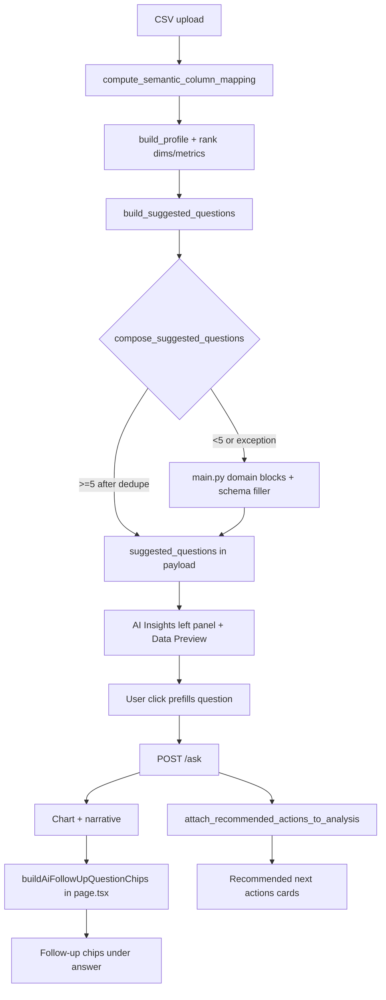

# Suggested Questions & Follow-up Questions — 15-Domain Quality Audit

**Audit date:** June 28, 2026  
**Phase 1 backend:** June 28, 2026  
**Branch:** `DEV`  
**Scope:** Audit (discovery) + **Phase 1 backend implementation** (suggested questions only)  
**Method:** Backend `build_suggested_questions()` per 15×1k fixture; deterministic tests; no LLM, no browser, no frontend changes.

---

## 1. Source files and functions

### Backend — Suggested Questions (upload / dashboard payload)

| File | Function / symbol | Role |
|------|-------------------|------|
| `backend/main.py` | `build_suggested_questions()` | **Primary entry** — ranks dims/metrics, calls engine, dedupes, falls back to domain heuristics + generics |
| `backend/main.py` | `_generic_suggested_questions()` | Fallback when `df` is None or confidence low |
| `backend/main.py` | `_schema_suggested_questions()` | Light schema filler (compare/trend/lead templates) |
| `backend/main.py` | `_dedup_question_list()`, `_normalize_suggested_question_key()` | Near-dup removal, cap at 6 |
| `backend/main.py` | `_suggested_ecommerce_questions()`, `_suggested_manufacturing_questions()` | Legacy domain blocks (used when engine returns &lt;5) |
| `backend/main.py` | `_tpl_compare_avg_across`, `_tpl_trend`, `_tpl_ranking`, `_tpl_outliers`, … | Template strings for legacy path |
| `backend/main.py` | `_compose_upload_payload()` | Injects `suggested_questions` into upload/filtered-dashboard JSON |
| `backend/intent_engine/suggested_questions_engine.py` | `compose_suggested_questions()` | **Engine orchestrator** — builds candidate pool, selects diverse 6 |
| `backend/intent_engine/suggested_questions_engine.py` | `detect_suggestion_vertical()` | Column-name heuristic → banking/retail/marketing/hr/operations/finance/**generic** |
| `backend/intent_engine/suggested_questions_engine.py` | `_generate_basic_candidates()` | Top performer, compare, trend, ranking |
| `backend/intent_engine/suggested_questions_engine.py` | `_generate_executive_candidates()` | Risk/opportunity/concentration + vertical extras |
| `backend/intent_engine/suggested_questions_engine.py` | `_generate_relationship_candidates()` | Driver/factor + **correlation** pair |
| `backend/intent_engine/suggested_questions_engine.py` | `select_diverse_candidates()` | Quota: basic 3, executive 2, relationship 1 |
| `backend/intent_engine/suggested_questions_engine.py` | `prioritize_columns()`, `VERTICAL_*_PRIORITY` | Metric/dimension ordering per vertical |
| `backend/main.py` | `_rank_category_dimensions()`, `_rank_numeric_metrics()` | Schema ranking inputs to engine |
| `backend/main.py` | `infer_auto_dashboard_kind()` | Passed as `dashboard_kind` (often **sales** even for banking/SaaS) |
| `backend/main.py` | `compute_semantic_column_mapping()` | Mapped roles used indirectly via column ranking |

### Backend — Follow-up routing (after user asks, not chip generation)

| File | Function | Role |
|------|----------|------|
| `backend/main.py` | `resolve_follow_up_turn()` | Detects follow-up vs new question; sort/filter ops; scoped meta |
| `backend/main.py` | `_looks_like_follow_up_question()`, `_is_explanation_follow_up()` | Follow-up detection |
| `backend/intent_engine/why_followup_reasoning.py` | `is_why_followup_question()` | “Why …” follow-up classification |
| `backend/intent_engine/recommended_actions.py` | `build_recommended_actions()`, `attach_recommended_actions_to_analysis()` | **Recommended next actions** (separate from chips) |

### Frontend — Display & follow-up chips

| File | Function | Role |
|------|----------|------|
| `frontend/app/page.tsx` | Upload handlers, `visibleSuggestedQuestions`, AI Insights panel | Reads `suggested_questions` from API; prefills question on click (**no auto-send**) |
| `frontend/app/page.tsx` | `buildAiFollowUpQuestionChips()` usage (~L10232) | Builds follow-up chips after each answer |
| `frontend/lib/data-preview-suggested-questions.ts` | `buildDataPreviewSuggestedQuestions()`, `resolveDataPreviewSuggestedQuestions()` | **Data Preview** chip list (can merge API + local polish) |
| `frontend/lib/ai-follow-up-suggestions.ts` | `buildAiFollowUpQuestionChips()` | **Primary follow-up generator** (3–5 chips) |
| `frontend/lib/ai-follow-up-suggestions.ts` | `buildNaturalBusinessFollowUpChips()` | Compare / why / growth chips from chart context |
| `frontend/lib/ai-follow-up-suggestions.ts` | `buildExecutiveLensFollowUpChips()` | Lens-specific chips (risk, opportunity, driver, …) |
| `frontend/lib/ai-follow-up-suggestions.ts` | `buildRelationshipScatterFollowUpChips()` | Scatter-specific follow-ups |
| `frontend/lib/suggested-follow-up-continuation.ts` | `isScopedFollowUpChip()`, `isNewRootAnalyticalChip()` | Scoped drill-down vs new root analysis |
| `frontend/lib/recommended-actions.ts` | Rule-based UI for backend `recommendedActions` | “Recommended next actions” cards |

### Tests (regression guards — not 15-domain coverage)

| File | Covers |
|------|--------|
| `backend/tests/test_suggested_questions_15_domain_quality.py` | **15-domain** upload-time quality: 6 Qs, no generic business, flags, temporal compare, weak correlate |
| `backend/tests/intent_engine/test_suggested_questions_engine.py` | Banking metric diversity, retail executive/relationship, dedupe |
| `backend/tests/intent_engine/test_banking_utilization_routing.py` | Banking utilization **trend** suggestion |
| `backend/tests/intent_engine/test_why_followup_reasoning.py` | Why follow-up backend reasoning |
| `backend/tests/test_follow_up_context.py`, `test_follow_up_domain_chains.py` | Follow-up context / chains |
| `frontend/lib/ai-follow-up-suggestions.test.ts` | Zone/product phrasing, natural business chips |
| `frontend/lib/data-preview-suggested-questions.test.ts` | Data Preview polish/dedupe |

---

## 2. Current generation flow

**Suggested questions:** Generated **once per upload** (and on filtered-dashboard refresh) on the backend. Mix target: ~40% basic, ~40% executive, ~20% relationship (1 correlation slot in practice).

**Follow-up questions:** Generated **on the frontend after each answer**, from last question + chart type/title/series + routing intent/executive lens. **Not** precomputed per domain at upload.

**Data Preview:** May use API list via `resolveDataPreviewSuggestedQuestions()` with local dedupe/polish; Overview AI Insights uses the same API list with hygiene filters in `page.tsx`.

---

## 3. Per-domain suggested questions (current)

Harvested via `build_suggested_questions()` after full upload mapping (June 28, 2026).  
Columns: **Vert** = `detect_suggestion_vertical()` · **Kind** = `infer_auto_dashboard_kind()`.

### retail_ecommerce_1k

| # | Suggested question | Quality notes |
|---|-------------------|---------------|
| 1 | What are the biggest retail business risks? | OK — retail vertical |
| 2 | What is the biggest retail business opportunity? | OK |
| 3 | Which product category drives the most profit? | Strong SME |
| 4 | Compare quantity across regions | Weak — secondary metric vs profit/sales focus |
| 5 | How does discount percentage trend over order date? | Weak — discount not primary KPI |
| 6 | How does profit correlate with quantity? | Relationship slot — acceptable |

**Follow-ups (representative, after Q3 + line chart):** `Why is North highest?` · `Compare profit across product categories` · `Which product category is growing fastest?` · `Which period changed most vs the prior bucket?` · `What is the most important business insight?`

---

### banking_financial_1k

| # | Suggested question | Quality notes |
|---|-------------------|---------------|
| 1 | What are the biggest portfolio risks? | Strong — banking vertical |
| 2 | What is the biggest portfolio opportunity? | Strong |
| 3 | Which customer segment has the highest delinquency rate? | Strong SME |
| 4 | Which customer segment has the highest loan balance? | Strong |
| 5 | Show credit utilization trend by report month | Strong (fixed in 61d0145) |
| 6 | How does loan balance correlate with deposit balance? | OK relationship |

**Vert:** banking · **Kind:** sales (mismatch)  
**Follow-ups:** Segment/delinquency drill-downs; utilization trend continuation; compare loan vs deposit by segment.

---

### hr_workforce_1k

| # | Suggested question | Quality notes |
|---|-------------------|---------------|
| 1 | What are the biggest workforce risks? | OK |
| 2 | What is the biggest workforce opportunity? | OK |
| 3 | Which department has the highest salary? | Strong |
| 4 | Compare attrition flag across status | **P1** — binary flag as metric; odd dim pairing |
| 5 | How does attrition flag trend over hire date? | **P1** — binary flag trend |
| 6 | How does salary correlate with attrition flag? | **P1** — weak binary correlation |

**Follow-ups:** Department salary drill-down; attrition/performance comparisons if chart supports.

---

### healthcare_patient_1k

| # | Suggested question | Quality notes |
|---|-------------------|---------------|
| 1 | What are the biggest business risks? | **P1** — generic, not healthcare |
| 2 | What is the biggest business opportunity? | **P1** — generic |
| 3 | Which department has the highest claim amount? | Strong |
| 4 | Compare readmission rate across segments | Good clinical ops |
| 5 | How does readmission rate trend over visit date? | Good |
| 6 | How does claim amount correlate with readmission rate? | OK clinical relationship |

**Vert:** generic · **Kind:** sales

---

### manufacturing_quality_1k

| # | Suggested question | Quality notes |
|---|-------------------|---------------|
| 1 | What are the biggest operations risks? | OK |
| 2 | What is the biggest operations opportunity? | OK |
| 3 | Which plant has the highest downtime minutes? | Strong ops |
| 4 | Compare defect rate across products | Good — check dim label (“products” vs product_line) |
| 5 | How does defect rate trend over production date? | Strong |
| 6 | How does downtime minutes correlate with defect rate? | OK ops relationship |

**Vert:** operations · **Kind:** operations

---

### marketing_campaign_1k

| # | Suggested question | Quality notes |
|---|-------------------|---------------|
| 1 | What are the biggest marketing risks? | OK |
| 2 | What is the biggest marketing opportunity? | OK |
| 3 | Which channel has the highest revenue? | Strong |
| 4 | Compare conversions across campaigns | Mild — channel vs campaign dim mix |
| 5 | How does conversion rate trend over campaign date? | Strong |
| 6 | How does revenue correlate with conversions? | OK |

**Vert:** marketing · **Kind:** sales

---

### saas_subscription_1k

| # | Suggested question | Quality notes |
|---|-------------------|---------------|
| 1 | What are the biggest business risks? | **P1** — generic, not SaaS |
| 2 | What is the biggest business opportunity? | **P1** |
| 3 | Which customer segment has the highest expansion revenue? | Good SaaS metric |
| 4 | Compare active users across months | **P1** — month as breakdown dimension |
| 5 | How does churn rate trend over month? | Good |
| 6 | How does expansion revenue correlate with active users? | OK |

**Vert:** generic · **Kind:** sales

---

### supply_chain_logistics_1k

| # | Suggested question | Quality notes |
|---|-------------------|---------------|
| 1–2 | Biggest business risks / opportunity | **P1** — generic |
| 3 | Which destination region has the highest freight cost? | Strong |
| 4 | Compare delivery days across regions | Good logistics |
| 5 | How does on time rate trend over ship date? | Good |
| 6 | How does freight cost correlate with delivery days? | OK |

**Vert:** generic · **Kind:** sales

---

### education_student_1k

| # | Suggested question | Quality notes |
|---|-------------------|---------------|
| 1–2 | Biggest business risks / opportunity | **P1** — generic |
| 3 | Which school region has the highest attendance rate? | Good |
| 4 | Compare enrollment count across levels | Good |
| 5 | How does attendance rate trend over term date? | Good |
| 6 | What are the top 5 school region ranked by pass rate? | Good ranking (no forced correlation) |

**Vert:** generic · **Kind:** sales

---

### insurance_claims_1k

| # | Suggested question | Quality notes |
|---|-------------------|---------------|
| 1–2 | Biggest business risks / opportunity | **P1** — generic |
| 3 | Which region has the highest claim amount? | Strong |
| 4 | Compare fraud flag across types | **P1** — binary flag as compare metric |
| 5 | How does loss ratio trend over claim date? | Good |
| 6 | How does claim amount correlate with fraud flag? | **P1** — weak binary correlation |

**Vert:** generic · **Kind:** sales

---

### real_estate_property_1k

| # | Suggested question | Quality notes |
|---|-------------------|---------------|
| 1–2 | Biggest business risks / opportunity | **P1** — generic |
| 3 | Which listing status has the highest sale price? | Good |
| 4 | Compare cap rate across regions | Strong CRE |
| 5 | How does cap rate trend over list date? | Good |
| 6 | How does sale price correlate with cap rate? | OK |

**Vert:** generic · **Kind:** sales

---

### telecom_usage_1k

| # | Suggested question | Quality notes |
|---|-------------------|---------------|
| 1–2 | Biggest business risks / opportunity | **P1** — generic |
| 3 | Which market region has the highest monthly revenue? | Strong |
| 4 | Compare churn rate across tiers | Strong telecom |
| 5 | How does churn rate trend over billing month? | Good |
| 6 | How does monthly revenue correlate with churn rate? | OK |

**Vert:** generic · **Kind:** sales

---

### hospitality_bookings_1k

| # | Suggested question | Quality notes |
|---|-------------------|---------------|
| 1–2 | Biggest business risks / opportunity | **P1** — generic |
| 3 | Which hotel brand has the highest room revenue? | Strong |
| 4 | Compare avg daily rate across markets | Good |
| 5 | How does avg daily rate trend over check in date? | Good |
| 6 | How does room revenue correlate with avg daily rate? | OK |

**Vert:** generic · **Kind:** sales

---

### energy_utilization_1k

| # | Suggested question | Quality notes |
|---|-------------------|---------------|
| 1–2 | Biggest business risks / opportunity | **P1** — generic |
| 3 | Which facility type has the highest utility cost? | Strong |
| 4 | Compare efficiency score across regions | Good |
| 5 | How does efficiency score trend over reading date? | Good |
| 6 | How does utility cost correlate with efficiency score? | OK |

**Vert:** generic · **Kind:** sales

---

### support_tickets_1k

| # | Suggested question | Quality notes |
|---|-------------------|---------------|
| 1–2 | Biggest business risks / opportunity | **P1** — generic |
| 3 | Which priority has the highest csat score? | **P1** — odd framing (priority vs satisfaction) |
| 4 | Compare escalations across regions | Good |
| 5 | How does csat score trend over opened date? | Good |
| 6 | What are the top 5 priority ranked by resolution hours? | Strong ops |

**Vert:** generic · **Kind:** sales

---

## 4. Follow-up questions — cross-cutting behavior

Follow-ups are **not** in the upload payload. After a typical **line trend** answer to question #3, the frontend emits a recurring pattern:

| Chip pattern | Source | Quality |
|--------------|--------|---------|
| `Why is {top} highest?` | `buildNaturalBusinessFollowUpChips` | Good when bar-like; weak on line-only |
| `Compare {metric} across {plural}` | Natural business | Often duplicates suggested Q |
| `Which {dim} is growing fastest?` / `Which period changed most…` | Line/area extras | Good for trends |
| `Which {dim} has the highest {metric}?` | Natural business | Often duplicates suggested Q |
| `What is the most important business insight?` | `buildAiFollowUpQuestionChips` | **P1** — generic |
| Scatter path | `buildRelationshipScatterFollowUpChips` | OK when user explicitly got scatter |
| Executive lens path | `buildExecutiveLensFollowUpChips` | Good when lens detected |

**Recommended next actions** (backend `recommended_actions.py`) are a third prompt surface — evidence-based drilldown/validation strings attached to analysis, not the same as follow-up chips.

---

## 5. P1 quality issues only

| ID | Issue | Affected domains | Root cause layer |
|----|-------|------------------|------------------|
| **SQ-P1-01** | **Generic executive pair** (“biggest business risks/opportunity”) on 9/15 fixtures | healthcare, saas, supply_chain, education, insurance, real_estate, telecom, hospitality, energy, support | `detect_suggestion_vertical()` returns `generic`; `VERTICAL_DOMAIN_NOUN.generic` = “business” |
| **SQ-P1-02** | **Forced correlation slot** (exactly 1 per domain when ≥2 metrics) often pairs weak/b binary fields | hr (attrition flag), insurance (fraud flag), retail (quantity), many others | `select_diverse_candidates` relationship quota + `_generate_relationship_candidates` always adds correlation |
| **SQ-P1-03** | **Binary / flag columns used as trend or compare metrics** | hr (`attrition flag` trend/compare), insurance (`fraud flag` compare/correlate) | `_generate_basic_candidates` does not exclude boolean/low-cardinality flags |
| **SQ-P1-04** | **Temporal column as breakdown dimension** (“across months”) | saas (`Compare active users across months`) | Compare template uses ranked category dims without temporal-dimension guard (mirrors Overview month issue) |
| **SQ-P1-05** | **Vertical vs dashboard_kind mismatch** — banking/SaaS/healthcare use `sales` kind but column vertical differs | banking (vert=banking, kind=sales), most 1k generics | `compose_suggested_questions` uses `detect_suggestion_vertical(columns)` not executive domain / mapping domain |
| **SQ-P1-06** | **Secondary metric leakage** in basic slot | retail (quantity, discount % vs sales/profit) | `prioritize_columns` + second-metric compare/ranking slots |
| **SQ-P1-07** | **Awkward SME phrasing** | support (“Which priority has the highest csat score?”) | Top-performer template without domain sanity check |
| **FU-P1-01** | **Generic follow-up chip** “What is the most important business insight?” on most answers | All (frontend) | Hardcoded in `buildAiFollowUpQuestionChips` |
| **FU-P1-02** | **Suggested ↔ follow-up duplication** (“Which X has the highest Y?” appears in both panels) | Most domains | No cross-panel dedupe between API suggestions and post-answer chips |
| **FU-P1-03** | **Profit-centric follow-up defaults** when schema has no profit | healthcare, hr, support, … | `buildNaturalBusinessFollowUpChips` profit branch / alternate metrics |

**Not P1 (acceptable or lower priority):** Single correlation on meaningful pairs (loan/deposit, revenue/conversions); banking portfolio wording; manufacturing/retail/marketing vertical nouns; education/support skipping correlation for ranking slot.

---

## 6. Minimal safe implementation plan (do not implement until approved)

### Phase 1 — Backend suggested questions — **IMPLEMENTED** (see §9)

1. **Extend `detect_suggestion_vertical()`** (or map from executive/mapping domain) for: `healthcare`, `saas`, `insurance`, `real_estate`, `telecom`, `hospitality`, `energy`, `customer_support`, `education`, `supply_chain` — add `VERTICAL_DOMAIN_NOUN` + metric/dimension priority tokens only.
2. **Gate correlation candidates:** skip when metric is boolean/flag/rate-with-binary-cardinality; require semantic pair quality score before consuming relationship quota.
3. **Block temporal breakdown dims** in compare/ranking templates (`month`, `report_month`, …) — reuse same policy as Overview auto-dashboard temporal guard.
4. **Exclude flag/binary columns** from trend and compare intents in `_generate_basic_candidates`.
5. **Prefer primary mapped metric** for basic slots (use mapping roles / first ranked business metric, not index 2/3).

**Do not touch:** Overview chart selection, scatter prune policy, export, H-Bar/V-Bar, mapping confidence aggregates.

### Phase 2 — Frontend follow-ups (narrow)

1. Remove or gate **FU-P1-01** generic insight chip behind empty chip list only.
2. Add **dedupe against last question + visible suggested list** when building follow-up chips.
3. Suppress profit follow-ups when no profit-like column in schema.

### Phase 3 — Regression tests (proposed)

| Test file | Assertion |
|-----------|-----------|
| `backend/tests/test_suggested_questions_15_domain.py` (new) | Per 1k fixture: no “business risks” on healthcare/SaaS; no flag trend; no “across months”; ≤1 correlation; no duplicate normalized keys |
| Extend `test_suggested_questions_engine.py` | Healthcare/SaaS vertical noun; flag exclusion |
| `frontend/lib/ai-follow-up-suggestions.test.ts` | No generic insight chip when ≥3 quality chips; dedupe vs lastQuestion |
| Optional snapshot | Normalized question keys per fixture in test data JSON |

---

## 7. Summary scores (deterministic rubric)

| Domain | Domain relevance | Metric relevance | Dim relevance | SME usefulness | Overall |
|--------|------------------|------------------|---------------|----------------|---------|
| retail_ecommerce_1k | High | Medium | High | Medium | **B** |
| banking_financial_1k | High | High | High | High | **A-** |
| hr_workforce_1k | High | Low | Medium | Low | **C+** |
| healthcare_patient_1k | Low | Medium | High | Medium | **C** |
| manufacturing_quality_1k | High | High | High | High | **B+** |
| marketing_campaign_1k | High | High | Medium | High | **B+** |
| saas_subscription_1k | Low | Medium | Low | Medium | **C** |
| supply_chain_logistics_1k | Low | High | High | Medium | **C+** |
| education_student_1k | Low | High | High | Medium | **C+** |
| insurance_claims_1k | Low | Medium | Medium | Low | **C-** |
| real_estate_property_1k | Low | High | High | Medium | **C+** |
| telecom_usage_1k | Low | High | High | Medium | **C+** |
| hospitality_bookings_1k | Low | High | High | Medium | **C+** |
| energy_utilization_1k | Low | High | High | Medium | **C+** |
| support_tickets_1k | Low | Medium | Medium | Low | **C-** |

**Aggregate:** 3 strong (banking, manufacturing, marketing), 4 acceptable with generic executive wording, 8 need vertical calibration and/or flag/correlation guards.

---

## 8. Audit artifacts

- Harvest script: inline `backend` Python probe (June 28, 2026) — not committed.
- Phase 1 harvest: `tests/test_suggested_questions_15_domain_quality.py` `_bind_fixture()` path (June 28, 2026).

---

## 9. Phase 1 backend implementation (completed)

### 9.1 Files changed

| File | Change |
|------|--------|
| `backend/intent_engine/suggested_questions_engine.py` | Domain verticals, metric/dim filters, correlation gating, phrasing helpers |
| `backend/main.py` | Pass `mapped_primary` + `executive_domain` into `compose_suggested_questions()` |
| `backend/tests/test_suggested_questions_15_domain_quality.py` | **New** — 15-fixture regression suite (14 test methods) |
| `docs/current-snapshot/suggested-questions-15-domain-quality.md` | This section |

**Not modified:** Overview defaults, chart rendering, export/PDF, H-Bar/V-Bar, mapping confidence, frontend follow-ups, recommended actions, AI narrative.

### 9.2 Issues fixed (backend P1)

| ID | Fix |
|----|-----|
| **SQ-P1-01** | Extended `detect_suggestion_vertical()` + `resolve_suggestion_vertical()` (from executive domain) and `VERTICAL_DOMAIN_NOUN` / metric-dimension priorities for healthcare, SaaS, support, supply chain, education, insurance, real estate, hospitality, energy, telecom. Generic “business risks/opportunity” replaced with domain nouns (e.g. patient care, subscription, logistics). |
| **SQ-P1-02** | Correlation slot only when `_correlation_pair_allowed()` passes (strong pair, no flags, min cardinality). `select_diverse_candidates()` skips relationship quota when no correlation candidates; ranking/executive fills slot instead. |
| **SQ-P1-03** | `_is_flag_metric_name()`, `_is_binary_numeric_metric()`, `_filter_suggest_metrics()` exclude flag/binary fields from trend, compare, and correlation. |
| **SQ-P1-04** | `_is_temporal_breakdown_dimension()` + `_filter_breakdown_dims()` block month/date/week/period from compare/ranking breakdowns; time fields remain for trend only. |
| **SQ-P1-06** | `_reorder_primary_first()` + `_is_weak_secondary_metric()`; basic slots prefer mapped primary metric; weak secondaries (quantity, discount %, etc.) demoted. |
| **SQ-P1-07** | `_format_top_performer_question()` + support-specific executive phrasing (CSAT risk, resolution bottleneck). |

**Deferred:** SQ-P1-05 (vertical vs `infer_auto_dashboard_kind` mismatch) — read-only executive domain hint added but dashboard_kind unchanged.

### 9.3 Before → after summary (15 fixtures)

| Domain | Before (audit) | After (Phase 1) |
|--------|----------------|-----------------|
| retail | Generic OK; quantity/discount leakage; profit↔quantity correlate | Retail nouns kept; sales/profit focus; no quantity compare or discount trend |
| banking | Strong (portfolio, utilization) | Unchanged portfolio/utilization; spend/loan correlate (still strong) |
| hr | attrition flag trend/compare/correlate | Salary/performance; ranking by performance rating; no flag wording |
| healthcare | Generic “business” executive pair | “Patient care” risks/opportunity; readmission trend + ranking |
| manufacturing | Strong ops | Operations nouns kept; primary-metric slots (units produced, defect trend, downtime ranking) |
| marketing | Strong | Marketing nouns kept; revenue/conversions focus; ranking instead of weak correlate |
| saas | Generic “business”; compare across **months** | “Subscription” executive pair; MRR/churn; no temporal compare |
| supply_chain | Generic “business” | “Logistics” executive pair; freight/on-time focus |
| education | Generic “business” | “Student outcomes” executive pair |
| insurance | Generic “business”; fraud flag compare/correlate | “Claims” executive pair; loss ratio trend; no fraud flag |
| real_estate | Generic “business” | “Property” executive pair; cap rate trend |
| telecom | Generic “business” | “Subscriber” executive pair; churn/revenue focus |
| hospitality | Generic “business” | “Hospitality” executive pair; occupancy trend |
| energy | Generic “business” | “Energy” executive pair; utility ranking + strong kwh↔cost correlate |
| support | Generic “business”; “Which priority has the highest csat score?” | “Customer support” executive pair; natural CSAT/ranking/bottleneck phrasing |

### 9.4 Post-fix suggested questions (harvest)

**retail_ecommerce_1k:** retail risks/opportunity · product category profit driver · highest sales by category · compare sales across regions · sales↔profit correlate

**banking_financial_1k:** portfolio risks/opportunity · delinquency by segment · spend by segment · credit utilization trend · spend↔loan correlate

**hr_workforce_1k:** workforce risks/opportunity · highest salary by department · compare salary across levels · top 5 departments by performance rating · salary↔performance correlate

**healthcare_patient_1k:** patient care risks/opportunity · claim amount by department · compare claims across segments · readmission rate trend · top departments by readmission rate

**manufacturing_quality_1k:** operations risks/opportunity · units produced by plant · compare units across products · defect rate trend · top plants by downtime

**marketing_campaign_1k:** marketing risks/opportunity · revenue by channel · compare revenue across campaigns · conversion rate trend · top channels by conversions

**saas_subscription_1k:** subscription risks/opportunity · MRR by plan type · compare MRR across segments · churn rate trend · top plan types by churn rate

**supply_chain_logistics_1k:** logistics risks/opportunity · freight cost by carrier · compare freight across regions · on-time rate trend · top carriers by on-time rate

**education_student_1k:** student outcomes risks/opportunity · enrollment by grade level · compare enrollment across regions · pass rate trend · top grade levels by pass rate

**insurance_claims_1k:** claims risks/opportunity · claim amount by policy type · compare claims across regions · loss ratio trend · top policy types by loss ratio

**real_estate_property_1k:** property risks/opportunity · sale price by property type · compare sale price across regions · cap rate trend · top property types by cap rate

**telecom_usage_1k:** subscriber risks/opportunity · monthly revenue by plan tier · compare revenue across regions · churn rate trend · top tiers by churn rate

**hospitality_bookings_1k:** hospitality risks/opportunity · room revenue by brand · compare room revenue across markets · occupancy rate trend · top brands by occupancy

**energy_utilization_1k:** energy risks/opportunity · energy kWh by facility type · compare kWh across regions · top facility types by utility cost · kWh↔utility cost correlate

**support_tickets_1k:** customer support risks/opportunity · tickets opened by category · compare tickets across priorities · top categories by CSAT · resolution bottleneck by category

### 9.5 Tests added

| File | Coverage |
|------|----------|
| `backend/tests/test_suggested_questions_15_domain_quality.py` | All 15 fixtures via `build_suggested_questions()`: 6 questions, no dupes, no generic business executive wording, no flag metrics, no temporal compare breakdown, no ID dims, no weak flag correlations, domain noun hints, banking/marketing/manufacturing/HR/support/retail guards |

Existing `backend/tests/intent_engine/test_suggested_questions_engine.py` — **unchanged behavior, all pass**.

### 9.6 Test results (June 28, 2026)

| Suite | Result |
|-------|--------|
| `tests/test_suggested_questions_15_domain_quality.py` + `tests/intent_engine/test_suggested_questions_engine.py` | **20 passed** |
| `tests/test_cross_domain_15_overview_validation.py` + `tests/intent_engine/test_banking_utilization_routing.py` | **9 passed** |
| Full `backend/tests/` | **492 passed**, 0 failed |

(Baseline before Phase 1: 478 backend tests.)

### 9.7 Remaining deferred (Phase 2+)

| ID | Layer | Notes |
|----|-------|-------|
| **SQ-P1-05** | Backend | Align `detect_suggestion_vertical()` with `infer_auto_dashboard_kind()` / mapping domain where safe |
| **FU-P1-01** | Frontend | Remove/gate generic “most important business insight?” chip |
| **FU-P1-02** | Frontend | Dedupe follow-up chips vs suggested-question list |
| **FU-P1-03** | Frontend | Suppress profit-centric follow-ups when schema has no profit column |
| Export/PDF | — | Out of scope |

**Next step:** Phase 2 frontend follow-up chip fixes when approved.

---

## 10. Final verification pass (June 28, 2026)

**Method:** Deterministic `build_suggested_questions()` probe on all 15×1k fixtures (same path as regression tests). No production code changes.

**Targeted tests re-run:** `test_suggested_questions_15_domain_quality.py` + `test_suggested_questions_engine.py` — **20 passed**.

### Aggregate

| Check | Result |
|-------|--------|
| All fixtures produce 6 questions | **15/15** |
| Generic “biggest business risks/opportunity” | **0/15** |
| Binary flag metric wording | **0/15** |
| Temporal column as compare breakdown | **0/15** |
| Weak flag correlations | **0/15** |
| Domain-aware vertical resolved | **15/15** (column heuristics; executive domain assists support/banking/hr/healthcare/SaaS) |
| `dashboard_kind` still `sales` on 12/15 | Expected — **SQ-P1-05 deferred** |

### Residual minor wording (acceptable for Phase 1)

- **banking:** `spend_amount` as mapped primary; Q4 “highest spend” alongside delinquency (banking-native loan/deposit compare demoted).
- **retail / hr / support / energy:** no dedicated **trend** slot in final 6 (ranking/correlate/bottleneck fills relationship quota instead).
- **manufacturing:** top slot is **units produced**; downtime/defect appear in trend + ranking slots (primary-metric bias).
- **support:** volume metric (`tickets_opened`) in Q3–Q4; CSAT/bottleneck covered in Q5–Q6.
- **Grammar:** “top 5 {dim} ranked by {metric}” template remains slightly awkward across several domains — cosmetic, not a P1 blocker.

**Verdict:** Phase 1 backend goals met; safe to commit. Phase 2 = frontend follow-up chips only.
