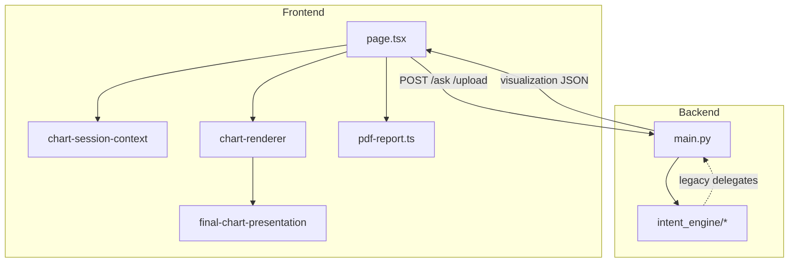

# AI Data Analyst App — File Map

**Generated:** June 2026  
**Companion:** [`project-snapshot.md`](project-snapshot.md)

Each entry: **path** · **purpose** · **dependencies** (what it imports or relies on).

---

## Root documentation

| File | Purpose | Dependencies |
|------|---------|--------------|
| [`AGENTS.md`](../AGENTS.md) | Cursor/agent rules: incremental changes, baseline preservation | Links to all `*_STABLE_*.md` |
| [`PROJECT_ARCHITECTURE_SUMMARY.md`](../PROJECT_ARCHITECTURE_SUMMARY.md) | Stack, tabs, API, pipelines | Codebase |
| [`LATEST_STABLE_UI_SNAPSHOT.md`](../LATEST_STABLE_UI_SNAPSHOT.md) | UI recovery point | `globals.css`, `page.tsx` |
| [`UI_BASELINE_RULES.md`](../UI_BASELINE_RULES.md) | Spacing, filters, metadata placement rules | UI components |
| [`UI_ARCHITECTURE_SNAPSHOT.md`](../UI_ARCHITECTURE_SNAPSHOT.md) | High-level UI regions | `page.tsx` |
| [`AI_INSIGHTS_STABLE_SUMMARY.md`](../AI_INSIGHTS_STABLE_SUMMARY.md) | Insights tab gates and layout | `page.tsx`, `ai-insights-ui.ts` |
| [`CHARTS_STABLE_SUMMARY.md`](../CHARTS_STABLE_SUMMARY.md) | Charts tab session behavior | `chart-session-context.tsx` |
| [`DATA_PREVIEW_STABLE_SUMMARY.md`](../DATA_PREVIEW_STABLE_SUMMARY.md) | Preview search/sort/pagination | Data preview components |
| [`PDF_EXPORT_STABLE_BASELINE.md`](../PDF_EXPORT_STABLE_BASELINE.md) | PDF section order and capture | `pdf-report.ts` |
| [`AI_VISUALIZATION_BEHAVIOR.md`](../AI_VISUALIZATION_BEHAVIOR.md) | Chart kind selection rules | `final-chart-presentation.ts` |
| [`docs/intent-engine-migration-log.md`](intent-engine-migration-log.md) | Phase 1 intent engine notes | `intent_engine/` |
| [`docs/project-snapshot.md`](project-snapshot.md) | This handoff snapshot | — |
| [`docs/file-map.md`](file-map.md) | This file | — |

---

## Frontend — App entry

| File | Purpose | Dependencies |
|------|---------|--------------|
| [`frontend/app/layout.tsx`](../frontend/app/layout.tsx) | Root layout, fonts, theme script | `globals.css`, `theme-script.tsx` |
| [`frontend/app/page.tsx`](../frontend/app/page.tsx) | **Main SPA**: all tabs, upload, filters, AI, charts, export | Most `lib/*`, `components/*`, `chart-session-context`, backend `localhost:8000` |
| [`frontend/app/globals.css`](../frontend/app/globals.css) | CSS variables, theme, `.data-preview-*`, `.ai-insights-page`, filters | Tailwind v4 |
| [`frontend/app/chart-types.ts`](../frontend/app/chart-types.ts) | `ChartKind`, `ChartRow` types | Used by renderer + session |
| [`frontend/app/dashboard-filter-types.ts`](../frontend/app/dashboard-filter-types.ts) | Filter entry types for API payloads | `FilterPanel`, `/ask`, `/filtered-dashboard` |
| [`frontend/app/pdf-report.ts`](../frontend/app/pdf-report.ts) | `runExecutivePdfExport`, jsPDF, Canvg, chart embed | `pdf-enterprise-style.ts`, `metric-value-format.ts`, capture refs from `page.tsx` |

---

## Frontend — Context

| File | Purpose | Dependencies |
|------|---------|--------------|
| [`frontend/contexts/chart-session-context.tsx`](../frontend/contexts/chart-session-context.tsx) | Chart list, `pushAIChart`, auto-dashboard sync, invalidation | `selected-visualization.ts`, `chart-types.ts` |

---

## Frontend — App shell

| File | Purpose | Dependencies |
|------|---------|--------------|
| [`frontend/components/app-shell/app-shell.tsx`](../frontend/components/app-shell/app-shell.tsx) | Sidebar + header + main layout | `app-sidebar`, `app-header` |
| [`frontend/components/app-shell/app-sidebar.tsx`](../frontend/components/app-shell/app-sidebar.tsx) | Nav, collapse state | `nav-config.tsx`, `sidebar-prefs.ts` |
| [`frontend/components/app-shell/app-header.tsx`](../frontend/components/app-shell/app-header.tsx) | Title, dataset badge, theme toggle | `theme-toggle.tsx` |
| [`frontend/components/app-shell/nav-config.tsx`](../frontend/components/app-shell/nav-config.tsx) | Tab definitions and icons | `main-nav-tabs.tsx` ids |
| [`frontend/components/theme-script.tsx`](../frontend/components/theme-script.tsx) | FOUC-free theme init | `theme.ts`, `localStorage` |
| [`frontend/components/theme-toggle.tsx`](../frontend/components/theme-toggle.tsx) | Light/dark control | `theme.ts` |

---

## Frontend — Home / shared components

| File | Purpose | Dependencies |
|------|---------|--------------|
| [`frontend/app/components/home/main-nav-tabs.tsx`](../frontend/app/components/home/main-nav-tabs.tsx) | Tab button UI | `MainNavTabId` from `page.tsx` |
| [`frontend/app/components/home/filter-panel.tsx`](../frontend/app/components/home/filter-panel.tsx) | Dimension filters + date range bar | `dashboard-filter-types`, `filter-date-field.tsx`, `overview-ui` / dashboard tokens |
| [`frontend/app/components/home/filter-date-field.tsx`](../frontend/app/components/home/filter-date-field.tsx) | Date input inside grouped range | `FilterPanel` |
| [`frontend/app/components/home/chart-renderer.tsx`](../frontend/app/components/home/chart-renderer.tsx) | **Recharts** plots (bar, line, scatter, pie, histogram) | `chart-layout-config.ts`, `final-chart-presentation.ts`, axis formatters |
| [`frontend/app/components/home/chart-insight-viewport-wrapper.tsx`](../frontend/app/components/home/chart-insight-viewport-wrapper.tsx) | Centering, max width/height for plots | Insights + Charts + PDF |
| [`frontend/app/components/home/charts-timeline-aside.tsx`](../frontend/app/components/home/charts-timeline-aside.tsx) | Charts tab left timeline | `chart-session-context` |
| [`frontend/app/components/home/charts-tab-intelligence-strip.tsx`](../frontend/app/components/home/charts-tab-intelligence-strip.tsx) | Source/type/measure chips | `charts-tab-ui.ts` |
| [`frontend/app/components/home/charts-tab-chart-reason.tsx`](../frontend/app/components/home/charts-tab-chart-reason.tsx) | “Why this chart” copy | `generate-chart-reason.ts` |
| [`frontend/app/components/home/charts-tab-plot-transition.tsx`](../frontend/app/components/home/charts-tab-plot-transition.tsx) | Plot transition pending state | Charts tab |
| [`frontend/app/components/home/overview/overview-kpi-card.tsx`](../frontend/app/components/home/overview/overview-kpi-card.tsx) | Overview KPI tile | `overview-ui.ts` |
| [`frontend/app/components/home/overview/overview-ai-summary.tsx`](../frontend/app/components/home/overview/overview-ai-summary.tsx) | Overview AI blurb panel | Upload response |
| [`frontend/app/components/home/overview-upload-selected-state.tsx`](../frontend/app/components/home/overview-upload-selected-state.tsx) | Pre-upload file confirmation | Overview upload |
| [`frontend/app/components/home/overview-inline-kpi-chip.tsx`](../frontend/app/components/home/overview-inline-kpi-chip.tsx) | Compact KPI chip variant | Overview |
| [`frontend/app/components/home/data-preview-dataset-context.tsx`](../frontend/app/components/home/data-preview-dataset-context.tsx) | Dataset metadata strip (Preview tab) | `data-preview-ui.ts` |
| [`frontend/app/components/home/data-preview-column-header.tsx`](../frontend/app/components/home/data-preview-column-header.tsx) | Sortable column header + profile popover | `data-preview-sort.ts` |
| [`frontend/app/components/home/data-preview-copy-cell.tsx`](../frontend/app/components/home/data-preview-copy-cell.tsx) | Copyable cell value | Clipboard API |
| [`frontend/app/components/home/data-preview-sort-icons.tsx`](../frontend/app/components/home/data-preview-sort-icons.tsx) | Sort direction icons | Column header |

---

## Frontend — AI Insights components

| File | Purpose | Dependencies |
|------|---------|--------------|
| [`frontend/app/components/ai-insight-chart-shell.tsx`](../frontend/app/components/ai-insight-chart-shell.tsx) | Insight chart frame, metadata chips, PDF capture root | `ai-insights-ui.ts`, `ChartInsightViewportWrapper` |
| [`frontend/app/components/SmartChartInsightPanel.tsx`](../frontend/app/components/SmartChartInsightPanel.tsx) | “AI Read on this chart” panel | `smart-chart-intelligence.ts` |
| [`frontend/app/components/ai-insight-answer-body.tsx`](../frontend/app/components/ai-insight-answer-body.tsx) | Parsed markdown-like answer sections | `insight-narrative-tone.ts` |
| [`frontend/app/components/ai-executive-insights-panel.tsx`](../frontend/app/components/ai-executive-insights-panel.tsx) | Executive insight card grid | Cards from `page.tsx` memo |
| [`frontend/app/components/intent-engine-debug-panel.tsx`](../frontend/app/components/intent-engine-debug-panel.tsx) | Debug intent JSON (env-gated) | `analysis-intent-debug.ts` |
| [`frontend/app/components/chart-category-axis-tick.tsx`](../frontend/app/components/chart-category-axis-tick.tsx) | Custom X tick rendering | `ChartRenderer` |
| [`frontend/app/components/chart-value-axis-title.tsx`](../frontend/app/components/chart-value-axis-title.tsx) | Y-axis title layout | `ChartRenderer` |

---

## Frontend — Lib: chart pipeline

| File | Purpose | Dependencies |
|------|---------|--------------|
| [`frontend/lib/selected-visualization.ts`](../frontend/lib/selected-visualization.ts) | Frozen chart contract, trend mode, zip pairs | `chart-session-context`, API viz shape |
| [`frontend/lib/final-chart-presentation.ts`](../frontend/lib/final-chart-presentation.ts) | **Pipeline A** kind + orientation | `chart-types`, question keywords, API type |
| [`frontend/lib/chart-layout-config.ts`](../frontend/lib/chart-layout-config.ts) | Margins, bar sizing, histogram bins | `ChartRenderer` |
| [`frontend/lib/chart-axis-layout.ts`](../frontend/lib/chart-axis-layout.ts) | Axis layout helpers | Renderer |
| [`frontend/lib/chart-axis-formatters.ts`](../frontend/lib/chart-axis-formatters.ts) | Tick formatters | `metric-value-format.ts` |
| [`frontend/lib/chart-time-x-axis.ts`](../frontend/lib/chart-time-x-axis.ts) | Temporal axis labeling | Trend charts |
| [`frontend/lib/chart-palette.ts`](../frontend/lib/chart-palette.ts) | Series colors | Recharts |
| [`frontend/lib/chart-png-capture.ts`](../frontend/lib/chart-png-capture.ts) | PNG capture helpers | Export |
| [`frontend/lib/overview-chart-heuristics.ts`](../frontend/lib/overview-chart-heuristics.ts) | **Pipeline B** overview mini charts | Overview only |
| [`frontend/lib/generate-chart-reason.ts`](../frontend/lib/generate-chart-reason.ts) | Human chart selection rationale | Charts tab |
| [`frontend/lib/canonical-chart-title.ts`](../frontend/lib/canonical-chart-title.ts) | Title normalization | Display + PDF |
| [`frontend/lib/normalized-viz-metadata.ts`](../frontend/lib/normalized-viz-metadata.ts) | Viz metadata normalization | `page.tsx` |
| [`frontend/lib/relationship-scatter-labels.ts`](../frontend/lib/relationship-scatter-labels.ts) | Scatter point label rules | Relationship charts |

---

## Frontend — Lib: AI Insights & alignment

| File | Purpose | Dependencies |
|------|---------|--------------|
| [`frontend/lib/ai-insights-ui.ts`](../frontend/lib/ai-insights-ui.ts) | Tailwind token strings for Insights layout | `page.tsx`, `globals.css` |
| [`frontend/lib/chart-question-intent.ts`](../frontend/lib/chart-question-intent.ts) | `chartSnapshotMatchesQuestionIntent` gate | Blocks wrong chart types |
| [`frontend/lib/insight-aligned-axis-merge.ts`](../frontend/lib/insight-aligned-axis-merge.ts) | Merge aligned analysis axis labels | API `alignedAnalysis` |
| [`frontend/lib/insight-confidence.ts`](../frontend/lib/insight-confidence.ts) | Display confidence; trusts backend score | API analysis fields |
| [`frontend/lib/insight-narrative-tone.ts`](../frontend/lib/insight-narrative-tone.ts) | Answer section styling rules | `AiInsightAnswerBody` |
| [`frontend/lib/insight-card-titles.ts`](../frontend/lib/insight-card-titles.ts) | Executive card title resolution | `executive-insight-ranking.ts` |
| [`frontend/lib/smart-chart-intelligence.ts`](../frontend/lib/smart-chart-intelligence.ts) | AI Read: recommendCore, presentation labels | Charts + Insights |
| [`frontend/lib/chart-insight-answers.ts`](../frontend/lib/chart-insight-answers.ts) | Chart-specific insight Q&A helpers | Smart panel |
| [`frontend/lib/chart-semantic-metadata.ts`](../frontend/lib/chart-semantic-metadata.ts) | Semantic context for charts | Metadata chips |
| [`frontend/lib/analysis-intent-debug.ts`](../frontend/lib/analysis-intent-debug.ts) | Parse `analysis.intent` for debug UI | Debug panel |
| [`frontend/lib/ai-follow-up-suggestions.ts`](../frontend/lib/ai-follow-up-suggestions.ts) | Follow-up chip generation | Dimension + measure from chart |
| [`frontend/lib/ai-follow-up-suggestions.test.ts`](../frontend/lib/ai-follow-up-suggestions.test.ts) | Vitest-style unit tests (not in npm scripts) | Vitest (dev only) |

---

## Frontend — Lib: executive & relationship viz

| File | Purpose | Dependencies |
|------|---------|--------------|
| [`frontend/lib/relationship-visualization.ts`](../frontend/lib/relationship-visualization.ts) | Parse `relationshipInsights`; **Pearson/strength/direction cards** | API scatter responses |
| [`frontend/lib/executive-insight-ranking.ts`](../frontend/lib/executive-insight-ranking.ts) | Map `rankedExecutiveInsights` → cards | Category bar charts |
| [`frontend/lib/executive-insights-brief.ts`](../frontend/lib/executive-insights-brief.ts) | Brief text helpers for executive layer | PDF + UI |
| [`frontend/lib/trend-visualization.ts`](../frontend/lib/trend-visualization.ts) | Trend executive cards | Time-series responses |
| [`frontend/lib/derived-profit-margin.ts`](../frontend/lib/derived-profit-margin.ts) | Profit margin executive insights | Derived metric charts |

---

## Frontend — Lib: unsupported analysis UX

| File | Purpose | Dependencies |
|------|---------|--------------|
| [`frontend/lib/unsupported-growth-analysis.ts`](../frontend/lib/unsupported-growth-analysis.ts) | Growth unsupported cards + copy | API `unsupportedGrowthAnalysis` |
| [`frontend/lib/unsupported-decline-analysis.ts`](../frontend/lib/unsupported-decline-analysis.ts) | Decline unsupported cards | API decline metadata |
| [`frontend/lib/unsupported-trend-analysis.ts`](../frontend/lib/unsupported-trend-analysis.ts) | Trend unsupported cards | Trend routing failures |
| [`frontend/lib/unsupported-multi-metric-analysis.ts`](../frontend/lib/unsupported-multi-metric-analysis.ts) | Missing metric operand UX | Multi-metric compare |

---

## Frontend — Lib: Data Preview

| File | Purpose | Dependencies |
|------|---------|--------------|
| [`frontend/lib/data-preview-ui.ts`](../frontend/lib/data-preview-ui.ts) | Table/pagination Tailwind tokens | Preview components |
| [`frontend/lib/data-preview-sort.ts`](../frontend/lib/data-preview-sort.ts) | Typed sort compare + cycle | `profile.column_types` |
| [`frontend/lib/data-preview-missing.ts`](../frontend/lib/data-preview-missing.ts) | NULL detection, search tokens | Search highlight |

---

## Frontend — Lib: tab tokens & misc

| File | Purpose | Dependencies |
|------|---------|--------------|
| [`frontend/lib/overview-ui.ts`](../frontend/lib/overview-ui.ts) | Overview cards, upload, filters | Overview tab |
| [`frontend/lib/charts-tab-ui.ts`](../frontend/lib/charts-tab-ui.ts) | Charts tab tokens | Charts layout |
| [`frontend/lib/export-tab-ui.ts`](../frontend/lib/export-tab-ui.ts) | Export tab tokens | Export tab |
| [`frontend/lib/ui-buttons.ts`](../frontend/lib/ui-buttons.ts) | Shared button variants | Multiple tabs |
| [`frontend/lib/theme.ts`](../frontend/lib/theme.ts) | Theme keys and storage | Theme toggle |
| [`frontend/lib/sidebar-prefs.ts`](../frontend/lib/sidebar-prefs.ts) | Sidebar collapse persistence | `localStorage` |
| [`frontend/lib/analytics-metadata.ts`](../frontend/lib/analytics-metadata.ts) | Metric/dimension display helpers | Mirrors backend metadata |
| [`frontend/lib/semantic-metric-engine.ts`](../frontend/lib/semantic-metric-engine.ts) | Client metric semantics | Alignment with mapping |
| [`frontend/lib/metric-value-format.ts`](../frontend/lib/metric-value-format.ts) | Number formatting for UI/PDF | Charts, PDF |
| [`frontend/lib/narrative-number-format.ts`](../frontend/lib/narrative-number-format.ts) | Narrative phrase cleanup | Answer body |
| [`frontend/lib/pdf-enterprise-style.ts`](../frontend/lib/pdf-enterprise-style.ts) | PDF layout constants | `pdf-report.ts` |
| [`frontend/lib/pdf-date-format.ts`](../frontend/lib/pdf-date-format.ts) | ISO date formatting for PDF | `pdf-report.ts` |
| [`frontend/lib/ux-narrative.ts`](../frontend/lib/ux-narrative.ts) | UX copy helpers | Various |
| [`frontend/lib/dev-render-count.ts`](../frontend/lib/dev-render-count.ts) | Dev-only render counting | Debug |

---

## Frontend — Config

| File | Purpose | Dependencies |
|------|---------|--------------|
| [`frontend/package.json`](../frontend/package.json) | deps: Next 16, React 19, Recharts, jspdf, html2canvas | — |
| [`frontend/tsconfig.json`](../frontend/tsconfig.json) | TS config; excludes `**/*.test.ts` | — |
| [`frontend/eslint.config.mjs`](../frontend/eslint.config.mjs) | ESLint | — |
| [`frontend/postcss.config.mjs`](../frontend/postcss.config.mjs) | Tailwind v4 PostCSS | — |
| [`frontend/types/canvg.d.ts`](../frontend/types/canvg.d.ts) | Ambient types for canvg | `pdf-report.ts` |
| [`frontend/AGENTS.md`](../frontend/AGENTS.md) | Frontend-specific agent notes | — |

---

## Backend — Core

| File | Purpose | Dependencies |
|------|---------|--------------|
| [`backend/main.py`](../backend/main.py) | **FastAPI app**: upload, preview, filters, `/ask`, viz pipeline, Claude, KPIs | pandas, `intent_engine`, `file_parsers`, `analytics_metadata` |
| [`backend/analytics_metadata.py`](../backend/analytics_metadata.py) | Chart title / metric label builders | Used by `main.py` |
| [`backend/services/file_parsers.py`](../backend/services/file_parsers.py) | CSV, Parquet, JSON load + flatten | pandas, pyarrow (parquet) |

---

## Backend — Intent engine

| File | Purpose | Dependencies |
|------|---------|--------------|
| [`backend/intent_engine/__init__.py`](../backend/intent_engine/__init__.py) | Package marker | — |
| [`backend/intent_engine/legacy.py`](../backend/intent_engine/legacy.py) | **Delegates** to `main.py` helpers | `main.py` (circular via lazy import) |
| [`backend/intent_engine/question_patterns.py`](../backend/intent_engine/question_patterns.py) | Decline, relationship, correlation routing, multi-metric detection | Used by resolve + validate |
| [`backend/intent_engine/column_resolve.py`](../backend/intent_engine/column_resolve.py) | Token → column; sales/revenue; categoricals | pandas profile |
| [`backend/intent_engine/correlation_analysis.py`](../backend/intent_engine/correlation_analysis.py) | Pearson/Spearman, pair resolution, synonyms, missing-column payload | `column_resolve`, pandas |
| [`backend/intent_engine/confidence_scoring.py`](../backend/intent_engine/confidence_scoring.py) | `calculate_insight_confidence` component model | `correlation_analysis.MIN_PEARSON_SAMPLE` |
| [`backend/intent_engine/forecast_guardrails.py`](../backend/intent_engine/forecast_guardrails.py) | `can_forecast`, projection validity | Time series metadata |
| [`backend/intent_engine/resolve_analysis_intent.py`](../backend/intent_engine/resolve_analysis_intent.py) | Builds `analysis.intent` JSON for API | `validate_support`, `legacy`, patterns |
| [`backend/intent_engine/resolve_metric_dimension.py`](../backend/intent_engine/resolve_metric_dimension.py) | Metric + dimension from question/intent_debug | `legacy`, profile |
| [`backend/intent_engine/resolve_derived_metric.py`](../backend/intent_engine/resolve_derived_metric.py) | Profit margin / ROI candidates | `legacy` |
| [`backend/intent_engine/validate_support.py`](../backend/intent_engine/validate_support.py) | Cohort can support intent? | decline, growth, trend checks |
| [`backend/intent_engine/decline_intent.py`](../backend/intent_engine/decline_intent.py) | Decline metric/dimension + time support | pandas |
| [`backend/intent_engine/multi_metric_intent.py`](../backend/intent_engine/multi_metric_intent.py) | Multi-metric compare + missing operands | `column_resolve` |
| [`backend/intent_engine/trend_unsupported.py`](../backend/intent_engine/trend_unsupported.py) | Trend unsupported assessment for API | `legacy` |
| [`backend/intent_engine/geographic_scope.py`](../backend/intent_engine/geographic_scope.py) | City/state/zone geographic grouping | Schema columns |
| [`backend/intent_engine/executive_insight_ranking.py`](../backend/intent_engine/executive_insight_ranking.py) | Rank category series → executive insights | Bar chart rows |
| [`backend/intent_engine/insight_card_titles.py`](../backend/intent_engine/insight_card_titles.py) | Measure/dimension labels for cards | Profile + intent |
| [`backend/intent_engine/categorical_outlier_narrative.py`](../backend/intent_engine/categorical_outlier_narrative.py) | Outlier narrative helpers | Outlier routing |
| [`backend/intent_engine/attach.py`](../backend/intent_engine/attach.py) | Attach intent to analysis payload | `resolve_analysis_intent` |

---

## Backend — Tests & fixtures

| File | Purpose | Dependencies |
|------|---------|--------------|
| [`backend/tests/intent_engine/test_relationship_routing.py`](../backend/tests/intent_engine/test_relationship_routing.py) | Scatter vs bar for relationship questions | `main.compute_visualization_for_question` |
| [`backend/tests/intent_engine/test_correlation_analysis.py`](../backend/tests/intent_engine/test_correlation_analysis.py) | Pearson bands, pair resolution | `correlation_analysis` |
| [`backend/tests/intent_engine/test_confidence_scoring.py`](../backend/tests/intent_engine/test_confidence_scoring.py) | Confidence model | `confidence_scoring` |
| [`backend/tests/intent_engine/test_forecast_guardrails.py`](../backend/tests/intent_engine/test_forecast_guardrails.py) | Forecast validity | `forecast_guardrails` |
| [`backend/tests/intent_engine/test_golden_questions.py`](../backend/tests/intent_engine/test_golden_questions.py) | Intent golden set | `resolve_analysis_intent` |
| [`backend/tests/intent_engine/test_decline_routing.py`](../backend/tests/intent_engine/test_decline_routing.py) | Decline charts | `main` |
| [`backend/tests/intent_engine/test_multi_metric_routing.py`](../backend/tests/intent_engine/test_multi_metric_routing.py) | Multi-metric paths | `main` |
| [`backend/tests/intent_engine/test_geographic_scope.py`](../backend/tests/intent_engine/test_geographic_scope.py) | Geographic column resolution | `geographic_scope` |
| [`backend/tests/intent_engine/test_geographic_insights_qa.py`](../backend/tests/intent_engine/test_geographic_insights_qa.py) | Geographic insight QA | Fixtures |
| [`backend/tests/intent_engine/test_executive_insight_ranking.py`](../backend/tests/intent_engine/test_executive_insight_ranking.py) | Ranking output shape | `executive_insight_ranking` |
| [`backend/tests/intent_engine/test_insight_card_titles.py`](../backend/tests/intent_engine/test_insight_card_titles.py) | Card title resolution | `insight_card_titles` |
| [`backend/tests/intent_engine/test_intent_detection_fixes.py`](../backend/tests/intent_engine/test_intent_detection_fixes.py) | Regression intent detection | patterns |
| [`backend/tests/intent_engine/test_categorical_outlier_narrative.py`](../backend/tests/intent_engine/test_categorical_outlier_narrative.py) | Outlier copy | narrative module |
| [`backend/tests/intent_engine/run_validation_report.py`](../backend/tests/intent_engine/run_validation_report.py) | Batch validation report script | golden + fixtures |
| [`backend/tests/fixtures/retail_region_product.csv`](../backend/tests/fixtures/retail_region_product.csv) | Default relationship tests | region, product, revenue, profit |
| [`backend/tests/fixtures/geographic_performance.csv`](../backend/tests/fixtures/geographic_performance.csv) | Correlation retest (customers, growth_rate) | zone, city, state |
| [`backend/tests/fixtures/geographic_one_period.csv`](../backend/tests/fixtures/geographic_one_period.csv) | Single-period geographic cases | trend unsupported |

---

## Backend — Key functions in `main.py` (navigation index)

These are not separate files but are the usual edit targets:

| Function / area | Purpose |
|---------------|---------|
| `compute_visualization_for_question` | **Chart routing orchestrator** |
| `_try_correlation_routing_pack` | Scatter / correlation-only / missing columns |
| `_try_build_relationship_scatter_visualization` | Row-level scatter + `relationshipInsights` |
| `_build_unified_analysis_payload` | Analysis object + confidence + intent attach |
| `_generate_insight_narrative` | Claude prompt + response |
| `build_profile` / `compute_semantic_column_mapping` | Schema + roles at upload |
| `apply_dashboard_filters_to_df` | Filtered cohort for `/ask` |
| `analyze_data` | Legacy fallback aggregation (bar paths) |
| `build_kpi_cards` / auto-dashboard builders | Overview charts |

---

## Dependency diagram (simplified)

---

## Files intentionally omitted

- `frontend/.next/` — build output  
- `frontend/node_modules/` — dependencies  
- `project_backups/` — historical backups  
- `frontend/scripts/*.py` — one-off codegen utilities  
- `frontend/public/*.svg` — static assets  

---

*For behavioral rules when editing mapped files, start with [`AGENTS.md`](../AGENTS.md).*
