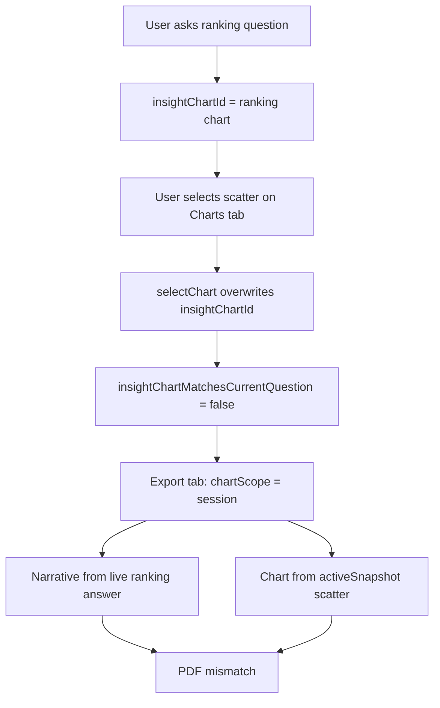
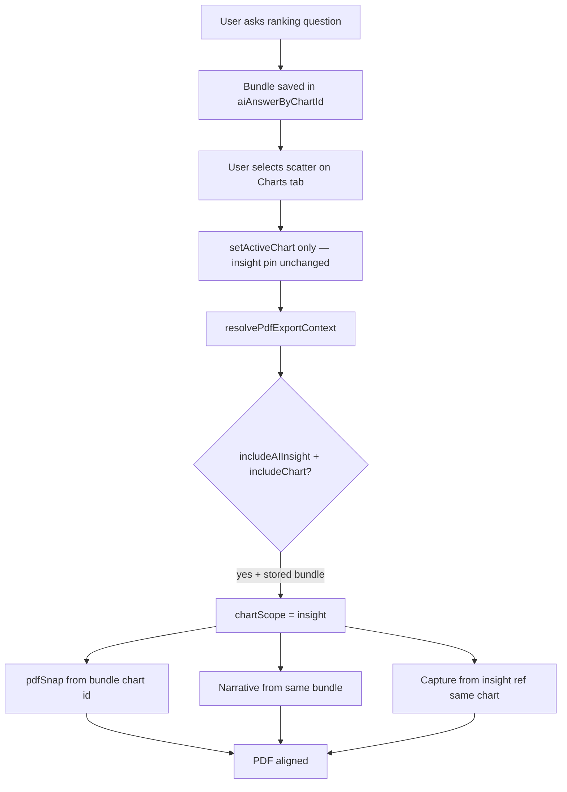

# PDF Visualization Context Alignment — Fix Report

## Root cause

PDF export mixed **narrative context** (business question, executive summary, AI insight) with a **different chart** because scope resolution was split across independent signals.

### A) Business question source

- Assembled in `buildExecutivePdfExportInput` → `buildExecutiveSummaryLines` and insight sections.
- Question text comes from `lastAskedQuestion` / `question` passed from `page.tsx` `downloadReportImpl`.
- Previously: live `answer` and `alignedAnalysis` could remain from the last AI Insights question even when chart scope fell back to **session**.

### B) Visualization chart source

- `downloadReportImpl` chose `pdfSnap` from `insightSnapshot` vs `activeSnapshot` based on `chartScope`.
- Chart image capture used `chartCaptureInsightRef` (insight) or `chartCaptureSessionRef` (session).
- Default `chartScope` was:

```ts
resolved.chartScope ??
  (insightChartMatchesCurrentQuestion && insightChartData.length > 0
    ? "insight"
    : "session");
```

- **Export tab** called `downloadReport()` without `chartScope: "insight"` (unlike the AI Insights button).
- When `insightChartMatchesCurrentQuestion` was false → **session** scope → Charts-tab chart (e.g. scatter).

### C) Accidental cross-context wiring

1. **`selectChart()` pinned both** `activeId` and `insightChartId`. Browsing the Charts timeline overwrote the AI insight pin.
2. **Scope split**: `includeAIInsight: true` + `chartScope: "session"` → ranking narrative + scatter chart.
3. **Strict match gate**: `insightChartMatchesCurrentQuestion` could fail after (1), forcing session chart while live answer/analysis still described the insight question.

## Fix (minimal)

| Change | Purpose |
|--------|---------|
| `resolve-pdf-export-context.ts` | Single resolver: when AI insight + chart export, force **insight** scope from `aiAnswerByChartId` / pinned chart, not Charts-tab selection |
| Charts timeline uses `setActiveChart` only | Decouple Charts-tab browse from AI insight pin (`pinAsInsight` option on `selectChartWithInsightState`) |
| `pinInsightChart()` in chart session | Temporary insight pin for capture when stored chart id ≠ current pin |
| PDF export reads sidecar ref after pin | Viz facts, badge, brief stay aligned after `flushSync` pin swap |
| Metadata paths use `pdfAlignedAnalysis` | Metric, dimension, semantics tied to export bundle |

PNG export and the existing hidden capture pipeline are unchanged.

## Files changed

- `frontend/lib/resolve-pdf-export-context.ts` (new)
- `frontend/lib/resolve-pdf-export-context.test.ts` (new)
- `frontend/contexts/chart-session-context.tsx` — `pinInsightChart`
- `frontend/app/page.tsx` — export resolver, Charts browse decouple, PDF assembly

## Before vs after flow

### Before (mismatch)



### After (aligned)



## Validation

### Automated regression

```bash
cd frontend && npm test -- --run lib/resolve-pdf-export-context.test.ts lib/build-executive-pdf-input.test.ts
```

Covers:

- Insight + chart export forces ranking chart when Charts tab has scatter selected
- Chart-only export uses session chart
- Session export does not leak unrelated live AI answer

### Manual matrix (recommended)

| Question type | Verify in PDF |
|---------------|---------------|
| Ranking | Question, summary, bar chart, facts, metadata all reference same dimension/metric |
| Compare | Grouped/stacked chart matches compare narrative |
| Trend | Time bucket title + trend chart + KPI lines consistent |
| Correlation | Scatter labels match correlation narrative |
| Geographic | Map/geo chart matches location question |

**Screenshots:** capture PDF visualization page + executive summary for each type after fix; compare business question text to chart title and metadata chips.

## Regression results

Run unit tests after pull (see command above). Full 100k functional validation behavior is unchanged — no chart-type logic, PNG path, or quota/capture architecture was rewritten.
