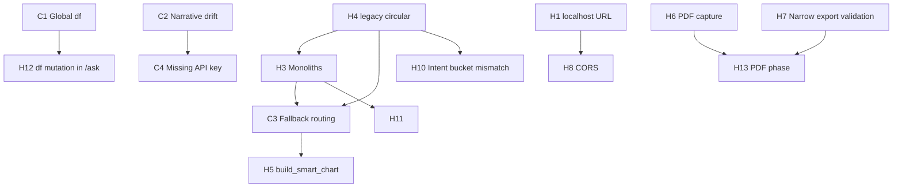

# Root Cause Analysis — Critical & High Issues

**Generated:** June 2026  
**Sources:** [`bug-inventory.md`](bug-inventory.md) · [`system-understanding.md`](system-understanding.md) · code verification in `backend/main.py`, `frontend/app/page.tsx`, and related modules.

**Scope:** All **Critical (C1–C4)** and **High (H1–H14)** items from the bug inventory. No fixes implemented.

**Confidence scale:**

| Level | Meaning |
|-------|---------|
| **High** | Confirmed in code paths or documented behavior |
| **Medium** | Strong inference from architecture; edge cases may vary |
| **Low** | Plausible but needs reproduction on specific datasets/deployments |

**Fix risk scale (implementation):**

| Level | Meaning |
|-------|---------|
| **Low** | Config / env / narrow guard; limited blast radius |
| **Medium** | Multi-file change; unit tests exist or can be added |
| **High** | Architectural refactor; broad regression surface (Insights, Charts, PDF) |

---

## Executive summary

| Theme | Issues | Underlying cause |
|-------|--------|------------------|
| **Session / concurrency** | C1, H12 | Process-wide pandas globals instead of request-scoped data |
| **Trust / grounding** | C2, C4 | LLM narrative is best-effort text; viz pipeline runs independently |
| **Chart correctness** | C3, H5, H10 | Layered legacy routers + two parallel intent vocabularies |
| **Deploy / ops** | H1, H8 | Dev-first localhost assumptions |
| **Cohort consistency** | H2 | Preview API contract predates filter-aware Insights |
| **Maintainability** | H3, H4, H11 | Monolith growth + partial intent_engine extraction + no E2E |
| **Export** | H6, H7, H13 | DOM/CSS capture stack + incomplete product phase |
| **Frontend duplication** | H9, H14 | Defensive recompute and intentional Overview pipeline split |

**Highest leverage fixes (by root cause, not inventory order):** per-request `DataFrame` (C1/H12), env API + CORS (H1/H8), hard-fail or block narrative when ungrounded (C2/C4), lock correlation routing + expand tests (C3/H5), API-only relationship stats (H9).

---

## Critical issues

### C1 — Global in-memory dataset (`df`) with no concurrency control

| Field | Detail |
|-------|--------|
| **Observed behavior** | One upload replaces the server’s active dataset for all clients. Concurrent `/upload`, `/ask`, or `/filtered-dashboard` calls share the same `df`, `dataset_profile`, and `column_mapping`. Last writer wins; answers can reference another user’s file in any multi-client deployment. |
| **Affected files** | `backend/main.py` (module globals `df`, `dataset_profile`, `column_mapping`, `uploaded_file_bytes`, …); all routes that read/write globals: `/upload`, `/preview`, `/ask`, `/filtered-dashboard`, `/update-column-mapping` |
| **Probable root cause** | Application was designed as a **single-user local demo**: FastAPI handlers use module-level mutable state instead of a session store, request context, or database. No locking, tenant ID, or per-connection dataframe. |
| **Confidence** | **High** — globals declared at lines 48–53; every endpoint uses `global df`. |
| **Proposed fix** | Introduce **request-scoped or session-scoped storage** (e.g. `session_id` on upload, dict/LRU of DataFrames, or pass `df` through all viz helpers). For multi-tenant production, add auth + isolation. Short-term: document single-user-only and reject concurrent use in shared hosting. |
| **Fix risk** | **High** — touches every backend route and `compute_visualization_for_question` signature/callers. |
| **Issue risk if unresolved** | **Critical** (wrong data, leakage) |

---

### C2 — AI narrative can diverge from chart when grounding is thin

| Field | Detail |
|-------|--------|
| **Observed behavior** | Answer prose may cite numbers that do not match the chart or `exact_result` when the anchor block is empty, partial, or misaligned. Users often read narrative before chips. Partial visualization + full-looking answer is possible. |
| **Affected files** | `backend/main.py` — `ask_question` prompt assembly (~13933–14196), `_generate_insight_narrative`, `_claude_narrative_fallback_answer`; `frontend/app/page.tsx` — answer display (less strict than viz gates) |
| **Probable root cause** | **Architectural split:** chart numbers are deterministic pandas; narrative is **unstructured LLM text** with prompt-only constraints (`viz_anchor`, `exact_result`, Rules). No JSON schema, post-generation numeric validation, or refusal when `exact_result`/`visualization` is missing. Fallback answers (C4) still return HTTP 200 with prose. Stacked-chart and `analyze_data` paths can produce `exact_result` that does not match final `chart_data` after repairs. |
| **Confidence** | **High** for mechanism; **Medium** for frequency on current golden paths (mitigations exist for scatter). |
| **Proposed fix** | (1) **Fail closed:** if `visualization` is null or `exact_result` is empty for analytic questions, return structured “insufficient evidence” without LLM call. (2) **Post-validate** narrative numbers against anchor tokens (regex/table parse). (3) Surface `partial_visualization_warning` / `alignment_repaired` prominently in UI. (4) Optional: structured narrative sections from templates + LLM only for interpretation. |
| **Fix risk** | **Medium** — prompt and response contract changes; UX copy updates. |
| **Issue risk if unresolved** | **Critical** (trust-breaking insights) |

**Related inventory:** AI-1–AI-4 in `bug-inventory.md`; frontend gates reduce **chart** mismatch but not **prose** mismatch.

---

### C3 — Chart routing fallback chain can still produce misleading charts

| Field | Detail |
|-------|--------|
| **Observed behavior** | Questions intended as relationship/correlation (or other specific intents) can still receive category bar charts, department averages, or generic totals when early routing fails or later fallbacks run. Historically: zone/count bars for “correlated with” questions. |
| **Affected files** | `backend/main.py` — `compute_visualization_for_question` (~12255–12900+); `analyze_data` (~8867+); `build_smart_chart`; `_deterministic_viz_last_resort`; `_fallback_aggregate_chart`; stacked-chart branch calling `analyze_data` (~12433); `backend/intent_engine/question_patterns.py` (correlation gate); `backend/tests/intent_engine/test_relationship_routing.py` |
| **Probable root cause** | **Ordered pipeline with multiple escape hatches:** primary routes (correlation pack, dual-metric, stacked, trend) can leave `chart_data` empty or set `chart_path_handled` false, then **`build_smart_chart` → `_deterministic_viz_last_resort` → `analyze_data`** keyword router fills gaps. `suppress_auto_charts` is flag-driven; any bug that omits the flag reopens bar fallbacks. `analyze_data` is large and keyword-driven (M2), not intent-engine-owned. |
| **Confidence** | **High** — flow confirmed in `compute_visualization_for_question`; Jun 2026 early correlation pack is mitigation, not removal of fallbacks. |
| **Proposed fix** | (1) After correlation routing attempt, **never** call `analyze_data`/`build_smart_chart` for that question class. (2) Centralize routing in `intent_engine` with explicit terminal states: `scatter | unsupported | grouped_bar`. (3) Expand golden tests for every fallback entry. (4) Log `routing_path` enum on API for debugging. |
| **Fix risk** | **High** — any change to `compute_visualization_for_question` is high regression risk (see test command in bug inventory). |
| **Issue risk if unresolved** | **Critical** (wrong chart type = wrong decisions) |

**Overlap with H5:** C3 is the **systemic** fallback architecture; H5 is the **specific** post-routing builders when `suppress_auto_charts` is false.

**Status (Jun 2026):** **Mitigated** — `correlation_routing_locked` in `compute_visualization_for_question` + `intent_engine/correlation_routing_guard.py`; tests in `test_correlation_routing_guard.py`. Trend and compare-by-dimension paths unchanged.

---

### C4 — Missing `ANTHROPIC_API_KEY` yields non-analytic fallback copy

| Field | Detail |
|-------|--------|
| **Observed behavior** | `/ask` returns templated messages (“verify ANTHROPIC_API_KEY…”, “temporarily overloaded…”) while **visualization and analysis still render**, so the product looks like a full AI answer. |
| **Affected files** | `backend/main.py` — `client = Anthropic(api_key=os.getenv("ANTHROPIC_API_KEY"))` (~36); `ask_question` try/except around `_generate_insight_narrative` (~14198–14202); `_claude_narrative_fallback_answer` (~11498–11524) |
| **Probable root cause** | **No startup or pre-flight validation** of API key. Viz pipeline runs before narrative; narrative failures are **swallowed** into user-visible fallback strings. Design choice: preserve chart when LLM fails (reasonable for overload) but same path for **misconfiguration** (misleading). |
| **Confidence** | **High** — `AuthenticationError` branch returns advisory text; response still includes `visualization`. |
| **Proposed fix** | (1) **Startup check:** fail fast or expose `/health` `llm_configured: false`. (2) On missing key, return **503** or `analysis.narrativeStatus: "unavailable"` with UI banner; do not use success-shaped answer body. (3) Optionally skip LLM call entirely when key absent to save latency. |
| **Fix risk** | **Low** — localized to init and `/ask` error handling. |
| **Issue risk if unresolved** | **Critical** in demo/prod misconfig (false confidence in AI) |

---

## High issues

### H1 — Hardcoded backend URL `http://localhost:8000`

| Field | Detail |
|-------|--------|
| **Observed behavior** | Frontend cannot reach API when backend is on another host/port or behind a gateway without code change or reverse proxy. |
| **Affected files** | `frontend/app/page.tsx` — `fetch("http://localhost:8000/...")` for `/upload`, `/preview`, `/ask`, `/filtered-dashboard`, `/select-sheet`, `/update-column-mapping` |
| **Probable root cause** | **Dev-first wiring**; no shared `getApiBase()` using `process.env.NEXT_PUBLIC_API_BASE` (or similar) applied to all fetch sites. |
| **Confidence** | **High** — six literal URLs in `page.tsx`. |
| **Proposed fix** | Single `lib/api-base.ts` (or env) consumed by all fetch calls; document in README. Default to `http://localhost:8000` for local dev. |
| **Fix risk** | **Low** — mechanical replacement; verify no other hardcoded URLs. |
| **Issue risk if unresolved** | **High** (deployment blocker) |

---

### H2 — `/preview` does not apply dashboard filters

| Field | Detail |
|-------|--------|
| **Observed behavior** | Data Preview table search/sort/pagination operates on **raw** `df.head(limit)` while AI Insights and KPIs use **filter-applied** cohort from `/ask` and `/filtered-dashboard`. Users see rows outside the active filter context. |
| **Affected files** | `backend/main.py` — `get_preview` (~5309–5330); `frontend/app/page.tsx` — `fetchPreviewRows` → `POST /preview`; `frontend/app/components/home/data-preview-*.tsx` (client-side on fetched window) |
| **Probable root cause** | **Endpoint contract from early design:** preview = cheap row slice for table UI, not “cohort inspector.” Filters were added to dashboard/ask later without extending preview payload. |
| **Confidence** | **High** — `get_preview` only uses global `df`, no `apply_dashboard_filters_to_df`. |
| **Proposed fix** | (A) Extend `PreviewRequest` with `dashboard_filters` + `date_range` and filter before `head`. (B) Or UI disclaimer: “Preview shows full dataset; Insights use active filters.” (C) Or client sends filters and backend mirrors `/ask` cohort. |
| **Fix risk** | **Medium** — API contract + `page.tsx` preview fetch; performance cap on filtered full scan. |
| **Issue risk if unresolved** | **High** (cohort mistrust) |

---

### H3 — Monolithic `main.py` (~14k lines) + monolithic `page.tsx` (~14k lines)

| Field | Detail |
|-------|--------|
| **Observed behavior** | Hard to locate routing order, merge conflicts, accidental regressions; new contributors cannot safely change one concern without touching others. |
| **Affected files** | `backend/main.py` (upload, KPIs, viz, Claude, filters); `frontend/app/page.tsx` (all tabs, gates, executive memos, export) |
| **Probable root cause** | **Organic single-file growth** without enforced module boundaries; partial extraction (`intent_engine/`, components, `lib/`) left orchestration in monoliths per `AGENTS.md` incremental policy. |
| **Confidence** | **High** — file sizes and responsibility map in `system-understanding.md`. |
| **Proposed fix** | **Incremental** decomposition only with approval: e.g. `viz_router.py`, `narrative.py`, `routes/ask.py`; frontend route-specific hooks (`useAiInsights.ts`). Not a big-bang rewrite. |
| **Fix risk** | **High** if done abruptly; **Medium** if slice-by-slice with tests. |
| **Issue risk if unresolved** | **High** (maintainability / regression rate), not immediate user-visible single bug |

---

### H4 — `intent_engine.legacy` ↔ `main.py` circular delegation

| Field | Detail |
|-------|--------|
| **Observed behavior** | Intent engine modules call `import main as legacy_main` at runtime; `main.py` imports `intent_engine`. Risk of import cycles, duplicate helpers, and tests that must load full monolith. |
| **Affected files** | `backend/intent_engine/legacy.py`; consumers: `resolve_metric_dimension.py`, `resolve_analysis_intent.py`, `trend_unsupported.py`, etc.; definitions remain in `backend/main.py` |
| **Probable root cause** | **Phase 1 migration strategy:** facades added without moving implementations out of `main.py`, creating **two entry points** to the same logic. |
| **Confidence** | **High** — `legacy.py` pattern verified. |
| **Proposed fix** | Move implementations from `main.py` into `intent_engine/` (or `backend/services/`) one function at a time; shrink `legacy.py` to re-exports; avoid `main` importing heavy submodules at top level where possible. |
| **Fix risk** | **High** — circular import ordering must be carefully staged. |
| **Issue risk if unresolved** | **High** (blocks clean testing and extraction; contributes to C3/H10) |

---

### H5 — Post-routing chart builders can override relationship intent

| Field | Detail |
|-------|--------|
| **Observed behavior** | When `chart_data` is empty and `suppress_auto_charts` is false, `build_smart_chart` or `_deterministic_viz_last_resort` may emit bar charts (including `scatterFallback` bar totals) unrelated to correlation intent. |
| **Affected files** | `backend/main.py` — ~12712–12767 (`build_smart_chart`, `_deterministic_viz_last_resort`); correlation branch ~12333–12346 (`suppress_auto_charts` on failure) |
| **Probable root cause** | **Default “always try to show a chart”** behavior for empty `chart_data`. `suppress_auto_charts` is not set on all relationship miss paths (e.g. partial failures, non-correlation relationship wording). `scatterFallback` intentionally substitutes bar totals when scatter build fails (non-correlation paths). |
| **Confidence** | **High** for code path; **Medium** for how often flags are wrong in production. |
| **Proposed fix** | Tie suppress flag to `question_requests_correlation_routing()` OR `primaryGoal === relationship`. Remove or gate `build_smart_chart` for relationship class. Return explicit unsupported payload instead of bar substitute. |
| **Fix risk** | **High** — same surface as C3; must run `test_relationship_routing`. |
| **Issue risk if unresolved** | **High** (misleading charts; subset of C3) |

**Status (Jun 2026):** **Mitigated** — same `correlation_routing_locked` gate blocks `build_smart_chart` / `_deterministic_viz_last_resort` for correlation questions.

---

### H6 — PDF chart capture fragility (Canvg + html2canvas + Tailwind v4)

| Field | Detail |
|-------|--------|
| **Observed behavior** | PDF export may show empty chart sections, soft/blurry images, or `chartEmbedFailed` / `PDF_EMPTY_STATES.chartCapture` paths. |
| **Affected files** | `frontend/app/pdf-report.ts`; `frontend/lib/chart-png-capture.ts`; `frontend/package.json` (html2canvas direct; canvg transitive via jspdf lockfile) |
| **Probable root cause** | **Export pipeline depends on DOM snapshot of Recharts SVG** in a browser context. html2canvas fails on modern CSS (`color-mix()`, Tailwind v4). Canvg path requires stable SVG structure; version drift breaks silently. Off-screen capture refs may be unmounted or wrong tab. |
| **Confidence** | **High** — comments and fallbacks in `chart-png-capture.ts`; inventory PDF-1–3. |
| **Proposed fix** | (1) Declare **direct** `canvg` dependency; pin versions. (2) PDF-specific plot stylesheet without `color-mix`. (3) Server-side or canvas export from data (longer term). (4) Automated export smoke test with fixture chart. |
| **Fix risk** | **Medium** — CSS/capture tuning; **High** if replacing render path. |
| **Issue risk if unresolved** | **High** (failed executive export) |

---

### H7 — PDF export validation is narrow

| Field | Detail |
|-------|--------|
| **Observed behavior** | Export can proceed when chart id/type match contract but **question**, scatter axes, or `relationshipInsights` are stale relative to current insight turn. |
| **Affected files** | `frontend/lib/selected-visualization.ts` — `validateExportMatchesContract` (~376–408); `frontend/app/page.tsx` — export handler (~10232+) |
| **Probable root cause** | Validation designed for **chart session contract integrity** (id, chartType, trend dimension heuristic), not **insight alignment** (`insightChartMatchesCurrentQuestion`, `chartSnapshotMatchesQuestionIntent`). |
| **Confidence** | **High** — function only checks id, chartType, trend dimension keywords. |
| **Proposed fix** | Reuse insight gates in export path: require `turnId` / question match, scatter axis labels, optional `relationshipInsights` hash. Block export with user-visible reason. |
| **Fix risk** | **Low–Medium** — additive checks in `page.tsx` export flow. |
| **Issue risk if unresolved** | **High** (wrong chart in executive PDF) |

---

### H8 — CORS restricted to `http://localhost:3000`

| Field | Detail |
|-------|--------|
| **Observed behavior** | Browser blocks API calls when frontend runs on another origin (port 3001, staging URL, production domain). |
| **Affected files** | `backend/main.py` — `CORSMiddleware(allow_origins=["http://localhost:3000"])` (~40–46) |
| **Probable root cause** | **Dev-only CORS allowlist**; no env-driven `ALLOWED_ORIGINS`. |
| **Confidence** | **High** |
| **Proposed fix** | `ALLOWED_ORIGINS` env (comma-separated); default localhost:3000 for dev. Pair with H1 API base URL. |
| **Fix risk** | **Low** |
| **Issue risk if unresolved** | **High** (deployment blocker with H1) |

---

### H9 — Frontend/client Pearson recompute for scatter executive cards

| Field | Detail |
|-------|--------|
| **Observed behavior** | Executive “Pearson r” card can differ from backend `exact_result` / LLM anchor when `relationshipInsights` is missing from API but scatter chart renders. |
| **Affected files** | `frontend/app/page.tsx` — `pearsonCorrelation` (~734), `buildExecutiveVizInsights` scatter branch (~3100–3143), `insightExecutiveVizInsights` memo (~9586–9676); preferred path: `frontend/lib/relationship-visualization.ts` — `buildRelationshipExecutiveCards` |
| **Probable root cause** | **Defensive duplicate analytics** on frontend for scatter when API omits `relationshipInsights`; recompute uses **plotted row subset** (up to 450 points) not necessarily same as backend cohort stats. |
| **Confidence** | **High** — dual paths in memo order; backend cap documented (M12). |
| **Proposed fix** | Never show client Pearson when `relationshipInsights` absent; show “coefficient unavailable” or hide correlation card. Ensure backend always attaches `relationshipInsights` for scatter routes. |
| **Fix risk** | **Low–Medium** — UI branch + API contract check. |
| **Issue risk if unresolved** | **High** (executive metrics disagree with narrative) |

---

### H10 — Intent metadata vs log bucket mismatch

| Field | Detail |
|-------|--------|
| **Observed behavior** | Logs show `detected_intent=compare` while `analysis.intent.primaryGoal=relationship` for correlation questions (e.g. “correlated with revenue”). |
| **Affected files** | `backend/main.py` — `_chart_selection_question_bucket` (~9873–9916), viz logs ~12867; `backend/intent_engine/resolve_analysis_intent.py` — `question_requests_correlation_routing` → `primaryGoal` relationship; `frontend` conversation `intentBucket` from `chartRecommendation.detectedIntent` |
| **Probable root cause** | **Two parallel intent systems:** legacy bucket uses `vs|versus|against` for “relationship” but **not** `correlat*`; default bucket is `"compare"`. Intent engine uses `question_patterns._CORRELATION_ROUTING_RE` including `correlated with`. Bucket still fed to `detectedIntent` / logs. |
| **Confidence** | **High** — regex diff between `_chart_selection_question_bucket` and `question_patterns.py`. |
| **Proposed fix** | Single source: derive `detectedIntent` from `resolve_analysis_intent().primaryGoal` or call shared classifier. Deprecate `_chart_selection_question_bucket` for user-visible fields. |
| **Fix risk** | **Medium** — audit frontend branches using `intentBucket` vs `analysis.intent`. |
| **Issue risk if unresolved** | **High** (debugging / wrong branches if bucket used) |

**Status (Jun 2026):** **Mitigated** — `_chart_selection_question_bucket` delegates to `chart_selection_bucket_override()` when correlation routing applies (`relationship`).

---

### H11 — No automated E2E / visual regression tests

| Field | Detail |
|-------|--------|
| **Observed behavior** | Regressions in `page.tsx` gates, chart render, PDF download, and tab flows are caught only by manual QA. |
| **Affected files** | Test gap: no `e2e/` Playwright/Cypress; coverage = `backend/tests/intent_engine/*` only; `frontend/lib/ai-follow-up-suggestions.test.ts` excluded from `tsc` / not in `npm test` |
| **Probable root cause** | **Investment choice:** unit tests added for intent engine backend; UI baseline docs used as manual contract; SPA monolith makes E2E setup costly. |
| **Confidence** | **High** |
| **Proposed fix** | Minimal Playwright: upload fixture → ask correlation question → assert scatter + no department bar → export PDF exists. Wire vitest for follow-ups. |
| **Fix risk** | **Medium** — CI infra and flake management. |
| **Issue risk if unresolved** | **High** (regression velocity on H3-scale codebase) |

---

### H12 — `/ask` temporarily mutates global `df` (restored in `finally`)

| Field | Detail |
|-------|--------|
| **Observed behavior** | During `/ask`, global `df` points at filtered cohort; concurrent requests may see filtered data or race with restore. Same pattern in `/filtered-dashboard` (~5129–5137). |
| **Affected files** | `backend/main.py` — `ask_question` `saved_df` / `df = final_df` / `finally` (~13898–14251); `filtered-dashboard` (~5129–5137); all code in `compute_visualization_for_question` that reads global `df` |
| **Probable root cause** | **Shortcut to avoid threading DataFrame** through hundreds of helpers written against global `df`. Restore in `finally` helps single-threaded sequential use but not concurrency. |
| **Confidence** | **High** |
| **Proposed fix** | Same as C1: pass `df` as argument to viz pipeline; remove global mutation. `/filtered-dashboard` should not mutate global for response build. |
| **Fix risk** | **High** — coupled to C1 refactor. |
| **Issue risk if unresolved** | **High** (subset of C1; race window) |

---

### H13 — Export/PDF product phase incomplete

| Field | Detail |
|-------|--------|
| **Observed behavior** | Export works end-to-end but product baseline marks phase **not finalized**: WYSIWYG gaps, section polish, static `pdf-report` import bundle cost, capture ref regressions. |
| **Affected files** | `frontend/app/pdf-report.ts`; `frontend/app/page.tsx` (`chartCaptureInsightRef`, `chartCaptureSessionRef`, export tab); `PDF_EXPORT_STABLE_BASELINE.md`; `AGENTS.md` §8 |
| **Probable root cause** | **Product prioritization** — core Insights/Charts stabilized before export hardening; technical debt (static import, dual capture refs) documented but not closed. |
| **Confidence** | **High** (documented); **Medium** for specific WYSIWYG gaps per scenario. |
| **Proposed fix** | Run PDF regression checklist; code-split PDF module; align capture dimensions with baseline (860px); fix H6/H7 first. |
| **Fix risk** | **Medium** — UX/copy changes; capture changes affect H6. |
| **Issue risk if unresolved** | **High** (executive deliverable quality) |

---

### H14 — Dual chart presentation pipelines (Overview vs session)

| Field | Detail |
|-------|--------|
| **Observed behavior** | Same metric may render as different chart kind/orientation on Overview mini charts (360px) vs AI Insights / Charts tab. |
| **Affected files** | `frontend/app/page.tsx` — `computeOverviewDashboardChartPresentation` (~4497); `frontend/lib/final-chart-presentation.ts` — `computeFinalChartPresentation`; `frontend/lib/overview-chart-heuristics.ts` |
| **Probable root cause** | **Intentional product split** per baseline: Overview uses lighter heuristics for auto-dashboard; session pipeline A is canonical for Insights/PDF. Not a bug per se but a **duplication risk** without shared tests. |
| **Confidence** | **High** — documented in `system-understanding.md` and `AGENTS.md`. |
| **Proposed fix** | Document precedence; add contract tests that same API chart type + rows resolve identically where product requires parity; or accept divergence and label Overview as “summary view”. |
| **Fix risk** | **High** if merging pipelines (baseline warns against without approval); **Low** if documentation-only. |
| **Issue risk if unresolved** | **High** (user confusion cross-tab); lower than C1/C3 |

---

## Cross-issue dependency map



---

## Recommended fix sequencing (by root cause)

| Phase | Target root cause | Issues addressed | Rationale |
|-------|-------------------|------------------|-----------|
| 1 | Deploy config | H1, H8 | Unblocks staging without touching viz |
| 2 | LLM config / grounding | C4, C2 (partial) | Fast trust win; fail closed on missing key |
| 3 | Request-scoped `df` | C1, H12 | Removes concurrency root; enables safe scaling |
| 4 | Routing lock + tests | C3, H5, H10 | Correlation-first + single intent vocabulary |
| 5 | API-only relationship stats | H9 | Small frontend change, high trust impact |
| 6 | Preview cohort | H2 | API + UI contract |
| 7 | PDF hardening | H6, H7, H13 | After capture stability |
| 8 | Test + decomposition | H11, H3, H4, H14 | Longer-term maintainability |

---

## Verification after fixes

```bash
# Backend routing (mandatory after C3/H5/H10 changes)
cd backend
python -m unittest tests.intent_engine.test_relationship_routing tests.intent_engine.test_correlation_analysis tests.intent_engine.test_intent_detection_fixes -v

# Full intent suite
python -m unittest discover -s tests/intent_engine -v
```

Manual: correlation question → scatter + matching `primaryGoal` in debug panel; PDF export from Insights and Export tab; Data Preview with filters applied (after H2).

---

*Aligns with [`bug-inventory.md`](bug-inventory.md) Critical/High sections and [`system-understanding.md`](system-understanding.md) flows. Update when fixes land or new regressions are found.*
