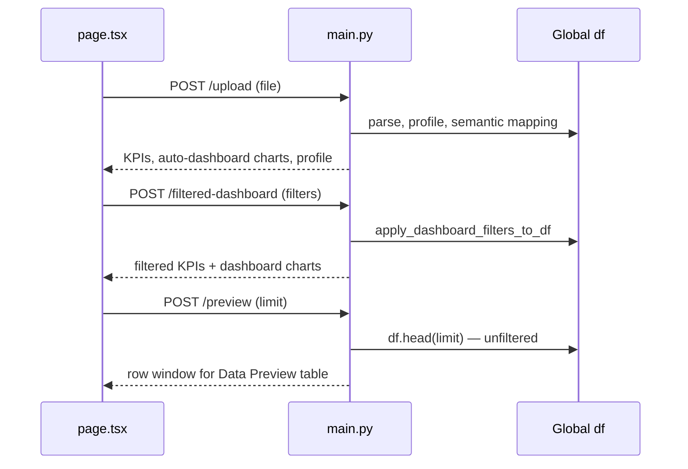
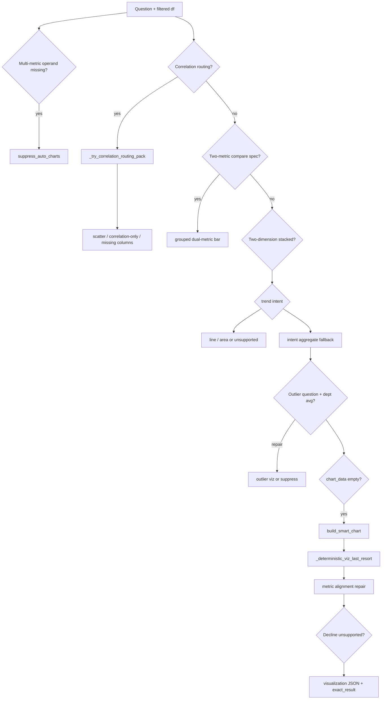
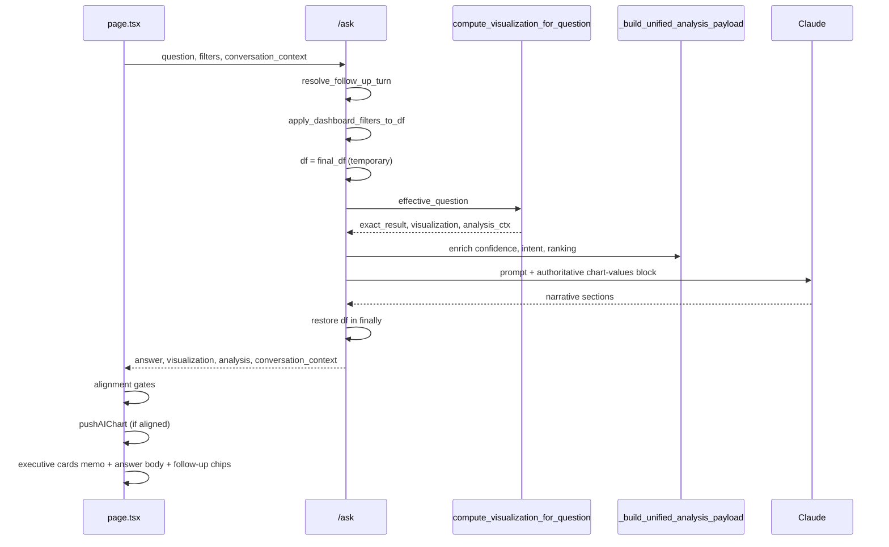
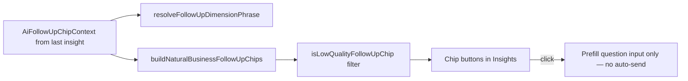
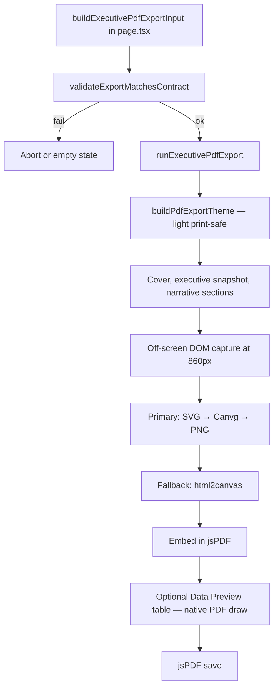

# AI Data Analyst App — System Understanding

**Generated:** June 2026  
**Purpose:** Consolidated architecture and flow reference for continued development.  
**Sources:** [`project-snapshot.md`](project-snapshot.md) · [`file-map.md`](file-map.md) · [`bug-inventory.md`](bug-inventory.md) · targeted code review (no code changes).

**Baseline authority (do not contradict without verifying code):** [`AGENTS.md`](../AGENTS.md) · [`PROJECT_ARCHITECTURE_SUMMARY.md`](../PROJECT_ARCHITECTURE_SUMMARY.md) · stable `*_STABLE_*.md` summaries.

---

## 1. Architecture summary

### 1.1 Product shape

A **single-route Next.js SPA** (`frontend/app/page.tsx`) talks directly to a **single-process FastAPI backend** (`backend/main.py`) at `http://localhost:8000`. There is no Next.js API proxy, no server-side auth, and no persistent server-side dataset storage beyond in-memory pandas globals.

| Layer | Role | Key constraint |
|-------|------|----------------|
| **Frontend** | Tabs (Overview, Data Preview, AI Insights, Charts, Export), filters, chart session, PDF | ~14k-line monolith state in `page.tsx`; presentation extracted to components/lib |
| **Backend** | Upload, profiling, KPIs, deterministic viz, Claude narrative | ~14k-line monolith; `intent_engine/` partially extracted |
| **AI (narrative only)** | Claude Haiku via `/ask` | Numbers for charts come from **pandas**, not the LLM |
| **Persistence** | Client `localStorage` (theme, sidebar, branding) | Dataset lost on server restart |

### 1.2 Frontend architecture

```
layout.tsx (theme, fonts)
    └── page.tsx (all tab state, fetch, gates, executive memos)
            ├── AppShell (sidebar, header, nav)
            ├── ChartSessionProvider (AI + auto-dashboard chart contracts)
            ├── Tab panels (Overview / Preview / Insights / Charts / Export)
            └── lib/* (chart presentation, confidence, follow-ups, PDF helpers)
                    └── components/* (ChartRenderer, shells, filters — mostly presentational)
```

**Two chart presentation pipelines (intentional split):**

| Pipeline | Resolver | Consumers |
|----------|----------|-----------|
| **A — Shared** | `computeFinalChartPresentation` (`final-chart-presentation.ts`) | AI Insights, Charts tab, PDF capture |
| **B — Overview only** | `computeOverviewDashboardChartPresentation` (in `page.tsx`) | Auto-dashboard mini charts (360px) |

**Stable UI contracts:** `AiInsightChartShell` → `ChartInsightViewportWrapper` → `ChartRenderer`; insight plan widths 760/850/900px; Charts session viewport ≤860px; symmetric `insightCartesianOuterMargins`.

### 1.3 Backend architecture

```
main.py
    ├── HTTP: /upload, /preview, /filtered-dashboard, /ask, /update-column-mapping, …
    ├── Globals: df, dataset_profile, column_mapping, uploaded_file_bytes
    ├── compute_visualization_for_question()  ← chart routing orchestrator
    ├── _build_unified_analysis_payload()     ← confidence + analysis object
    ├── _generate_insight_narrative()         ← Claude
    └── intent_engine/* (patterns, correlation, confidence, ranking, guardrails)
            └── legacy.py → delegates back to main.py (Phase 1 migration)
```

**Session model:** One active dataset per server process. `/ask` temporarily assigns `df = final_df` and restores in `finally` — not safe for concurrent requests.

### 1.4 Stable vs experimental vs open

| Category | Examples |
|----------|----------|
| **Stable (baseline)** | Upload + semantic mapping, filters, KPIs, AI Insights viz + gates, correlation scatter, confidence model, forecast guardrails, Charts session, follow-up chips (prefill only), geographic scope, decline/growth/trend unsupported UX |
| **Experimental** | `analysis.intent` metadata, intent debug panel (`NEXT_PUBLIC_AI_INSIGHTS_DEBUG`), Export/PDF polish phase, Vitest follow-up tests (not in npm scripts) |
| **Open / high-risk** | Multi-tenant `df` (C1), hardcoded API URL (H1), filter-blind `/preview` (H2), PDF capture fragility (H6), E2E absence (H11) — see [`bug-inventory.md`](bug-inventory.md) |

---

## 2. Request flow (end-to-end)

### 2.1 Dataset lifecycle



### 2.2 Typical API surface

| Endpoint | Filter-aware | Primary output |
|----------|--------------|----------------|
| `POST /upload` | N/A | Profile, mapping, KPIs, auto-dashboard spec |
| `POST /filtered-dashboard` | Yes | Filtered KPIs + chart specs |
| `POST /preview` | **No** | Raw `df.head(limit)` |
| `POST /ask` | Yes | Answer, visualization, analysis, conversation_context |
| `POST /update-column-mapping` | N/A | Updated roles |

Frontend uses **direct** `fetch("http://localhost:8000/...")` from `page.tsx` (no env abstraction on all paths).

### 2.3 Cross-cutting request concerns

- **CORS:** `allow_origins=["http://localhost:3000"]` in `main.py`.
- **Filters:** Same `dashboard_filters` + `date_range` payload shape for Overview, `/ask`, and `/filtered-dashboard`.
- **Conversation:** `/ask` accepts `conversation_context` (turnId, followUpChain, lastInsightChartId, filtersApplied) for follow-up resolution and cohort narrowing.

---

## 3. Chart routing flow

Chart **data and type** are decided entirely in the backend. The frontend only **resolves presentation** (kind, orientation, margins) from API `chartType` + row shape.

### 3.1 Backend orchestrator: `compute_visualization_for_question`

**Location:** `backend/main.py` (~12255+).

**Ordered routing (simplified):**



**Early wins (Jun 2026):** Correlation questions run `_try_correlation_routing_pack` **first** so relationship intent does not fall through to zone/category bar aggregation.

**Correlation lock (Jun 2026):** When `question_requests_correlation_routing()` is true (`intent_engine/correlation_routing_guard.py`), the pipeline sets `correlation_routing_locked` and **does not** run dual-metric-by-dimension, stacked multi-dim, `analyze_data`, `build_smart_chart`, `_deterministic_viz_last_resort`, or post-routing aggregate repair. `_chart_selection_question_bucket` returns `relationship` for the same detector (aligned with `analysis.intent.primaryGoal`).

**Suppression flags:** `suppress_auto_charts` is forced for correlation-locked questions; also used for multi-metric, decline, and correlation missing-column failures.

**Outputs:**

- `visualization`: labels, datasets, `chartType`, scatter axes, `relationshipInsights`, provenance
- `exact_result`: tabular + correlation lines for LLM anchor
- `intent_debug` / `smart_trace`: metric, dimension, aggregation, routing notes
- Unified context via `_build_unified_analysis_payload`

### 3.2 Frontend presentation pipeline A

```
API visualization
  → normalized in page.tsx (labels/rows)
  → SelectedVisualization contract (chart-session-context)
  → computeFinalChartPresentation (apiChartStringToKind, temporal heuristics)
  → chart-layout-config + ChartRenderer (Recharts)
```

**Gates before showing chart:**

1. `insightChartMatchesCurrentQuestion` — turn id, question text, chart snapshot id alignment
2. `chartSnapshotMatchesQuestionIntent` — blocks misleading types (e.g. department-average bar on outlier questions without explicit `by dimension`)

### 3.3 Chart session (Charts tab)

- **Source of truth:** `ChartSessionProvider` — charts from `pushAIChart` (Insights) or `replaceAutoDashboardCharts` (Overview).
- **No refetch** on tab switch; timeline selects contract from session.
- **Dedup / invalidation** on dataset or filter changes per context rules.

### 3.4 Duplicate / divergent routing risks

| Risk | Detail |
|------|--------|
| Fallback chain | `analyze_data`, `build_smart_chart`, `_deterministic_viz_last_resort` can still produce wrong chart types if early gates regress |
| Pipeline B | Overview mini charts may differ in kind/orientation from Insights for same metric |
| Intent bucket vs goal | Logs may say `compare` while `analysis.intent.primaryGoal` is `relationship` |
| Scatter sample cap | Relationship builder `.head(450)` may differ from full-cohort stats if API fields omitted |

**Regression tests:** `backend/tests/intent_engine/test_relationship_routing.py`, `test_correlation_analysis.py`.

---

## 4. AI insight flow

### 4.1 `/ask` pipeline



### 4.2 Question parsing layers

| Layer | Location | Responsibility |
|-------|----------|----------------|
| Follow-up plan | `main.py` — `resolve_follow_up_turn` | Effective question, blocked turns, filtered_df |
| Tags / buckets | `_chart_selection_question_bucket`, `detect_intent_tags` | Legacy compare/trend/relationship labels |
| Intent engine patterns | `question_patterns.py` | Decline, relationship, correlation phrases |
| Metric/dimension | `_resolve_question_metric_spec`, `resolve_metric_dimension.py`, `column_resolve.py` | Column tokens, synonyms |
| Support validation | `validate_support.py`, `resolve_analysis_intent.py` | `unsupported_analysis`, growth/trend exemptions |

### 4.3 Executive summary generation (UI layer)

**Order of precedence in `page.tsx` memos:**

1. Unsupported paths (growth, decline, trend, multi-metric) — dedicated lib builders
2. **Relationship scatter** — `buildRelationshipExecutiveCards` from `relationshipInsights` (preferred over client Pearson recompute)
3. Profit margin / ROI derived — `derived-profit-margin.ts`
4. Trend cards — `trend-visualization.ts`
5. Grouped dual-metric bar
6. **Ranked API** — `rankedExecutiveInsights` from `executive_insight_ranking.py` (category bars, ≥2 points, non-scatter)
7. Generic — `buildExecutiveVizInsights` + `insight-card-titles.ts`

**AI narrative:** Claude output in answer body; must align with `exact_result` / authoritative chart-values block. Not used for chart numbers.

**AI Read panel:** `SmartChartInsightPanel` — rule-based `smart-chart-intelligence.ts` (not LLM); gated on question match in Insights.

### 4.4 Grounding and hallucination controls

| Control | Mechanism |
|---------|-----------|
| Numeric anchor | `build_visualization_anchor_for_prompt` + `exact_result` in prompt |
| Frontend viz gate | Hide chart/export when snapshot ≠ question intent |
| Unsupported analysis | Empty chart + executive cards instead of misleading viz |
| Confidence | Low band + reasons when evidence thin |

**Residual risks:** Fallback narrative without anchor (C2), client-side Pearson if `relationshipInsights` missing (H9), follow-up chips not cohort-validated (AI-8).

---

## 5. Confidence scoring flow

### 5.1 Backend (authoritative)

**Module:** `backend/intent_engine/confidence_scoring.py` — `calculate_insight_confidence()`.

**Model:** Component **sum** (not fixed 38/52 floors). Bands: High ≥70, Medium ≥42, Low otherwise.

| Component | Typical signal |
|-----------|----------------|
| Cohort rows | `log10(row_count)` capped contribution |
| Chart groups / scatter pairs | Relationship-aware joint-pair scoring vs category group count |
| Mapping confidence | high / medium / low from semantic mapping |
| Chart–intent fit | Dual-metric complete, scatter vs bar, unsatisfied trend/growth/decline/multi-metric |
| Statistical support | Pearson sample ≥ `MIN_PEARSON_SAMPLE` (8) |
| Forecast | `forecast_guardrails.can_forecast` |
| Alignment | Penalties for `alignment_repaired`, `partial_visualization_warning` |

**Wiring:** `_build_unified_analysis_payload` builds `InsightConfidenceInput` from viz outcome and attaches:

- `insightConfidenceScore`, `insightConfidenceLevel`, `insightConfidenceReasons`, `insightConfidenceRationale`, `evidenceSummaryLine`

**Intent attachment:** `attach.enrich_analysis_with_intent` adds `analysis.intent` unless `INTENT_ENGINE_DISABLE=1`.

### 5.2 Frontend (display + fallback)

**Module:** `frontend/lib/insight-confidence.ts`.

- **Primary:** Trust `insightConfidenceScore` / reasons from API when present.
- **Fallback:** Recompute component model locally if API fields missing.
- **Known gap:** Client `groupPoints()` treats each scatter point as a “group” when API score absent (M6) — can under-score valid scatter.

### 5.3 UI surfacing

- Confidence band chips and rationale in Insights answer region
- Cautious narrative when `cautiousNarrativeRequired` / qualitative-only correlation
- PDF may rewrite “limited evidence” phrasing via `PDF_BUSINESS_COPY_REPLACEMENTS`

---

## 6. Follow-up generation flow

**Scope:** Client-side only — does not call backend.

**Module:** `frontend/lib/ai-follow-up-suggestions.ts`.



**Inputs:** Last question, chart kind, axis labels, series rows, alternate metrics, dataset columns, dual-metric flags, breakdown dimension for scatter.

**Design rules:**

- Domain-agnostic (no hardcoded region/zone literals in chips)
- Strip chart-title junk and histogram bucket labels from metric phrases
- Compare chips deduped via `metricStemForCompare`
- Awkward generic takeaways filtered (`AWKWARD_TAKEAWAY_RE`)

**Conversation continuity (backend):** Prior turn excerpt and metric focus via `conversation_sidecar` in `/ask` prompt — separate from chip generation.

**Tests:** `ai-follow-up-suggestions.test.ts` exists; Vitest not wired in `package.json` (M15).

---

## 7. PDF generation flow

### 7.1 Entry points

| Entry | Capture ref | Width context |
|-------|-------------|---------------|
| Export tab | `chartCaptureSessionRef` | Charts session (≤860px) |
| Insights “Export this insight” | `chartCaptureInsightRef` | Plan widths 760/850/900 |

Both call `runExecutivePdfExport` in `frontend/app/pdf-report.ts`.

### 7.2 Pipeline



**Supporting libs:** `pdf-enterprise-style.ts`, `chart-png-capture.ts`, `metric-value-format.ts`, `pdf-date-format.ts`.

### 7.3 Validation and gaps

**`validateExportMatchesContract`** (`selected-visualization.ts`): checks chart id, chartType, trend dimension heuristics — **does not** verify question alignment, scatter axes, or `relationshipInsights` (H7).

**Failure modes:** `PDF_EMPTY_STATES` for null capture ref, Canvg/SVG drift, Tailwind v4 `color-mix()` breaking html2canvas (PDF-2).

**Status:** Functional E2E; product marks Export as **not finalized** — polish and regression checklist in `PDF_EXPORT_STABLE_BASELINE.md`.

**Bundle:** pdf-report statically imported (known debt; code-split pending).

---

## 8. Architectural weaknesses (consolidated)

| Weakness | Impact |
|----------|--------|
| Monolithic `main.py` + `page.tsx` | Merge conflicts, opaque routing order, hard onboarding |
| `intent_engine.legacy` ↔ `main` circular delegation | Duplicated source of truth, import-order risk |
| Global `df` without isolation | Wrong data under concurrency; `/ask` temporary mutation (H12) |
| Split intent metadata | `intent_debug`, `smart_trace`, `analysis.intent`, log buckets can disagree |
| Frontend mirrors backend logic | Confidence, executive titles, Pearson — drift when API fields missing |
| No URL routing / tab persistence | No deep links; refresh loses tab context |
| No auth / RBAC | Open API if exposed |
| Recharts DOM coupling | PDF capture breaks on markup/CSS changes |
| Static PDF import | Main-thread cost and bundle size |

---

## 9. Hardcoded logic inventory (production-relevant)

| Category | Examples | Risk |
|----------|----------|------|
| API origin | `localhost:8000`, CORS `localhost:3000` | Deploy |
| Compare-by regex | `region\|product\|category\|…` in compare parsers | Zone-only phrasing relies on inference |
| Semantic roles | `product`, `sales`, `region`, `customer`, `date`, `profit` | Non-standard schemas need mapping UI |
| Growth phrases | `growth rate` in `_GROWTH_INTENT_RE` | Mitigated for correlation via routing exemption |
| Claude model id | `claude-haiku-4-5-20251001` | Version pin |
| Insight plan widths | 760 / 850 / 900 px | Design constants (OK) |
| Scatter row cap | 450 points in relationship builder | Sample vs cohort narrative mismatch |
| Correlation synonyms | e.g. `customer count` → customers | Maintain alias table in `correlation_analysis.py` |

**Not found in production routing:** Hardcoded customer city/zone **values** (fixtures/tests only).

---

## 10. Duplicate implementations

| Domain | Backend | Frontend | Recommendation |
|--------|---------|----------|----------------|
| Confidence | `confidence_scoring.py` | `insight-confidence.ts` | API authoritative; fix client scatter `groupPoints` fallback |
| Executive card titles | `insight_card_titles.py` | `insight-card-titles.ts` | Single generator or shared spec |
| Pearson / correlation | `correlation_analysis.py` | `relationship-visualization.ts`, `buildExecutiveVizInsights` | UI reads API `relationshipInsights` only |
| Intent detection | `main.py` helpers | — | Continue extraction to `intent_engine` |
| Metric column resolve | `_best_numeric_column_for_question` | `semantic-metric-engine.ts` | Consolidate with `column_resolve.py` |
| Chart kind | API `chartType` | `final-chart-presentation.ts`, `smart-chart-intelligence.ts` | Document precedence; avoid third path in Overview |

---

## 11. Top 10 technical risks

| # | Risk | Severity | Why it matters |
|---|------|----------|----------------|
| 1 | **Global in-memory `df` without tenant isolation** | Critical | Last upload wins; concurrent `/ask` can leak or corrupt cohort (C1, H12) |
| 2 | **LLM narrative diverges from chart when anchor thin** | Critical | Users trust prose; fallback paths may lack `exact_result` (C2) |
| 3 | **Chart routing fallback chain misroutes intent** | Critical | `build_smart_chart` / `analyze_data` can reopen bar-for-correlation bugs (C3) |
| 4 | **Missing `ANTHROPIC_API_KEY` still returns “answers”** | Critical | Viz renders with template fallback copy (C4) |
| 5 | **PDF capture failure (Canvg / html2canvas / CSS)** | High | Blank or soft charts in executive export (H6, PDF-1–3) |
| 6 | **No E2E or visual regression tests** | High | ~14k-line `page.tsx` changes undetected until manual QA (H11) |
| 7 | **Hardcoded API URL + narrow CORS** | High | Blocks staging/production without code edits (H1, H8) |
| 8 | **Triple Pearson / executive insight paths** | Medium–High | UI coefficient can differ from backend if `relationshipInsights` omitted (H9, M7–M8) |
| 9 | **Dual chart pipelines (Overview vs session)** | Medium–High | Same metric may render differently across tabs (H14) |
| 10 | **`/preview` ignores dashboard filters** | Medium | Data Preview cohort ≠ Insights filtered cohort (H2) |

---

## 12. Top 10 recommended improvements

| # | Improvement | Rationale | Suggested approach |
|---|-------------|-----------|-------------------|
| 1 | **Per-request DataFrame or session store** | Addresses C1/H12 | Pass `df` through pipeline; or session id + locked store; no global mutation |
| 2 | **Environment-based API URL + CORS** | Deployment blocker | `NEXT_PUBLIC_API_BASE` + backend `ALLOWED_ORIGINS` |
| 3 | **PDF capture regression suite** | Finalize Export phase | Scripted export smoke; declare `canvg` direct dependency; test both capture refs |
| 4 | **Expand correlation golden tests** | Lock C3/CR fixes | More fixtures for column naming variants; run on every `main.py` viz touch |
| 5 | **API-only correlation coefficients in UI** | Remove H9 drift | Never recompute Pearson in `buildExecutiveVizInsights` when relationship path |
| 6 | **Align `detected_intent` logs with `analysis.intent.primaryGoal`** | Debuggability | Single intent enum at end of `compute_visualization_for_question` |
| 7 | **Filter-aware preview or explicit UI disclaimer** | Cohort trust | Extend `/preview` with filter payload or banner on Preview tab |
| 8 | **Fix frontend scatter confidence fallback** | M6 | Mirror backend `relationship_scatter` branch in `groupPoints()` |
| 9 | **Wire Vitest + narrow E2E smoke** | M15/H11 | `npm test` for follow-ups; Playwright for ask → chart → export happy path |
| 10 | **Continue intent_engine extraction (incremental)** | H3/H4 | Move one routing branch at a time; reduce `legacy.py` callbacks — **only with explicit approval** per AGENTS.md |

---

## 13. Key file index (quick navigation)

| Path | Role |
|------|------|
| `frontend/app/page.tsx` | All product state, gates, executive memos, fetch |
| `frontend/contexts/chart-session-context.tsx` | Chart session contracts |
| `frontend/app/components/home/chart-renderer.tsx` | Recharts rendering |
| `frontend/lib/final-chart-presentation.ts` | Pipeline A kind/orientation |
| `frontend/lib/chart-question-intent.ts` | `chartSnapshotMatchesQuestionIntent` |
| `frontend/lib/ai-follow-up-suggestions.ts` | Follow-up chips |
| `frontend/lib/insight-confidence.ts` | Confidence display |
| `frontend/lib/relationship-visualization.ts` | Relationship executive cards |
| `frontend/app/pdf-report.ts` | PDF engine |
| `backend/main.py` | APIs, viz orchestrator, Claude |
| `backend/intent_engine/correlation_analysis.py` | Scatter routing + stats |
| `backend/intent_engine/confidence_scoring.py` | Confidence model |
| `backend/intent_engine/question_patterns.py` | Intent patterns |
| `backend/intent_engine/executive_insight_ranking.py` | Ranked bar insights |
| `docs/bug-inventory.md` | Full defect and risk catalog |

---

## 14. Verification commands

```bash
# Full backend unit suite (canonical)
cd backend
python run_tests.py -v
# equivalent: python -m unittest discover -s tests/intent_engine -v
# Do NOT use: python -m unittest discover -s tests  (see docs/known-test-failures.md)

# After chart routing changes (minimum)
python -m unittest tests.intent_engine.test_relationship_routing tests.intent_engine.test_correlation_analysis -v
```

---

## 15. Agent discipline for future changes

From [`AGENTS.md`](../AGENTS.md):

- **Incremental fixes** on the narrowest owning layer.
- Do **not** redesign working Insights/Charts/PDF layouts without explicit approval.
- Do **not** merge Overview (pipeline B) and session (pipeline A) presentation without approval.
- Re-run routing tests and manual PDF export after edits to `main.py` or `pdf-report.ts`.

---

*This document synthesizes handoff docs and code structure as of June 2026. Update it when major architectural decisions land (session model, API config, PDF finalization, intent engine Phase 2).*
